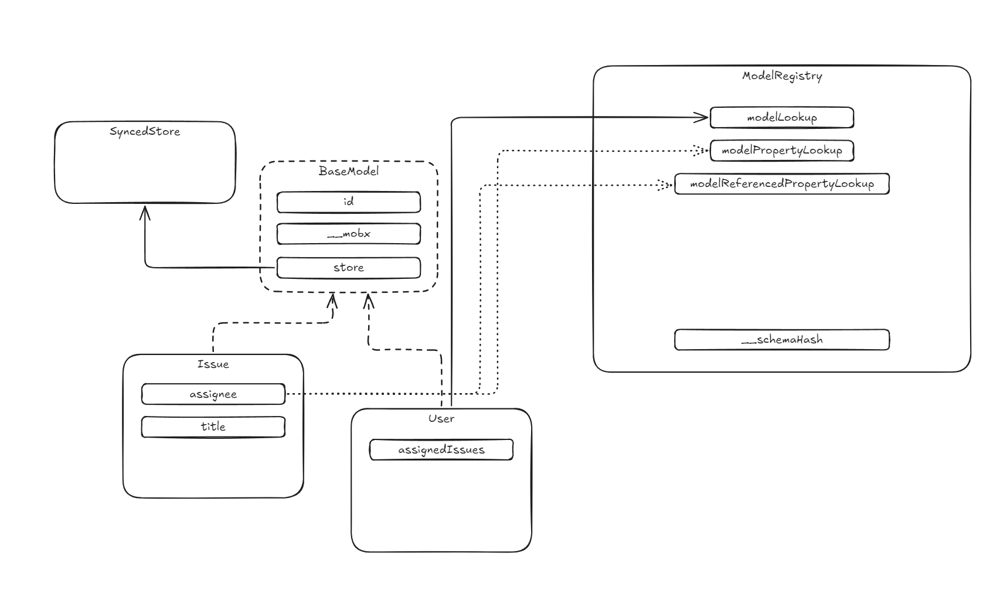

# A Reverse Study of Linear Sync Engine

> [!WARNING]
> This is still a work in progress. There may be lots of mistakes and misleading.

I specialize in collaborative software, focusing on rich text editors and spreadsheets. **Collaboration engines**, also known as **data sync engines**, play a pivotal role in enhancing user experience. They enable real-time, simultaneous edits on the same file while offering features like offline availability and file history. Typically, engineers use **operational transformation (OT)** or **conflict-free replicated data types (CRDTs)** to build these sync engines. While these technologies are effective for editors and spreadsheets, they may not be ideal for other types of applications. Here's why.

OT is widely recognized for its complexity. This stems from the need to account for diverse data models and operation sets across different applications, which requires significant effort to implement accurate operations and transformation functions. While OT excels at synchronizing edits, preserving user intent, and handling conflicts, its complexity often makes it overkill for simpler use cases—such as managing user information or file metadata—where a straightforward **last-writer-wins** approach might suffice.

CRDTs, on the other hand, appear more user-friendly. They offer built-in support for fundamental data structures (e.g., texts, lists, maps, counters), reducing the workload for developers. However, CRDTs often introduce metadata overhead and become challenging to manage in scenarios involving partial syncing or permission controls—such as when users can only access a subset of files. These issues arise because CRDTs are primarily designed for decentralized systems, while most modern applications still depend on centralized servers. Although I am personally an advocate of CRDTs, they often fall short for some practical use cases.

What I look for in a sync engine includes:

1. **Support for arbitrary data models**: Not limited to rich text or spreadsheets, making it adaptable to a wide range of scenarios.
2. **Rich features**: It should support partial syncing, enforce permission control, and include features like undo/redo, offline availability, and edit history.
3. **Great developer experience**: Ideally, it should allow model definitions in an ORM-like manner. Developers should not need to be experts in the engine to build collaborative applications.

Then, I discovered [Linear](https://linear.app). The [Linear Sync Engine (LSE)](https://linear.app/docs/offline-mode) offers an elegant solution to all the requirements mentioned above. Additionally, it provides a streamlined API that simplifies feature development. For example, updating the title of an issue is as simple as:

```jsx
issue.title = "New Title";
issue.save();
```

I believe LSE is exactly what I've been looking for, so I decided to reverse-engineer its frontend code to understand how it works. Additionally, I’m documenting my findings to help others who plan to build similar data sync engines.

In this post, we will explore how Linear:

- Defines models, their properties, and relationships
- Makes models observable using MobX
- Bootstraps by fully loading data from the server and constructing models in memory
- Builds a local database and populates it with data
- Boots from the local IndexedDB
- Hydrates lazily-loaded data
- Executes transactions and sends them to the server
- Applies updates received from the server

To assist you in understanding the raw code, I’ve uploaded a copy of Linear’s code with detailed comments. These annotations include insights and details not discussed in this post. At the end, you’ll find a table mapping abbreviated names to their full versions. For the best experience, I recommend reading this article on a desktop or laptop, as you may need to view the code alongside the text. Additionally, I’ll include a callout at the start of each section to highlight the functions relevant to that section.

## Introduction

If you haven’t yet watched Tuomas’ [two talks](https://www.youtube.com/watch?v=WxK11RsLqp4&t=2175s), a [podcast](https://www.devtools.fm/episode/61), and a [recent presentation](https://www.youtube.com/watch?v=VLgmjzERT08) at Local First Conf about LSE, I highly recommend checking them out before continuing. That said, here are the core concepts behind LSE:


### Model

Entities such as "Issue," "Team," "Organization," and "Comment" are **models** in LSE. Models have **properties** and **references** to other models, many of which are observable (via **MobX**) to automatically refresh views when changes occur. Models can be bootstrapped from the **local** database (IndexedDB) or the server (via **full bootstrapping**). Operations (additions, deletions, updates) on these models, their properties, and references are sent to the server as **transactions**, which are then broadcast as **deltas** to other connected clients to ensure data consistency across multiple copies.

### Transaction

Operations sent to the server are encapsulated as **transactions**. These transactions are designed to execute _only_ on the server and may fail, so they are reversible (on the client). If the client loses connection to the server, transactions are cached in IndexedDB and resent once the client is back online.

### Delta

After transactions are executed, the server broadcasts "deltas" to all clients (including the one that sent the transactions) to update the models. Deltas may not be identical to the original transactions sent by the client, as the server may perform side effects (such as generating history) during execution.

### Sync Engine

The **Sync Engine** consists of key modules responsible for tasks such as:

1. Bootstrapping models from the local database or server.
2. Managing the local database.
3. Detecting changes in models and sending transactions to the server.
4. Handling transactions and deltas.

In the following sections, we will discuss these concepts in detail, starting with **"Model"**.

## Chapter 1: Models

### `ModelRegistry`

When Linear starts, the first step is to generate metadata for models, including their properties (such as references), methods (actions), and computed values. LSE maintains a detailed dictionary, called `ModelRegistry` (`rr` in the code), to keep track of this metadata.


_The names in the screenshots may differ from those in the source code on the GitHub repo, and that’s perfectly fine because Linear has excellent continuous deployment. They nearly ship new code every half hour!_

`ModelRegistry` is a class with static members that store various types of metadata and corresponding methods for registering and retrieving this data. For example:

- `modelLookup` maps a model’s name to its constructor.
- `modelPropertyLookup` registers metadata for a model’s properties.
- `modelReferencedPropertyLookup` registers metadata for a model’s references.

`ModelRegistry` also includes a special property, `__schemaHash`, which is the hash of all models' metadata and their properties. This hash is used to determine if the local database needs to be migrated.

### Model



LSE uses `class` to define models, with all model classes extending `BasicModel`, which includes the following properties and methods:

- **`id`**: A unique UUID for each model, used as the key to retrieve a model from the **object pool**.
- **`_mobx`**: An empty object essential for making the model observable, explained further in the "Observability" section.
- **`makeObservable`**: Makes the model observable. By default, models are not observable when constructed; this method should be called at the appropriate time to enable observability.
- **`store`**: Holds a reference to `SyncedStore`, which will be covered in more detail in later chapters. Object pool lives somewhere in `SyncedStore`.
- **`propertyChanged`, `markPropertyChanged`, `changeSnapshot`**: Used to track property changes and generate a transaction.
- **`save`**: Generates an `UpdateTransaction` when called.
- Methods ending with **`Mutation`**, such as `updateMutation`, generate GraphQL mutation queries.
- **`updateFromData`**: Dumps serialized values into a model. LSE does not pass arguments to the constructor when creating a model; instead, it calls this method.
- **`attachToReferencedProperties`**: Attaches all reference properties of a model.

> [!NOTE]
> After I wrote this post, the Linear team changed how properties are stored. Now, every model object includes a `__data` property to store property values. This change impacts the implementations of certain decorators and the hydration process.

Models' metadata includes:

1. **`usedForPartialIndexes`**
2. **`loadStrategy`**: There are five different load strategies:
    - **`instant`**: Models that should be loaded into memory during application bootstrapping. This is the default strategy.
    - **`lazy`**: Models that are loaded into memory only when hydrated. If used, all instances of that model are loaded simultaneously. For example, `ExternalUser`.
    - **`partial`**: Models that are loaded on demand. This strategy is commonly used. For example, `DocumentContent`.
    - **`explicitlyRequested`**: Models that are loaded only when explicitly requested. For example, `DocumentContentHistory`.
    - **`local`**: Models persisted only in the local database. I couldn’t find any models that use this strategy.
3. **`partialLoadMode`**: This property has three possible values: `full`, `regular`, and `lowPriority`. This will determine how a model will be hydrated.

Currently, there are 76 models in Linear.

![[count of models.png]]

> [!NOTE]
> During his presentation at Local First Conf, Tuomas explained how features can be developed without modifying the server-side code. In my opinion, this is achieved by setting the load strategy to `local` for any new model, ensuring it persists or bootstraps only in the local IndexedDB. Once the new model is finalized, syncing is implemented by changing its load strategy from `local` to one of the other options.

LSE uses TypeScript decorators to register metadata in the `ModelRegistry`. One such decorator is `Model` (referred to as `We` in the source code), which is used to declare models. For example, consider the `Issue` model:

```tsx
re = Pe([We("Issue")], re);

// In the source code, it may be something like:
@Model("Issue")
class Issue {}
```

In the implementation of `Model` :

1. The model’s name and constructor function are registered in `ModelRegistry`'s `modelLookup`.
2. The model’s name, schema version, and property names are combined into a **hash value**, which is registered in `ModelRegistry` and used to check the database schema. If the model’s `loadStrategy` is `partial`, this information is also included in the hash.

> [!NOTE]
> When discussing the implementation, it is highly recommended to also read the code.

### Properties

Models have properties, and there are **seven types of properties** (defined in the enumeration `vn`):

1. **`property`**: A property that is "owned" by the model. For example, `title` is a `property` of `Issue`.
2. **`ephemeralProperty`**: Similar to a `property`, but it is not persisted in the database. This type is rarely used. For example, `lastUserInteraction` is an ephemeral property of `User`.
3. **`reference`**: A property used when a model holds a reference to another model. Its value is typically the ID of the referenced model. A reference can be lazy-loaded, meaning the referenced model is not loaded until this property is accessed. For example, `subscription` is a `reference` of `Team`.
4. **`referenceModel`**: When `reference` or `backReference` properties are registered, a `referenceModel` property is also created. This property defines getters and setters to access the referenced model using the corresponding `reference` or `backReference`.
5. **`referenceCollection`**: Similar to `reference`, but it refers to an array of models. For example, `templates` is a `referenceCollection` of `Team`.
6. **`backReference`**: A `backReference` is the inverse of a `reference`. For example, `favorite` is a `backReference` of `Issue`. The key difference is that a `backReference` is considered "owned" by the referenced model. When the referenced model (B) is deleted, the `backReference` (A) is also deleted.
7. **`referenceArray`**: Used for many-to-many relationships. For example, `members` of `Project` is a `referenceArray` that references `Users`, allowing users to be members of multiple projects.

Each property has **property metadata**, which instructs LSE on how to handle the property in scenarios like hydration and data-fetching. Some key fields of property metadata include:

1. **`serializer`**: Defines how to serialize the property for data transfer or storage.
2. **`type`**: Specifies the type of the property.
3. **`persistence`**: Indicates how the property should be stored in the database. Options include `none`, `createOnly`, `updateOnly`, and `createAndUpdate`.
4. **`indexed`**: Determines whether the property should be indexed in the database.
5. **`lazy`**: Specifies whether the property should be loaded only when the model is hydrated.
6. **`referenceOptional`**: Its distinction from `referenceNullable` is unclear.
7. **`referenceNullable`**: Its function is unknown.
8. **`referencedClassResolver`**: A function that returns the constructor of the referenced model.
9. **`referencedProperty`**: If the referenced model has a property that references back, this specifies the name of that property.
10. **`cascadeHydration`**: Indicates whether referenced models should be hydrated in a cascading manner.
11. **`onDelete`**: Defines how to handle the referenced model when the model is deleted. Options include `CASCADE`, `NO ACTION`, `SET NULL`, and `REMOVE AND CASCADE WHEN EMPTY`.
12. **`onArchive`**: Specifies how to handle the referenced model when the model is archived.

There are different decorators for various types of properties. In this post, I will cover four of them.

#### `Property` (`w`)

Let’s take the `Issue` model as an example. The `priority` is declared as a `property` of `Issue`:

```tsx
Pe([w({
    serializer: P_
})], re.prototype, "priority", void 0);

// In the source code, it may looks like:
@Model("Issue")
class Issue {
  @Property({ serializer: PrioritySerializer })
  priority: Priority;
}
```

In `Property` 's implementation:

1. The property is made observable by calling `M1`, which we would cover in detail in section "[Observability](#observability)".
2. The metadata is generated, and this property is registered to `ModelRegistry`.

#### `Reference` (`pe`)

For example, `assignee` is a `reference` of `Issue`, and `assignedIssues` is a `LazyReferenceCollection` of `User`.

```tsx
Pe([pe(()=>K, "assignedIssues", {
    nullable: !0,
    indexed: !0
})], re.prototype, "assignee", void 0);

st([Nt()], K.prototype, "assignedIssues", void 0);

// In the source code, it may looks like:
@Model("Issue")
class Issue {
 @Reference(() => User, "assignedIssues", {
   nullable: true,
   indexed: true,
 })
 assignee: User | null;
}

@Model("User")
class User {
  @LazyReferenceCollection()
  assignedIssues: LazyReferenceCollectionImpl;

  constructor() {
    this.assignedIssues = new LazyReferenceCollectionImpl(Issue, this, "assigneeId", undefined, {
      canSkipNetworkHydration: () => this.canSkipNetworkHydration(Issue)
    }),
  }
}
```

In the implementation of `Reference`, two properties are actually registered: `assignee` and `assigneeId`.

1. The `assignee` is not stored in the database; only `assigneeId` is. They have different `type`s.
2. LSE uses a getter and setter to link `assigneeId` and `assignee`. When the `assignee` value is set, `assigneeId` is updated with the new value's `ID`. Similarly, when `assignee` is retrieved, the corresponding record is fetched from the data store using the ID.
3. Additionally, `assigneeId` is made observable with `M1`.

![[properties of Issue.png]]
_There are lots of reference and reference id pairs in the screenshot._

Check the commented source code (`pe` `A4`) for further details.

### Observability (`M1`)

The `M1` function handles the necessary operations to enable observability. It uses `Object.defineProperty` to define a getter and setter for the property that needs to be observable.

When a value is assigned to the property, the setter checks if it needs to create a MobX box on `_mobx` and assigns the value to that box. The same logic applies to the getter, which ensures that if the box exists, it retrieves the value from it. By wrapping React components with `observer`, MobX can track which components subscribe to the observables and automatically refresh them when the observable values change.

Additionally, when setting the value, the `propertyChanged` method is called to register which property has changed, along with the old and new values. This information will later be used to create a transaction, which we'll discuss in a subsequent section.

Check the commented source code (`M1`) for more details.

### Actions (`rt`) & Computed (`O`)

Let's take `moveToTeam` and `parents` of `Issue` for example, there is `Action` decorator and `Computed` decorator.

```jsx
Pe([rt], re.prototype, "moveToTeam", null);
Pe([O], re.prototype, "parents", null);

// The source code would be something like:
@Model("Issue")
class Issue {
  @Action
  moveToTeam() {
    // implementation
  }

  @Computed
  get parents() {
    // implementation
  }
}
```

**Action** and **computed** are core MobX primitives. During bootstrapping, these properties are made observable by directly calling MobX's `makeObservable` API.

### Takeaway of this chapter

- Models and properties have metadata that defines their behavior in LSE.
- LSE uses decorators to register models, properties, references, actions, and computed values in the `ModelRegistry`.
- LSE employs `Object.defineProperty` to implement getters and setters for building references and making models observable.

## Chapter 2: Bootstrapping & Lazy Loading

Now, let's discuss how Linear bootstraps. We'll begin with an overview to give you a basic understanding, then break it down into more interesting details.

- [ ] A graph show the calling hierarchy.
- [ ] Should make them more accurate.

1. `StoreManager` (`cce`) creates `PartialStore` (`jm`) or `FullStore` (`TE`) for each model to synchronize in-memory data with the IndexedDB (1).
2. Link to IndexedDB and check if it is necessary to create or migrate the database.
3. Identify the bootstrap type to decide the bootstrapping method (3).
4. Bootstrap the database (4).
5. For a full or partial bootstrap, retrieve the model from the server (5).
6. Store model data for persistence (6).
7. Load data that needs immediate hydration into memory. Initialize in-memory model objects, start observability, apply delta for local bootstrapping, load persisted transactions, save data into IndexedDB by flushing stores, monitor remote changes, and schedule the execution of persisted transactions (7).

- [ ] A graph to show relationship of these models

Some criticial modules includes:

1.

### Create `ObjectStore`s

During the bootstrapping process, the first step is to construct the `StoreManager`, which creates `ObjectStore` instances for each model registered in the `ModelRegistry`. Each `ObjectStore` manages the corresponding table for its model in IndexedDB.

![[store manager.png]]
_There are 76 kinds of models so there are 76 `ObjectStore` consequently._

Models have different `loadStrategy` configurations, so LSE generates different store types accordingly. The `PartialObjectStore` (`p3`, `Jm`) handles models with a `partial` load strategy, while the `FullObjectStore` (`TE`) is used for all other models.

When an `ObjectStore` is created, it calculates a hash for the model. This hash serves as the table name in the database.

`this.storeName = $1(e + Me.propertyHashOfModel(e));`

For example, the `Issue` model has a `storeName` of `"a232cc0c00b69a475fde5509d42b82ee"`, which corresponds to a table with the same hash.

![[Pasted image 20241123154734.png]]

![[Pasted image 20241123154827.png]]

What's noteworthy is that for models with a `loadStrategy` of `partial`, there will be an additional database named `<hash>_partial`. This database stores indexes for lazy loading these models, which we will discuss in detail at the end of this chapter.

### Create Databases & Tables

>[!NOTE]
> To gain a deeper understanding of this process, search for the line `this.syncClient.initializeDatabase(s)` in the source code. Detailed code comments in this section provide further insights into how the database is initialized and managed.

After `ObjectStore`s are constructed, the next step is to prepare the database. When logged into a single account with one workspace loaded, LSE maintains two databases (ignoring Sentry here) in IndexedDB: `linear_databases` and `linear_(hash)`.

- **`linear_databases`**: This database stores database info about other databases. LSE creates a database for each user+workspace combination (I'll just say workbench). ![[Pasted image 20241124210603.png]]
- **`linear_(hash)`**: This database contains the actual data for a workspace. For instance, `linear_b4782b3125a816b51a44e59f2e939efa` represents my private workspace's data. It organizes data into tables, each dedicated to a specific model type. Additionally, it includes two special tables: ![[Pasted image 20241124210603.png]]
  - **`_meta`**: Stores persistence details for each model and its metadata such as `lastSyncId`.
    - ![[Pasted image 20241214095213.png]]
  - **`_transaction`**: Contains unsent mutations queued for server synchronization.

Now, let's explore how these two databases are generated.

The `DatabasesManager` (`jn`) class provides various methods for managing databases. One of its key components is the static `database` function, which is responsible for creating the `linear_databases` database.

The next step is retrieving the metadata for the workspace being bootstrapped. This task is handled by the `databaseInfo` method of the `DatabasesManager` class. The database info for a database includes:

1. **`name`**: The database name. The hash is derived from `userId`, `version`, and `userVersion`. Consequently, different user identities result in multiple databases.
2. **`schemaHash`**: Used for database migration. It is actually `_schemaHash` property of `ModelRegistry`.
3. **`schemaVersion`**: A local incremental counter that determines whether a database migration is needed. If the new `schemaHash` differs from the one stored in IndexedDB, the counter increments. The updated version is then passed as the second parameter to [`IndexedDB.open`](http://indexdb.open/) to assess whether migration is required.

Once the database info is retrieved, it is saved into the `linear_databases` database via the `registerDatabase` method in the `DatabasesManager` class.

After this step, LSE is ready to create the workspace-specific database, such as `linear_b4782b3125a816b51a44e59f2e939efa`. LSE will connect to the database and determine whether it needs to be created or migrated. If required, the `StoreManager`'s `createStores` method is invoked to set up the necessary tables in the database.

The last step of this part is to get the database's metadata via `Database.getMetadata`. Metadata fields of a database includes:

1. `lastSyncId`. When the database is newly created, it is `undeifned`.
2. `firstSyncId`
3. `backendDatabaseVersion`
4. `updatedAt`
5. `subscribedSyncGroups`

- [ ] Some remains unknown.

### Determine the bootstrapping type

> [!NOTE]
> Search for the line `await this.syncClient.bootstrap(s)` and method `requiredBootstrap`.

The `Database.requiredBootstrap` method determines the type of bootstrapping to perform. There are three types of bootstrapping:

1. **`full`**: LSE loads all data from the server.
2. **`local`**: The application loads data from the local database and catches up with the server using incremental deltas.
3. **`partial`**: Only a subset of data is loaded.

LSE performs a **full bootstrapping** under the following conditions (excluding demo workspaces):

1. **No stores are ready**:  
    Newly created tables, as previously discussed, are considered "not ready."
2. Or, **`lastSyncId` is undefined**:  
    This indicates the database has no record of the last synchronization point.
3. Or, **Models are outdated**:  
    If the client is online and some models are determined to be outdated, a full bootstrap ensures all data is refreshed.

For this scenario, we assume a **full bootstrapping** process is required.

### Request & Response

> [!NOTE]
> Search for the following methods:
>
> 1. `bootstrap` of `Database`.
> 2. `fullBootstrap` of `BootstrapHelper` (`Xm`).
> 3. `restModelsJsonStreamGen` of `GraphQLClient` (`sd`)

When Linear does a full bootstrapping, it would send a request like this:

```
https://client-api.linear.app/sync/bootstrap?type=full&onlyModels=WorkflowState,IssueDraft,Initiative,ProjectMilestone,ProjectStatus,TextDraft,ProjectUpdate,IssueLabel,ExternalUser,CustomView,ViewPreferences,Roadmap,RoadmapToProject,Facet,Project,Document,Organization,Template,Team,Cycle,Favorite,CalendarEvent,User,Company,IssueImport,IssueRelation,TeamKey,UserSettings,PushSubscription,Activity,ApiKey,EmailIntakeAddress,Emoji,EntityExternalLink,GitAutomationTargetBranch,GitAutomationState,Integration,IntegrationsSettings,IntegrationTemplate,NotificationSubscription,OauthClientApproval,Notification,OauthClient,OrganizationDomain,OrganizationInvite,ProjectLink,ProjectUpdateInteraction,InitiativeToProject,Subscription,TeamMembership,TimeSchedule,TriageResponsibility,Webhook,WorkflowCronJobDefinition,WorkflowDefinition,ProjectRelation,DiaryEntry,Reminder
```

Note that the request includes two parameters:

1. **`type`**: Specifies the type of bootstrap, which can be either `full` or `partial`. In this case, it is set to `full`.
2. **`onlyModels`**: Lists the names of the models to be loaded.

The response is a stream of objects, where each line (except for the last line) contains the properties of a model.

```jsx
{"id":"8ce3d5fe-07c2-481c-bb68-cd22dd94e7de","createdAt":"2024-07-03T11:37:04.865Z","updatedAt":"2024-07-03T11:37:04.865Z","userId":"4e8622c7-0a24-412d-bf38-156e073ab384","issueId":"01a3c1cf-7dd5-4a13-b3ab-a9d064a3e31c","events":[{"type":"issue_deleted","issueId":"01a3c1cf-7dd5-4a13-b3ab-a9d064a3e31c","issueTitle":"Load data from remote sync engine."}],"__class":"Activity"}
{"id":"ec9ec347-4f90-465c-b8bc-e41dae4e11f2","createdAt":"2024-07-03T11:37:06.944Z","updatedAt":"2024-07-03T11:37:06.944Z","userId":"4e8622c7-0a24-412d-bf38-156e073ab384","issueId":"39946254-511c-4226-914f-d1669c9e5914","events":[{"type":"issue_deleted","issueId":"39946254-511c-4226-914f-d1669c9e5914","issueTitle":"Reverse engineering Linear's Sync Engine"}],"__class":"Activity"}
// many lines omitted here
_metadata_={"method":"mongo","lastSyncId":2326713666,"subscribedSyncGroups":["89388c30-9823-4b14-8140-4e0650fbb9eb","4e8622c7-0a24-412d-bf38-156e073ab384","AD619ACC-AAAA-4D84-AD23-61DDCA8319A0","CDA201A7-AAAA-45C5-888B-3CE8B747D26B"],"databaseVersion":948,"returnedModelsCount":{"Activity":6,"Cycle":2,"DocumentContent":5,"Favorite":1,"GitAutomationState":3,"Integration":1,"Issue":3,"IssueLabel":4,"NotificationSubscription":2,"Organization":1,"Project":2,"ProjectStatus":5,"Team":1,"TeamKey":1,"TeamMembership":1,"User":1,"UserSettings":1,"WorkflowState":7,"Initiative":1,"SyncAction":0}}
```

Let's take an example:

```json
{
  "id": "556c8983-ca05-41a8-baa6-60b6e5d771c8",
  "createdAt": "2024-01-22T01:02:41.099Z",
  "updatedAt": "2024-05-16T08:23:31.724Z",
  "number": 1,
  "title": "Welcome to Linear 👋", // text encoding problem
  "priority": 1,
  "boardOrder": 0,
  "sortOrder": -84.71, // apperantly LSE use fractional indexing for sorting
  "startedAt": "2024-05-16T08:16:57.239Z",
  "labelIds": ["30889eaf-fac5-4d4d-8085-a4c3bd80e588"],
  "teamId": "89388c30-9823-4b14-8140-4e0650fbb9eb",
  "projectId": "3e7ada3c-f833-4b9c-b325-6db37285fa11",
  "projectMilestoneId": "397b95c4-3ee2-47b0-bad1-d6b1c7003616",
  "subscriberIds": ["4e8622c7-0a24-412d-bf38-156e073ab384"],
  "previousIdentifiers": [],
  "assigneeId": "4e8622c7-0a24-412d-bf38-156e073ab384",
  "stateId": "030a7891-2ba5-4f5b-9597-b750950cd866",
  "reactionData": [],
  "__class": "Issue"
}
```

The last line of the response contains metadata for this request, with certain fields updating the corresponding fields in the database's metadata.

```json
{
  "method": "mongo", // as Tuomas talked in his video, they are using mongoDB as cache
  "lastSyncId": 2326713666,
  "subscribedSyncGroups": [
    "89388c30-9823-4b14-8140-4e0650fbb9eb",
    "4e8622c7-0a24-412d-bf38-156e073ab384",
    "AD619ACC-AAAA-4D84-AD23-61DDCA8319A0",
    "CDA201A7-AAAA-45C5-888B-3CE8B747D26B"
  ],
  "databaseVersion": 948,
  "returnedModelsCount": {
    "Activity": 6,
    "Cycle": 2,
    "DocumentContent": 5,
    "Favorite": 1,
    "GitAutomationState": 3,
    "Integration": 1,
    "Issue": 3,
    "IssueLabel": 4,
    "NotificationSubscription": 2,
    "Organization": 1,
    "Project": 2,
    "ProjectStatus": 5,
    "Team": 1,
    "TeamKey": 1,
    "TeamMembership": 1,
    "User": 1,
    "UserSettings": 1,
    "WorkflowState": 7,
    "Initiative": 1,
    "SyncAction": 0
  }
}
```

The JSON strings will be parsed into plain objects and returned to the caller. Finally, these models will be cached in the `ObjectStore`s, and the database metadata will be updated accordingly.

### Construct Models & Object Pool

> [!NOTE]
> Search for the following methods:
>
> 1. `bootstrap` of `SyncClient` (`ng`).
> 2. `addModelToLiveCollections` of `SyncClient`.
> 3. `updateFromData` & `updateReferencedModels` of `Model` (`as`).

With the raw models in place, it's time to construct the models and save them into the Object Pool, making them accessible to other parts of the application—a process known as model hydration.

LSE begins this process by invoking `Database.getAllInitialHydratedModelData`. The `Database` loads models with a `loadStrategy` set to `instant`. For these models, LSE retrieves their constructors from `ModelRegistry` and calls these constructors to create the model objects. These objects are then added to the Object Pool using `addModelToLiveCollections`.

The Object Pool is implemented as a map called `modelLookup` on `SyncClient`. This map associates a model's ID with its corresponding model object, allowing other parts of Linear to easily retrieve a model by its ID.

When constructing a model object, LSE does not pass the dehydrated model directly to the constructor. Instead, it first initializes the object with default field properties, then hydrates it by calling `updateFromData` to populate it with the dehydrated data. Additionally, `attachToReferencedProperties` is invoked to populate any references.

### Partial Loading

> [!NOTE]
> Search for the following methods:
>
> 1. `hydrate` of `Model` (`as`)

As noted in the previous section, LSE does not load all data into the Object Pool during bootstrapping. Instead, additional data is fetched through network requests or retrieved from IndexedDB as you use the app. For instance, when you view the details of an issue, LSE asynchronously loads comments to this issue. This process is known as **hydration**. Classes with a `hydrate` method can be hydrated, such as `Model`, `LazyReferenceCollection`, `LazyReference`, `RequestCollection`, and `LazyBackReference`.

Let's first take a look at the `hydrate` method of the `Model`. It checks all its properties that need to be hydrated and calls their `hydrate` method. There are four types of properties that need to be hydrated:

1. `LazyReferenceCollection`
2. `LazyReference`
3. `Reference` and `ReferenceCollection` that are set to be hydrated cascaded with the model.

We won't dive deep into the hydration of `Reference` and `ReferenceCollection`, because it simply involves calling the `hydrate` method of other `Model` instances recursively. Instead, let's focus on `LazyReferenceCollection` and `LazyReference`, as they involve lazy loading. Let's talk about `LazyReferenceCollection` first.

> [!note]
> Please refer to the following:
>
> - constructor of `Issue` (`re`)
> - `LazyReferenceCollectionImpl` (`Et`)
>   - `hydrate`
>   - `getCoveringPartialIndexValues`
> - `LazyReferenceCollection` (`Nt`)
> - `PartialIndexHelper` (`Ku`)
>   - `resolveCoveringPartialIndexValues`
>   - `partialIndexInfoForModel`
>   - `processPartialIndexInfoForModel`

When we talked about definition properties, we learned that reference collection is one of the seven types of properties. Now let's have an in-depth discussion about it. There is a `LazyReferenceCollection` (`Nt`) decorator. For example, `comments` is a `LazyReferenceCollection` property of `Issue`. This decorator will register the property's metadata into `ModelRegistry`.

```ts
Pe([Nt()], re.prototype, "comments", void 0);
```

And there is also a `LazyReferenceCollectionImpl` class. For example, in the constructor of `Issue`:

```ts
        this.comments = new Et(nt,this,"issueId"),
```

The source code will be something like:

```js
class Issue extends BaseModel {
 @LazyReferenceCollection()
 comments: LazyReferenceCollection;

 constructor() {
  this.comments = new LazyReferenceCollectionImpl(Comment, this, "issueId");
 }
}
```

`LazyReferenceCollectionImpl` can take options. For example, `assignedIssues` is a `lazyReferenceCollection` property of `User` model:

```ts
this.assignedIssues = new Et(re,this,"assigneeId",void 0,{
    canSkipNetworkHydration: ()=>this.canSkipNetworkHydration(re) 
}),
```

> [!WARNING]
> At the time I am publishing this post, LSE uses a different approach that does not require developers to manually call the constructor of `LazyReferenceCollectionImpl`. To put it simply, they added more decorators similar to `LazyReferenceCollection` which can autometically constructor `LazyReferenceCollectionImpl` with different options. Since this change seems not relavent to how hydration works, I will ignore this change here.

In the `hydrate` method of `LazyReferenceCollectionImpl`, the first to step is to call `this.getCoveringPartialIndexValues` to get partial index values. So what is a partial index?

#### Partial Index

> [!note]
> Please refer to the following:
>
> - constructor of `Issue` (`re`)
> - `LazyReferenceCollectionImpl` (`Et`)
>   - `hydrate`
>   - `getCoveringPartialIndexValues`
> - `LazyReferenceCollection` (`Nt`)
> - `PartialIndexHelper` (`Ku`)
>   - `resolveCoveringPartialIndexValues`
>   - `partialIndexInfoForModel`
>   - `processPartialIndexInfoForModel`

**Partial Index** plays a crucial role in LSE because it addresses a critical question: **How does LSE determine which model should be lazy loaded?** To put the question in another word, if we would like to query lazy models, what should be the query parameters? Of course, if we have the ids of those models, the answer will be easy. But, in some other cases, when LSE needs to load comments of an issue, it apparently cannot get those ids.

Imagine you are design Linear's database schema, if you would like to query comments where they reference a specific issue, you would like to set a `issueId` field and build index on that field. This also happens in LSE's frontend code. When defining the Comment model, there will be a lazy reference to Issue and LSE will create index for that field.

```ts
Yt([pe(()=>re, "comments", {
    optional: !0,
    nullable: !1,
    indexed: !0
})], nt.prototype, "issue", void 0);

// The possible source code may look like:
@Model()
class Comment extends BaseModel {
  @Reference(() => Issue, "comments", {
    optional: true,
    nullable: false,
    indexed: true
  })
  issue: Issue | null;
}
```

So LSE can query comments by issue's id. In another word, the query parameter could be `issueId-<id-of-the-issue>`.

And LSE goes further. `Issue` can be reference by other models. For example, `Cycle` also have a `lazyReferenceCollection` property of `Issue`, and `Issue` references `Cycle` as well:

```ts
$t([Nt()], ct.prototype, "issues", void 0);

Pe([pe(()=>ct, "issues", {
    nullable: !0,
    indexed: !0,
    onDelete: "SET NULL",
    onArchive: "NO ACTION"
})], re.prototype, "cycle", void 0);

// I am omitting the possible source code here. Hope you already got the idea!
```

That means a comment can be referenced in a nested way. For example, if you send the query parameter to be `issue.cycleId-<id-of-the-cycle>`, theoretically, you can get all comments of all issues of that cycle.

Let's get back to the calling chain. that's happened in method `processPartialIndexInfoForModel`. LSE will calculate the reference chains up to 3 levels. For example, this picture tells what models can reference a comment, and what are the name of the reference properties.

![[Pasted image 20241210090957.png]]

And in `resolveCoveringPartialIndexValues`, LSE will use the partial index info to check if the model actually exists in the memory. For example, the `Issue` does reference a `Cycle`, neither a `Project`, so the covering partial index values will not contain related query params.

![[Pasted image 20241210091448.png]]

#### Hydration

> [!note]
> Please refer to the following:
>
> - constructor of `Issue` (`re`)
> - `SyncClient` (`ng`)
>   - `hydrateModelsByIndexedKey`
> - `Database` (`eg`)
>   - `getModelDataByIndexedKey`
> - `PartialStore` (`Jm`)
>   - `getAllForIndexedKey`

And then `hydrate` of `LazyReferenceCollecitonImpl` will call `SyncedStore.hydrateModels` and consequently `SyncClient.hydrateModelsByIndexedKey`.

First, LSE will check if it need to perform a network hydration. LSE will perform local hydration on one of the following conditions:

1. There's no `coveringPartialIndexValues`.
2. `coveringPartialIndexValues` cannot be found in the partial store.
3. `canSkipNetworkHypdraton` options returns `true`.

Please recall that when we talked about `ObjectStore`, we learned that for each model whose `loadStrategy` is `partial`, there will be a partial index store for storing indexes. This is when the store will be used. For example, `Comment`'s partial index store has two records which means LSE had tried to load `Comment`s with these indexes, so LSE can be sure that either it has fetched corresponding comments for the server some time in the past.

![[Pasted image 20241210083609.png]]

If LSE doesn't need to perform a network hydration, it will query the IndexedDB with the index. Otherwise, it will can `BatchModelLoader.addRequest` to schedule a network hydration.

#### `BatchModelLoader` (`wm`)

> [!NOTE]
> Please refer to the following:
>
> - `BatchedRequest` (`PE`)
>   - `addRequest`
> - `BatchModelLoader` (`wm`)
>   - `handleBatch`
>   - `loadSyncBatch`
>   - `loadPartialModels`
>   - `loadFullModels`
>   - `handleLoadedModels`
> - `Database` (`eg`)
>   - `loadPartialModels`
>   - `setPartialIndexValueForModel`

`BatchModelLoader` , as its name suggests, batch a group of network hydration requests to a single GraphQL request. We will not discuss deduping and...

In method `handleBatch`, Linear will divide requests into 3 categories:

1. Requests that is associated to a `SyncGroup`, which we will cover in the next section.
2. Requests loading models that should be loaded in full.
3. Other requests

And LSE will call different methods to load different categories of requests, respectively `loadPartialModels`, `loadFullModels` and `loadSyncBatch`.

In `loadSyncBatch`, it will call `GraphQLClient.resetModelsJsonStream` to send a request to `https://client-api.linear.app/sync/batch`, the body will be like:

```json
{"requests":[{"id":"6f14ab52-ed51-4db8-a981-c04620683218","skipSavingModelsInDatabase":false,"modelName":"Issue"}]}
```

And the response will be like:

```json
{"id":"6f14ab52-ed51-4db8-a981-c04620683218","createdAt":"2024-11-22T15:42:02.909Z","updatedAt":"2024-12-02T14:22:16.569Z","number":19,"title":"Test issue","priority":1,"boardOrder":0,"sortOrder":22,"prioritySortOrder":-93.79,"slaType":"all","labelIds":["30889eaf-fac5-4d4d-8085-a4c3bd80e588","c8085a01-0973-49b0-9ed7-8aa35ac96c5d"],"teamId":"89388c30-9823-4b14-8140-4e0650fbb9eb","subscriberIds":["4e8622c7-0a24-412d-bf38-156e073ab384"],"previousIdentifiers":[],"creatorId":"4e8622c7-0a24-412d-bf38-156e073ab384","assigneeId":"4e8622c7-0a24-412d-bf38-156e073ab384","stateId":"7bd765d0-7fa4-40ed-9b62-ae963436682c","reactionData":[],"__class":"Issue"}
_metadata_={"returnedModelsCount":{"Issue":1}}
```

Does this response looks familiar to you? Yes, this is also the format of the responding of a full bootstrapping! Later in 'handleLoadedModels', this response wil be parsed, models will be written into the database and created in memory. And what is also important is that the partial index of the request will also get saved into the database.

#### `SyncGroup`

_For a long time this remains unknown to me..._

### Takeaway of this chapter

## Chapter 3: Syncing to the Server

In the final part, we would talk about how LSE sync between clients and the server. What exactly happens when we change the assignee of an issue? How does LSE manage undo/redo functionality, networking, error handling, offline caching, and many other details within these two lines?

```jsx
issue.assignee = user;
issue.save();
```

### The Whole Picture

First, let's review the entire process, then we can delve into the details.

![[Pasted image 20241009161445.png]]

1. When a property is assigned a value, decorators will bookkeeper what property has been changed and what the new value and the old value are (1), and perhaps also update back references.
2. Once `save()` is called, the model call `SyncedStore` , subsequently `SyncedClient` and `TransactionQueue` to generate a n `Transaction` (2).
3. The generated transaction is pushed into a queue (sometimes sent immediately) and saved into the `__transactions` table in IndexedDB (3). `TransactionQueue` schedule a timer to repeatedly sending these pending transactions to the server.
4. Later, it is sent to the backend along with other transactions in a batch, a process known as transaction execution (4).
5. If the transaction is accepted by the backend, it is removed from the `__transactions` table (5) (6).
6. Subsequently, the backend sends a delta to `SyncClient` (7), informing clients of changes made on the server. `SyncClient` rebases transactions that haven't been accepted by the server, modifies in-memory models (8), and updates the tables in IndexedDB (9).

### Find Out What Has Been Changed

- `M1`
- `as#propertyChanged`
- `as#markPropertyChanged`
- `as#referencedPropertyChanged`
- `as#updateReferencedModel`

As we have discussed in section "Observability", LSE uses a decorator `M1` to make a property observable. It also plays a critical part in generating transactions. When a property of a model is assigned with a new value, the setter would intercept the assignment and call `propertyChanged` to record the name of that property, the old value and the new value. `markPropertyChanged` would then be called to serialize the old value and store it in `modifiedProperties`.

<aside>
💡 In addition to
</aside>

### Generate Transactions

There are various types of transactions:

| Minimized name | Possible original names | Description                                                             |
| -------------- | ----------------------- | ----------------------------------------------------------------------- |
| `M3` `Zo`      | `BaseTransaction`       | The base class of all transactions.                                     |
| `Hu`           | `CreationTransaction`   | The transaction to add an model.                                        |
| `zu`           | `UpdateTransaction`     | The transaction to update properties on an existing model.              |
| `g3`           | `DeleteTransaction`     | The transaction to delete a model. E.g. deleting a comment of an issue. |
| `m3`           | `ArchiveTransaction`    | The transaction to archive a model. E.g. deleting an issue.             |
| `y3`           | `UnarchiveTransaction`  | The transaction to unarchive a model.                                   |

`uce` (`TransactionQueue`) provides methods to create and execute transactions. But how does LSE determine which type of transaction it should generate, and what is the content of a transaction?

When the model object's `save` method is called, it invokes the `save` method of `SyncedStore`. If the model exists in `SyncClient`, an `UpdateTransaction` is generated. During the construction of `UpdateTransaction`, the model’s `changeSnapshot` function is called. Ultimately, an object is generated to represent the changes:

```jsx
{
  assigneeId: {
    original: this.modifiedProperties[n],
    updatedFrom: this.modifiedProperties[n],
    updated: i,
    unoptimizedUpdated: s
  }
}
```

### Transaction Queue

`TransactionQueue` use four arrays to manage transactions.

1. `createdTransactions` When a transaction is queued, it first goes to `createdTransactions`. A `commitCreatedTransactions` scheduler periodically moves all transactions in this array to the end of `queuedTransactions`.
2. `queueTransactions` These transactions are pushed to a queue, waiting to be executed. Transactions would all be saved into `__transactions` when are are move to `queuedTransactions` .
3. `executingTransactions` These transactions have been sent to the server but have not been accepted yet. The `TransactionQueue` has a `dequeueTransaction` scheduler that periodically moves transactions from `queuedTransactions` to `executingTransactions` in a FIFO manner.
4. `completedButUnsyncedTransactions` These transactions have been sent to the server and accepted, but the corresponding delta has not been received. When a set of transactions from `executingTransactions` is executed, they are removed from `executingTransactions` and pushed to `completedButUnsyncedTransactions`. Note that `completedButUnsyncedTransactions` are removed from `__transactions` in IndexedDB.
5. `persistedTransactionsEnqueue` When the database bootstraps, transactions saved in `__transactions` would be loaded into this array. After remote updates have been processed, they are moved to `queueTransactions` and waiting to be executed. During processing remove updates, these transactions may need to rebase on deltas.

At any given moment, transactions in `completedButUnsyncedTransactions` must be created earlier than those in `executingTransactions`, and the same applies to any other two arrays. This is important because the sequence plays a role when rebasing transactions.

### Generating GraphQL Mutating Queries

Before sending a batch of transactions to the server, it is converted into GraphQL mutating queries. Each transaction calls the `prepare` function to generate parameters (there are a lot of details but I am not going to cover in this post). These parameters are then used in `TransactionExecutor.execute` to create the query path and parameters.

```jsx
mutation IssueUpdate($issueUpdateInput: IssueUpdateInput!) {
  issueUpdate(id: "a8e26eed-7ad4-43c6-a505-cc6a42b98117", input: $issueUpdateInput
) { lastSyncId } }
```

```jsx
{
    "issueUpdateInput": {
        "assigneeId": "e86b9ddf-819e-4e77-8323-55dd488cb17c"
    }
}
```

## Part 4: Syncing from the Server

Delta from the server would be executed in the `applyDelta` method. After we modified the assignee, the delta would look like this:

A delta includes one or more actions, each identified by an `action` type. The current types are:

1. `I` for insertion
2. `U` for updating
3. `A` for archiving
4. `D` for deleting
5. `C` remains unknown
6. `G` remains unknown
7. `S` remains unknown
8. `V` remains unknown

For the updating action, LSE broadcasts all properties of the model, not just the changed ones. The model’s `updateFromData` would be called to update all properties.

```jsx
[
  {
    id: 2361610825,
    modelName: "Issue",
    modelId: "a8e26eed-7ad4-43c6-a505-cc6a42b98117",
    action: "U",
    data: {
      id: "a8e26eed-7ad4-43c6-a505-cc6a42b98117",
      title: "Connect to Slack",
      number: 3,
      teamId: "369af3b8-7d07-426f-aaad-773eccd97202",
      stateId: "28d78a58-9fc1-4bf1-b1a3-8887bdbebca4",
      labelIds: [],
      priority: 3,
      createdAt: "2024-05-29T03:08:15.383Z",
      sortOrder: -12246.37,
      updatedAt: "2024-07-13T06:25:40.612Z",
      assigneeId: "e86b9ddf-819e-4e77-8323-55dd488cb17c",
      boardOrder: 0,
      reactionData: [],
      subscriberIds: ["e86b9ddf-819e-4e77-8323-55dd488cb17c"],
      prioritySortOrder: -12246.37,
      previousIdentifiers: [],
    },
    __class: "SyncAction",
  },
  {
    id: 2361610826,
    modelName: "IssueHistory",
    modelId: "ac1c69bb-a37e-4148-9a35-94413dde172d",
    action: "I",
    data: {
      id: "ac1c69bb-a37e-4148-9a35-94413dde172d",
      actorId: "e86b9ddf-819e-4e77-8323-55dd488cb17c",
      issueId: "a8e26eed-7ad4-43c6-a505-cc6a42b98117",
      createdAt: "2024-07-13T06:25:40.581Z",
      updatedAt: "2024-07-13T06:25:40.581Z",
      toAssigneeId: "e86b9ddf-819e-4e77-8323-55dd488cb17c",
    },
    __class: "SyncAction",
  },
  {
    id: 2361610854,
    modelName: "Activity",
    modelId: "1321dc17-cceb-4708-8485-2406d7efdfc5",
    action: "I",
    data: {
      id: "1321dc17-cceb-4708-8485-2406d7efdfc5",
      events: [
        {
          type: "issue_updated",
          issueId: "a8e26eed-7ad4-43c6-a505-cc6a42b98117",
          issueTitle: "Connect to Slack",
          changedColumns: ["subscriberIds", "assigneeId"],
        },
      ],
      userId: "e86b9ddf-819e-4e77-8323-55dd488cb17c",
      issueId: "a8e26eed-7ad4-43c6-a505-cc6a42b98117",
      createdAt: "2024-07-13T06:25:41.924Z",
      updatedAt: "2024-07-13T06:25:41.924Z",
    },
    __class: "SyncAction",
  },
];
```

When applying a delta, it might conflict with local changes (transactions). For updating actions and transactions, LSE needs to rebase transactions onto the model modified by the action. This starts with the `TransactionQueue.rebaseTransactions` method.

LSE rebase all transactions in a specific order: `completedButUnsyncedTransactions`, `executingTransactions`, `queuedTransactions`, and `persistedTransactionsEnqueue`, as mentioned earlier. In terms of rebasing, it:

1. Adjusts the original transaction values to those specified by the action. For example, if I change the title of an issue from "A" to "B", and my colleagues change it from “A” to “C”, during rebasing on my device, my transaction would update from `A -> B` to `C -> B`.
2. Updates the model’s properties again since they have been altered by the action. This inevitably leads to some back-and-forth value assignments.

As Tuomas mentioned in his talk, this follows a last-writer-wins strategy.

### Side effects on the server

If you made any changes offline and then reload the page, it may seem that the changes are lost. However, they are not. The transactions are stored in the database and will be sent to the server once you are back online. **Linear does not apply these transactions locally as they are designed to be executed only on the backend.** In other words, the frontend and backend use different methods to update data. The backend needs to check authentication, generate history records, send emails, and so on. Linear refers to these as 'side effects'.

💡 Linear has to do some side effects on the server.

### Error handling

### Undo & redo

Undo and redo operations in LSE are based on transactions. Each transaction type has a specific `undoTransaction` method. This method executes the undo logic and returns another transaction for redo purposes. For example, the `undoTransaction` method of `UpdateTransaction` reassigns the model's property with its previous values and returns another `UpdateTransaction` to the `UndoQueue`. It is important to note that when a transaction performs its undo logic, a new transaction is created and added to the `queuedTransactions` to ensure synchronization.

But how does the `UndoManager` determine which transactions should be appended to the undo redo stack? It turns out that Linear UI is responsible for identifying the differences.

```jsx
n.title !== d &&
  o.undoQueue.addOperation(
    s.jsxs(s.Fragment, {
      children: [
        "update title of issue ",
        s.jsx(Le, {
          model: n,
        }),
      ],
    }),
    () => {
      //
      (n.title = d), n.save();
    }
  );
```

When an edit is made, the UI calls `UndoQueue.addOperation` to have `UndoQueue` subscribe to the next `transactionQueuedSignal` and create an undo item. This signal is triggered when transactions are added to `queuedTransactions`. The subscription ends when a callback finishes execution. What is in that callback? It is `save()`, our old friend! So when we perform an undo, although the signal is triggered, since `UndoQueue` is not listening to it, no extra undo item will be created.

### Add, Delete and Archive

For `DeleteTransaction`, `ArchiveTransaction`, and `UnarchiveTransaction`, there are specific methods on models to generate these transactions. We would not take a deeper investigation into them.

### Takeaway

A quick summary of this part:

1. **Client-side operations will never directly alter the tables in the local database!** Only data synced from the server would do that. You can consider
2. Unlike OT, which only sends an acknowledgment signal to the mutator client, **LSE consistently sends all properties of modified models to all clients, regardless of whether one of them is the mutator**. It really simplifies things.
3. LSE use simple **last-writer-win strategy to handle conflicts**, and only handle conflicts for updating actions.

## Part 5: Miscellaneous

## Conclusion

Thanks for joinning me in this journey of reversing LSE!

# Appendix A: Minimized and Possible Original Names Lookup

| Minimized names                                                                                                                                         | Possible original names                                                     | Description                                                                                                                                                                    |
| ------------------------------------------------------------------------------------------------------------------------------------------------------- | --------------------------------------------------------------------------- | ------------------------------------------------------------------------------------------------------------------------------------------------------------------------------ |
| `Me` `rr`                                                                                                                                               | `ModelRegistry`                                                             |                                                                                                                                                                                |
| `w`                                                                                                                                                     | `ApplicationStore`                                                          |                                                                                                                                                                                |
| `Ln`                                                                                                                                                    | `makeObservable`                                                            | `MobX` API to make an object observable.                                                                                                                                       |
| `sg` `hf` `km`                                                                                                                                          | `SyncedStore`                                                               | It is the `store` in models. It provides lots of methods to get or manipulate models.                                                                                          |
| `Hr`                                                                                                                                                    | `SyncedClient`                                                              |                                                                                                                                                                                |
| `Dt`                                                                                                                                                    | `Database`                                                                  |                                                                                                                                                                                |
| `jn`                                                                                                                                                    | `DatabaseManager`                                                           |                                                                                                                                                                                |
| `cce`                                                                                                                                                   | `StoreManager`                                                              | The in-memory store manager. It manages lots of object stores. Each store maps to a model, and maps to a table in the database.                                                |
| `TE`                                                                                                                                                    | `FullStore`                                                                 | A store which content should be loaded all-at-once.                                                                                                                            |
| `Jm` `p3`                                                                                                                                               | `PartialStore`                                                              | A store which content can be partially loaded. It extends `FullStore` .                                                                                                        |
| `uce`                                                                                                                                                   | `TransactionQueue`                                                          |                                                                                                                                                                                |
| `A8` `sd`                                                                                                                                               | `GraphQLClient`                                                             | A GraphQL client. It would be used by many classes.                                                                                                                            |
| `w`                                                                                                                                                     | `Property`                                                                  | This refers to a self-owned property of a model. For example, `title` is a property of `Issue`.                                                                                |
| `_g`                                                                                                                                                    | `EphemeralProperty`                                                         | This is also a self-owned property of a model but is not stored in the database. For example, `lastUserInteraction` is an ephemeral property of `User`.                        |
|                                                                                                                                                         |                                                                             | For example, `documentContentId` of `Issue` refers to the document model's ID of the issue's description.                                                                      |
| `pe`                                                                                                                                                    | `Reference`                                                                 |                                                                                                                                                                                |
| `xe` `Nt`                                                                                                                                               | `ReferenceCollection` `LazyReferenceCollection`                             | This is used for 1 to many relationships. For example, `issues` is a lazy reference collection of `IssueLabel`. And `notifications` is a reference collection of `Initiative`. |
| `pe` `hr` `Ue` `g5` `dt` `kl`                                                                                                                           | `WithBackReference` `LazyWithBackReference` `Reference` `LazyBackReference` | These 6 decorators are used to declare reference and back references with different options.                                                                                   |
| `ReferenceArray`                                                                                                                                        | `ii`                                                                        |                                                                                                                                                                                |
| Many to many relationships. For example, `labels` are reference array of `Issue`. (But `issues` are lazy reference collection of `Label`).              |                                                                             |                                                                                                                                                                                |
| `as`                                                                                                                                                    | `Model`                                                                     |                                                                                                                                                                                |
| The base class that each model will inherit. The class declares a `store` and `__mobx` . The are the critical parts of data fetching and observability. |                                                                             |                                                                                                                                                                                |
| The class provides lots of static methods to register models, properties and their metadata.                                                            |                                                                             |                                                                                                                                                                                |
| `Qc`                                                                                                                                                    | `UUID`                                                                      | A helper function to generate UUID.                                                                                                                                            |
