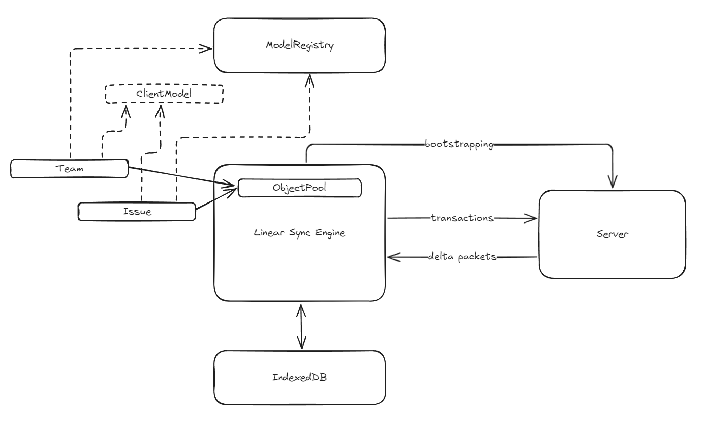
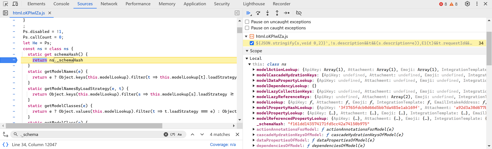

# A Reverse Study of Linear Sync Engine

> [!WARN] WORK IN A PROGRESS

I work on collaborative softwares, focusing on rich text editors and spreadsheets. **Collaboration engines**, also known as **data sync engines**, play a pivotal role in enhancing user experience in these softwares. They enable real-time, simultaneous edits on the same file while offering features like offline availability and file history. Typically, engineers use **[Operational Transformation (OT)](https://en.wikipedia.org/wiki/Operational_transformation)** or **[Conflict-free Replicated Data Types (CRDTs)](https://en.wikipedia.org/wiki/Conflict-free_replicated_data_type)** to build sync engines. While these technologies are effective for editors and spreadsheets, they may not be ideal for other types of applications. Here's why.

OT is widely adopted but notorious for its complexity. This complexity stems from the need to account for diverse data models and operation sets across different applications, which requires significant effort to implement correct operations and transformation functions. While OT excels at synchronizing edits, preserving user intent, and handling conflicts, its complexity often makes it overkill for simpler use cases—such as managing user information or file metadata—where a straightforward **last-writer-wins** approach might suffice.

CRDTs, on the other hand, appear more user-friendly. They offer built-in support for fundamental data structures (e.g., texts, lists, maps, counters), reducing the workload for developers. However, CRDTs often introduce metadata overhead and become challenging to manage in scenarios involving partial syncing or permission controls—such as when users can only access a subset of files. These issues arise because CRDTs are primarily designed for decentralized systems, while most modern applications still depend on centralized servers. Although I am personally an advocate of CRDTs, they often fall short for some use cases.

What I look for in a sync engine includes:

1. **Support for arbitrary data models**: Making it adaptable to a wide range of scenarios.
2. **Rich features**: It should support partial syncing, enforce permission control, and include features like undo/redo, offline availability, and edit history.
3. **Great developer experience**: Ideally, it should allow model definitions in an ORM-like manner. Developers should not need to be experts in sync engines to build collaborative applications.

[Linear](https://linear.app)'s [Linear Sync Engine (LSE)](https://linear.app/docs/offline-mode) provides an elegant solution to all the aforementioned requirements. Moreover, it offers an intuitive API that abstracts away the underlying complexity, making feature development significantly simpler. For instance, updating the title of an issue can be as straightforward as:

```jsx
issue.title = "New Title";
issue.save();
```

I believe LSE is exactly what I've been looking for, so I decided to reverse-engineer its frontend code to understand how it works. Additionally, I'm documenting my findings to help others who are interested as I am.

>[!INFO] Good References
>
>This [gist](https://gist.github.com/pesterhazy/3e039677f2e314cb77ffe3497ebca07b#gistcomment-5184039) introduces some off-the-shelf solutions, such as ElectricSQL and ZeroSync (which, BTW, I am also very curious about), for general-purpose synchronization. You might want to check them out as well.

In this post, we will explore how LSE:

- Defines models, properties, and references.
- Uses **MobX** to make models observable.
- Performs **bootstrapping**.
- Builds and populates a local database (IndexedDB).
- Hydrates lazily-loaded data.
- Syncs clients with the server.
- Handles undo and redo.

To help you better understand how the Linear Sync Engine (LSE) works at the code level, I’ve uploaded a version of Linear’s (uglified) code with detailed comments. These annotations provide additional insights that may not be covered in this post. Since the identifiers' names are obfuscated, I’ve done my best to infer their possible original names. At the end of the post, you’ll also find a table mapping abbreviated terms to their full forms.

For the best experience, I recommend cloning the repository and viewing the code in your favorite editor. This allows you to refer to the code alongside the text for a more seamless reading experience. Personally, I suggest using VS Code because its TypeScript language service handles large files exceptionally well. Additionally, I’ll include callouts at the beginning of each section to highlight relevant code snippets. You can easily jump to these by searching for symbols using the shortcut <kbd>Ctrl + Shift + O</kbd> (or <kbd>Meta + Shift + O</kbd> on macOS).


I am not affiliated with the Linear team, nor have I consulted them while writing this article. As a result, there may be inaccuracies or discrepancies with the actual implementation. However, I’ve made every effort—especially by watching relevant talks and comparing LSE to well-studied operational transformation (OT) approaches—to ensure that my description of the LSE approach is as accurate as possible. I hope it serves as a valuable reference for building a similar collaborative engine. If you spot any errors or misleading information, please submit an issue or a pull request to help me correct it. Your feedback is greatly appreciated!

That said, I may inevitably fall victim to the [curse of knowledge](https://en.wikipedia.org/wiki/Curse_of_knowledge). If anything is unclear, the fault is mine, and I’d be more than happy to provide further explanations. Feel free to open an issue, and I’ll gladly add more details—or even diagrams—to make the article easier to understand.

With that out of the way, let’s dive in!

## Introduction



If you haven’t yet watched Tuomas’ [two](https://www.youtube.com/watch?v=WxK11RsLqp4&t=2175s) [ talks](https://linear.app/blog/scaling-the-linear-sync-engine), a [podcast](https://www.devtools.fm/episode/61), and a [presentation at Local First Conf](https://www.youtube.com/watch?v=VLgmjzERT08)  about LSE, I highly recommend exploring them out before proceeding. These resources provide valuable context. However, here are the core concepts behind LSE:

**Model**

Entities such as **"Issue," "Team," "Organization," and "Comment"** are referred to as **models** in LSE. These models possess **properties** and **references** to other models, many of which are observable (via **MobX**) to automatically update views when changes occur. In essence, models and properties include **metadata** that dictate how they behave in LSE.

Models can be loaded from either the **local database** (IndexedDB) or the server. Some models are only **partially loaded** and can be **hydrated** on demand, either from the local database or by fetching additional data from the server. Once loaded, models are stored in an **Object Pool**, which serves as a large map for retrieving models by their **UUIDs**.

Operations—such as additions, deletions, updates, and archiving—on models, their properties, and references are encapsulated as **transactions**. These transactions are sent to the server, executed there, and then broadcast as **delta packets** to all connected clients. This ensures data consistency across multiple clients.

**Transaction**

Operations sent to the server are packaged as **transactions**. These transactions are intended to execute **exclusively** on the server and are designed to be **reversible** on the client in case of failure. If the client loses its connection to the server, transactions are temporarily **cached** in IndexedDB and automatically resent once the connection is reestablished.

Additionally, transactions play a key role in supporting **undo** and **redo** operations, enabling seamless changes and corrections in real-time collaborative workflows.

**Delta packets**

Once transactions are executed, the server broadcasts **delta packets** to all clients—including the client that initiated the transaction—to update the models.

The **delta packets** may differ from the original transactions sent by the client, as the server might perform **side effects** during execution (e.g., generating history). Each delta packet is associated with a **lastSyncId**, a monotonically increasing number that ensures LSE maintains the correct order of delta packets. This mechanism prevents clients from missing updates and helps identify any missing packets if discrepancies occur.

In the following chapters, we will explore these concepts in detail, along with the corresponding modules that manage them. We'll begin with the **"Model"**.

## Chapter 1: Defining Models

### `ModelRegistry`

> [!NOTE] Code References
>
> - `rr`: `ModelRegistry`

When Linear starts, it first generates metadata for models, including their properties, methods (actions), and computed values. To manage this metadata, LSE maintains a detailed dictionary called `ModelRegistry`.



>[!INFO] Uglified Names 
>
> The names in the screenshots (`Xs` for example) may differ from those in the source code available on the GitHub repository (`rr`). This is completely normal, as Linear's outstanding continuous deployment pipeline enables them to ship updates nearly every half hour!

`ModelRegistry` is a class with static members that store various types of metadata and provide methods for registering and retrieving this information. For example:

- **`modelLookup`**: Maps a model’s name to its constructor.
- **`modelPropertyLookup`**: Stores metadata about a model’s properties.
- **`modelReferencedPropertyLookup`**: Stores metadata about a model’s references.
- etc.

We will discuss how some of this metadata is registered, focusing particularly on models and their properties.

### Model

> [!NOTE] Code References
> 
> - `We`: `ClientModel` decorator
> - `as`: `Model` base model class
> - `re` `Vs`: `Issue` model class
> - `rr.registerModel`: `ModelRegistry.registerModel`

![[models.png]]
LSE uses JavaScript's `class` keyword to define models, with all model classes extending the base `Model` class. This base class provides the following key properties and methods:

- **`id`**: A unique UUID assigned to each model, serving as the key for retrieving the model from the Object Pool.
- **`_mobx`**: An empty object required to make the model observable, as detailed in the "Observability" section.
- **`makeObservable`**: A method for enabling observability. By default, models are not observable upon construction, so this method must be invoked at the appropriate time.
- **`store`**: A reference to `SyncedStore`, which will be explored in depth in later chapters.
- **`propertyChanged`, `markPropertyChanged`, `changeSnapshot`**: Methods that track property changes and generate an `UpdateTransaction`.
- **etc.**: Additional important properties and methods will be discussed in subsequent chapters.

> [!NOTE] **Changes to `_mobx`**  
> During the writing of this post, the Linear team updated how properties are stored. The `_mobx` object was removed, and each model now includes a `__data` property to store property values. This change impacts the implementation of certain decorators and the hydration process. However, the core concept remains unchanged, so I have not revised the related sections of this post.

Models' metadata includes:

1. **`loadStrategy`**: Defines how models are loaded into memory. There are five strategies:
    - **`instant`**: Models loaded during application bootstrapping. This is the default strategy.
    - **`lazy`**: Models loaded into memory only when hydrated. All instances of the model are loaded simultaneously. Example: `ExternalUser`.
    - **`partial`**: Models loaded on demand, commonly used. Example: `DocumentContent`.
    - **`explicitlyRequested`**: Models loaded only when explicitly requested. Example: `DocumentContentHistory`.
    - **`local`**: Models persisted exclusively in the local database. No models were identified using this strategy.
2. **`partialLoadMode`**: Determines how a model is hydrated, with three possible values: `full`, `regular`, and `lowPriority`.
3. **`usedForPartialIndexes`**: Pertains to partial indexing functionality.

In the next chapter, we will explore how this metadata influences the loading behavior of models.

![[Writings/Reverse LSE/models/model-registry.png]]

_When I started writing this post, there were 76 models in Linear. As I am about to finish, there are 80 models._

> [!NOTE] **What is `local` used for in a sync engine like Linear Sync Engine?**  
> During his presentation at Local First Conf, Tuomas explained how new features can be developed without modifying server-side code. This is accomplished by setting the load strategy to `local` for any new model, ensuring that it persists or boots only in the local IndexedDB. Once the model is finalized, syncing is enabled by changing its load strategy from `local` to one of the other strategies.

LSE uses **TypeScript decorators** to register metadata in `ModelRegistry`. The decorator responsible for registering models' metadata is `ClientModel` (also known as `We`).

For example, consider the `Issue` model:

```tsx
re = Pe([We("Issue")], re);
```

The original source code may looks like this:

```typescript
@ClientModel("Issue")
class Issue extends Model {}
```

In the implementation of `ClientModel`:

1. The model’s name and constructor function are registered in `ModelRegistry`'s `modelLookup`.
2. The model’s name, schema version, and property names are combined into a **hash value**, which is registered in `ModelRegistry` and used to check the database schema. If the model’s `loadStrategy` is `partial`, this information is also included in the hash.

You can refer to the source code for more details about how `ClientModel` works.

### Properties

> [!NOTE] Code References
> - `vn`: `PropertyTypeEnum`
> - `w`: `Property` decorator
> - `pe`: `Reference` decorator
> - `A4`: `registerRefernence` helper function
> - `rr.registerModel`: `ModelRegistry.registerModel`
> - `rr.registerProperty`: `ModelRegistry.registerProperty`

Each property has **property metadata**, with some key fields including:

1. **`type`**: Specifies the property’s type.
2. **`lazy`**: Specifies whether the property should be loaded only when the model is hydrated.
3. **`persistence`**: Indicates how the property should be stored in the database. Options include `none`, `createOnly`, `updateOnly`, and `createAndUpdate`.
4. **`indexed`**: Determines whether the property should be indexed in the database.
5. **`serializer`**: Defines how to serialize the property for data transfer or storage.
6. **`referenceOptional`**: Its distinction from `referenceNullable` is unclear.
7. **`referenceNullable`**: Its function is unknown.
8. **`referencedClassResolver`**: A function that returns the constructor of the referenced model.
9. **`referencedProperty`**: If the referenced model has a property that references back, this specifies the name of that property.
10. **`cascadeHydration`**: Indicates whether referenced models should be hydrated in a cascading manner.
11. **`onDelete`**: Defines how to handle the referenced model when the model is deleted. Options include `CASCADE`, `NO ACTION`, `SET NULL`, and `REMOVE AND CASCADE WHEN EMPTY`.
12. **`onArchive`**: Specifies how to handle the referenced model when the model is archived.

There are **seven types of properties** (defined in the enumeration `vn`):

1. **`property`**: A property that is "owned" by the model. For example, `title` is a `property` of `Issue`.
2. **`ephemeralProperty`**: Similar to a `property`, but it is not persisted in the database. This type is rarely used. For example, `lastUserInteraction` is an ephemeral property of `User`.
3. **`reference`**: A property used when a model holds a reference to another model. Its value is typically the ID of the referenced model. A reference can be lazy-loaded, meaning the referenced model is not loaded until this property is accessed. For example, `subscription` is a `reference` of `Team`.
4. **`referenceModel`**: When `reference` or `backReference` properties are registered, a `referenceModel` property is also created. This property defines getters and setters to access the referenced model using the corresponding `reference` or `backReference`.
5. **`referenceCollection`**: Similar to `reference`, but it refers to an array of models. For example, `templates` is a `referenceCollection` of `Team`.
6. **`backReference`**: A `backReference` is the inverse of a `reference`. For example, `favorite` is a `backReference` of `Issue`. The key difference is that a `backReference` is considered "owned" by the referenced model. When the referenced model (B) is deleted, the `backReference` (A) is also deleted.
7. **`referenceArray`**: Used for many-to-many relationships. For example, `members` of `Project` is a `referenceArray` that references `Users`, allowing users to be members of multiple projects.

LSE uses a variety of decorators to register different types of properties. In this chapter, let’s first look at three of them.

#### `Property` decorator (`w`)

Let’s take the `Issue` model as an example. `priority` and `title` are declared as  properties of type `property` of `Issue`:

```tsx
Pe([w()], re.prototype, "title", void 0);
Pe([w({
    serializer: P_
})], re.prototype, "priority", void 0);
```

The original source code may look like this:

```tsx
@ClientModel("Issue")
class Issue extends Model {
  @Property()
  public title: string;

  @Property({ serializer: PrioritySerializer })
  public priority: Priority;
}
```

In the implementation of `Property`:

1. The property is made observable by calling `M1`, which will be covered in the "Observability" section.
2. The property is registered in `ModelRegistry`.

Please refer to the source code for more details.

#### `Reference` (`pe`) and `OneToMany` (`Nt`)

For example, `assignee` is a `reference` of `Issue`, as each issue can be assigned to only one user. On the other hand, `assignedIssues` is a `LazyReferenceCollection` of `User`, as a user can have many assigned issues.

```tsx
Pe([pe(()=>K, "assignedIssues", {
    nullable: !0,
    indexed: !0
})], re.prototype, "assignee", void 0);

st([Nt()], K.prototype, "assignedIssues", void 0);
```

The original source code may look like this:

```tsx
@ClientModel("Issue")
class Issue {
 @Reference(() => User, "assignedIssues", {
   nullable: true,
   indexed: true,
 })
 assignee: User | null;
}

@ClientModel("User")
class User {
  @OneToMany()
  assignedIssues: LazyReferenceCollection;

  constructor() {
    this.assignedIssues = new LazyReferenceCollection(Issue, this, "assigneeId", undefined, {
      canSkipNetworkHydration: () => this.canSkipNetworkHydration(Issue)
    }),
  }
}
```

In the implementation of the `Reference` decorator (more specifically, the `registerReference` `A4` function), two properties are actually registered in `ModelRegistry`: `assignee` and `assigneeId`.

1. They are of different types. `assignee` is of type `referenceModel`, while `assigneeId` is of type `reference`. The `assignee` property is not persisted in the database; only `assigneeId` is.
2. LSE uses a getter and setter to link `assigneeId` and `assignee`. When the `assignee` value is set, `assigneeId` is updated with the new value's `ID`. Similarly, when `assignee` is accessed, the corresponding record is fetched from the data store using the `ID`.
3. Additionally, `assigneeId` is made observable with `M1`.

![[Pasted image 20250125095420.png]]

_There are lots of `referenceModel` and `reference` pairs in the `ModelRegistry`._

### Schema Hash

`ModelRegistry` includes a special property called **`__schemaHash`**, which is a hash of all models' metadata and their properties' metadata. This hash is crucial for determining whether the local database requires migration, a topic covered in detail in a later chapter. I have already added comments in the source code explaining how it is calculated, so I won’t repeat that here.

> [!INFO] TypeScript Decorators  
> When TypeScript transpiles decorators, it processes property decorators before model decorators. As a result, property decorators are executed first. By the time `ModelRegistry.registerModel` is called, all properties of that model have already been registered, and their metadata will also be included in the `__schemaHash`.

### Observability (`M1`)

> [!NOTE] Code References
> - `M1`: `observabilityHelper`


The `M1` function plays a critical role in making models and properties observable.

It uses `Object.defineProperty` to define a getter and setter for the property that needs to be observable. When a value is assigned to the property, the setter checks whether a MobX box needs to be created on `__mobx` and assigns the value to that box.

The same logic applies to the getter, which ensures that if the box exists, it retrieves the value from it. By wrapping React components with `observer`, MobX can track which components subscribe to the observables and automatically refresh them when the observable values change.

Additionally, when setting the value, the `propertyChanged` method is called to register the property change, along with the old and new values. This information will later be used to create an `UpdateTransaction`, which we’ll discuss in a the third chapter.

Check the source code for more details.


---

- **`save`**: Generates an `UpdateTransaction` when called.
- Methods ending with **`Mutation`**, such as `updateMutation`, generate GraphQL mutation queries.
- **`updateFromData`**: Dumps serialized values into a model. LSE does not pass arguments to the constructor when creating a model; instead, it calls this method.
- **`attachToReferencedProperties`**: Attaches all reference properties of a model.
