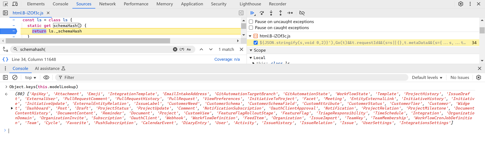

# A Reverse Study of Linear Sync Engine

> [!IMPORTANT]
> Check out the [SUMMARY](./SUMMARY.md)
> 
> My friends found this too long, so I wrote a summary highlighting the key points—making it a 10-minute read. If you're only interested in the main ideas or want to skip the implementation details, just read the summary.

I work on collaborative softwares, focusing on rich text editors and spreadsheets. **Collaboration engines**, also known as **data sync engines**, play a pivotal role in enhancing user experience in these softwares. They enable real-time, simultaneous edits on the same file while offering features like offline availability and file history. Typically, engineers use **[Operational Transformation (OT)](https://en.wikipedia.org/wiki/Operational_transformation)** or **[Conflict-free Replicated Data Types (CRDTs)](https://en.wikipedia.org/wiki/Conflict-free_replicated_data_type)** to build sync engines. While these technologies are effective for editors and spreadsheets, they may not be ideal for other types of applications. Here's why.

OT is widely adopted but notorious for its complexity. This complexity stems from the need to account for diverse data models and operation sets across different applications, which requires significant effort to implement correct operations and transformation functions. While OT excels at synchronizing edits, preserving user intent, and handling conflicts, its complexity often makes it overkill for simpler use cases—such as managing user information or file metadata—where a straightforward **last-writer-wins** approach might suffice.

CRDTs, on the other hand, appear more user-friendly. They offer built-in support for fundamental data structures (e.g., texts, lists, maps, counters), reducing the workload for developers. However, CRDTs often introduce metadata overhead and become challenging to manage in scenarios involving partial syncing or permission controls—such as when users can only access a subset of files. These issues arise because CRDTs are primarily designed for decentralized systems, while most modern applications still depend on centralized servers. Although I am personally an advocate of CRDTs, they often fall short for some use cases.

What I look for in a sync engine includes:

1. **Support for arbitrary data models**: Making it adaptable to a wide range of scenarios.
2. **Rich features**: It should support partial syncing, enforce permission control, and include features like undo/redo, offline availability, and edit history.
3. **Great developer experience**: Ideally, it should allow model definitions in an ORM-like manner. Developers should not need to be experts in sync engines to build collaborative applications.

[Linear](https://linear.app)'s Linear Sync Engine (LSE) provides an elegant solution to all the aforementioned requirements. Moreover, it offers an intuitive API that abstracts away the underlying complexity, making feature development significantly simpler. For instance, updating the title of an issue can be as straightforward as:

```jsx
issue.title = "New Title";
issue.save();
```

I believe LSE is exactly what I've been looking for, so I decided to reverse-engineer its frontend code to understand how it works. Additionally, I'm documenting my findings to help others who are interested as I am.

> [!NOTE]
> Good References
>
> This [gist](https://gist.github.com/pesterhazy/3e039677f2e314cb77ffe3497ebca07b#gistcomment-5184039) introduces some off-the-shelf solutions, such as ElectricSQL and ZeroSync (which, BTW, I am also very curious about), for general-purpose synchronization. You might want to check them out as well.

In this post, we will explore how LSE:

- Defines models, properties, and references.
- Uses **MobX** to make models observable.
- Performs **bootstrapping**.
- Builds and populates a local database (IndexedDB).
- Hydrates lazily-loaded data.
- Syncs clients with the server.
- Handles undo and redo.

To help you better understand how the Linear Sync Engine (LSE) works at the code level, I've uploaded a version of Linear's (uglified) code with detailed comments. These annotations provide additional insights that may not be covered in this post. Since the identifiers' names are obfuscated, I've done my best to infer their possible original names. At the end of the post, you'll also find a table mapping abbreviated terms to their full forms.

For the best experience, I recommend cloning the repository and viewing the code in your favorite editor. This allows you to refer to the code alongside the text for a more seamless reading experience. Personally, I suggest using VS Code because its TypeScript language service handles large files exceptionally well. Additionally, I'll include callouts at the beginning of each section to highlight relevant code snippets. You can easily jump to these by searching for symbols using the shortcut <kbd>Ctrl + Shift + O</kbd> (or <kbd>Meta + Shift + O</kbd> on macOS).


I am not affiliated with the Linear team, nor have I consulted them while writing this article. As a result, there may be inaccuracies or discrepancies with the actual implementation. However, I've made every effort—especially by watching relevant talks and comparing LSE to well-studied operational transformation (OT) approaches—to ensure that my description of the LSE approach is as accurate as possible. I hope it serves as a valuable reference for building a similar collaborative engine. If you spot any errors or misleading information, please submit an issue or a pull request to help me correct it. Your feedback is greatly appreciated!

That said, I may inevitably fall victim to the [curse of knowledge](https://en.wikipedia.org/wiki/Curse_of_knowledge). If anything is unclear, the fault is mine, and I'd be more than happy to provide further explanations. Feel free to open an issue, and I'll gladly add more details—or even diagrams—to make the article easier to understand.

With that out of the way, let's dive in!

## Introduction

If you haven't yet watched Tuomas' [two](https://www.youtube.com/watch?v=WxK11RsLqp4&t=2175s) [ talks](https://linear.app/blog/scaling-the-linear-sync-engine), a [podcast](https://www.devtools.fm/episode/61), and a [presentation at Local First Conf](https://www.youtube.com/watch?v=VLgmjzERT08) about LSE, I highly recommend exploring them out before proceeding. These resources provide valuable context. However, here are the core concepts behind LSE:


**Model**

Entities such as `Issue`, `Team`, `Organization`, and `Comment` are referred to as **models** in LSE. These models possess **properties** and **references** to other models, many of which are observable (via **MobX**) to automatically update views when changes occur. In essence, models and properties include **metadata** that dictate how they behave in LSE.

Models can be loaded from either the **local database** (IndexedDB) or the server. Some models supports **partially loading** and can be loaded on demand, either from the local database or by fetching additional data from the server. Once loaded, models are stored in an **Object Pool**, which serves as a large map for retrieving models by their **UUIDs**.

Models can be **hydrated** lazily, meaning its properties can be loaded only when accessed. This mechanism is particularly useful for improving performance by loading only the necessary data.

Operations—such as additions, deletions, updates, and archiving—on models, their properties, and references are encapsulated as **transactions**. These transactions are sent to the server, executed there, and then broadcast as **delta packets** to all connected clients. This ensures data consistency across multiple clients.

**Transaction**

Operations sent to the server are packaged as **transactions**. These transactions are intended to execute **exclusively** on the server and are designed to be **reversible** on the client in case of failure. If the client loses its connection to the server, transactions are temporarily **cached** in IndexedDB and automatically resent once the connection is reestablished.

Transactions are associated with a **sync id**, which is a monotonically increasing number that ensures the correct order of operations. This number is crucial for maintaining consistency across all clients.

Additionally, transactions play a key role in supporting **undo** and **redo** operations, enabling seamless changes and corrections in real-time collaborative workflows.

**Delta packets**

Once transactions are executed, the server broadcasts **delta packets** to all clients—including the client that initiated the transaction—to update the models. A delta packet contains several **sync action**s, and each action is associated with a **sync id** as well. This mechanism prevents clients from missing updates and helps identify any missing packets if discrepancies occur.

The **delta packets** may differ from the original transactions sent by the client, as the server might perform **side effects** during execution (e.g., generating history).

---

In the following chapters, we will explore these concepts in detail, along with the corresponding modules that manage them. We'll begin with the **"Model"**.

## Chapter 1: Defining Models and Metadata

First and foremost, we need to figure out how models are defined in LSE.

### `ModelRegistry`

> [!NOTE]
> Code References
>
> - `rr`: `ModelRegistry`

When Linear starts, it first generates metadata for models, including their properties, methods (actions), and computed values. To manage this metadata, LSE maintains a detailed dictionary called `ModelRegistry`.


> [!NOTE]
> Uglified Names
>
> The names in the screenshots (e.g., Xs) may differ from those in the GitHub source code (rr). Additionally, names may vary across different screenshots. This is completely normal, as Linear ships nearly every half hour!

`ModelRegistry` is a class with static members that store various types of metadata and provide methods for registering and retrieving this information. For example:

- **`modelLookup`**: Maps a model's name to its constructor.
- **`modelPropertyLookup`**: Stores metadata about a model's properties.
- **`modelReferencedPropertyLookup`**: Stores metadata about a model's references.
- etc.

We will discuss how some of this metadata is registered in this chapter, focusing particularly on models and their properties.

### Model

> [!NOTE]
> Code References
>
> - `We`: `ClientModel` decorator
> - `as`: `Model` base model class
> - `re` `Vs`: `Issue` model class
> - `rr.registerModel`: `ModelRegistry.registerModel`


LSE uses JavaScript's `class` keyword to define models, with all model classes extending the base `Model` class. This base class provides the following key properties and methods:

- **`id`**: A unique UUID assigned to each model, serving as the key for retrieving the model from the Object Pool.
- **`_mobx`**: An empty object required to make the model observable, as detailed in the "Observability" section.
- **`makeObservable`**: A method for enabling observability. By default, models are not observable upon construction, so this method must be invoked at the appropriate time.
- **`store`**: A reference to `SyncedStore`, which will be explored in depth in later chapters.
- **`propertyChanged`, `markPropertyChanged`, `changeSnapshot`**: Methods that track property changes and generate an `UpdateTransaction`.
- **etc.**: Additional important properties and methods will be discussed in subsequent chapters.

> [!NOTE]
> While writing this post, the Linear team updated how properties are stored. The `_mobx` object was removed, and each model now uses a `__data` property to store property values. This change affects the implementation of certain decorators and the hydration process. However, it does not impact our understanding of LSE, so I have not revised the related sections of this post.

Models' metadata includes:

1. **`loadStrategy`**: Defines how models are loaded into the client. There are five strategies:
   - **`instant`**: Models that are loaded during application bootstrapping (default strategy).
   - **`lazy`**: Models that do not load during bootstrapping but are fetched all at once when needed (e.g., `ExternalUser`).
   - **`partial`**: Models that are loaded on demand, meaning only a subset of instances is fetched from the server (e.g., `DocumentContent`).
   - **`explicitlyRequested`**: Models that are only loaded when explicitly requested (e.g., `DocumentContentHistory`).
   - **`local`**: Models that are stored exclusively in the local database. No models have been identified using this strategy.
2. **`partialLoadMode`**: Specifies how a model is hydrated, with three possible values: `full`, `regular`, and `lowPriority`.
3. **`usedForPartialIndexes`**: Relates to the functionality of partial indexing.
4. etc.



_When I started writing this post, there were 76 models in Linear. As I am about to finish, there are 80 models._

> [!NOTE]
> What is `local` used for?
>
> You might wonder what the `local` load strategy is used for, given that no models currently use it.
> In his presentation at Local First Conf, Tuomas explained how new features can be developed without modifying server-side code. My guess is that this is achieved by initially setting a new model's load strategy to `local`, ensuring it persists only in the local IndexedDB. Once the model is finalized, syncing can be enabled by changing its load strategy to one of the other available strategies.

LSE uses **TypeScript decorators** to register metadata in `ModelRegistry`. The decorator responsible for registering models' metadata is `ClientModel` (also known as `We`).

For example, consider the `Issue` model:

```tsx
re = Pe([We("Issue")], re);
```

The original source code may looks like this:

```typescript
@ClientModel("Issue")
class Issue extends Model {}
```

In the implementation of `ClientModel`:

1. The model's name and constructor function are registered in `ModelRegistry`'s `modelLookup`.
2. The model's name, schema version, and property names are combined into a **hash value**, which is registered in `ModelRegistry` and used to check the database schema. If the model's `loadStrategy` is `partial`, this information is also included in the hash.

You can refer to the source code for more details about how `ClientModel` works.

### Properties

> [!NOTE]
> Code References
>
> - `vn`: `PropertyTypeEnum` enumeration
> - `w`: `Property` decorator
> - `pe`: `Reference` decorator
> - `A4`: `registerReference` helper function
> - `rr.registerModel`: `ModelRegistry.registerModel`
> - `rr.registerProperty`: `ModelRegistry.registerProperty`

Models have properties that are implemented as JavaScript class properties. Each property is associated with property metadata, which includes key fields such as:

1. `type`: Specifies the property's type.
2. `lazy`: Specifies whether the property should be loaded only when the model is hydrated.
3. `serializer`: Defines how to serialize the property for data transfer or storage.
4. `indexed`: Determines whether the property should be indexed in the database. Used for references.
5. `nullable`: Specifies whether the property can be `null`, used for references.
6. etc.

`type` is an enumeration that includes the following values:

1. **`property`**: A property that is "owned" by the model. For example, `title` is a `property` of `Issue`.
2. **`ephemeralProperty`**: Similar to a `property`, but it is not persisted in the database. This type is rarely used. For example, `lastUserInteraction` is an ephemeral property of `User`.
3. **`reference`**: A property used when a model holds a reference to another model. Its value is typically the ID of the referenced model. A reference can be lazy-loaded, meaning the referenced model is not loaded until this property is accessed. For example, `subscription` is a `reference` of `Team`.
4. **`referenceModel`**: When `reference` properties are registered, a `referenceModel` property is also created. This property defines getters and setters to access the referenced model using the corresponding `reference`.
5. **`referenceCollection`**: Similar to `reference`, but it refers to an array of models. For example, `templates` is a `referenceCollection` of `Team`.
6. **`backReference`**: A `backReference` is the inverse of a `reference`. For example, `favorite` is a `backReference` of `Issue`. The key difference is that a `backReference` is considered "owned" by the referenced model. When the referenced model (B) is deleted, the `backReference` (A) is also deleted.
7. **`referenceArray`**: Used for many-to-many relationships. For example, `members` of `Project` is a `referenceArray` that references `Users`, allowing users to be members of multiple projects.

LSE uses a variety of decorators to register different types of properties. In this chapter, let's first look at three of them.

#### `Property` (`w`)

Let's take the `Issue` model as an example. `priority` and `title` are declared as properties of type `property` of `Issue`:

```tsx
Pe([w()], re.prototype, "title", void 0);
Pe(
  [
    w({
      serializer: P_,
    }),
  ],
  re.prototype,
  "priority",
  void 0
);
```

The original source code may look like this:

```tsx
@ClientModel("Issue")
class Issue extends Model {
  @Property()
  public title: string;

  @Property({ serializer: PrioritySerializer })
  public priority: Priority;
}
```

In the implementation of `Property`:

1. The property is made observable by calling `M1`, which will be covered in the [Observability](#observability-m1) section.
2. The property is registered in `ModelRegistry`.

Please refer to the source code for more details.

#### `Reference` (`pe`) and `OneToMany` (`Nt`)

For example, `assignee` is a `reference` of `Issue`, as each issue can be assigned to only one user. On the other hand, `assignedIssues` is a `LazyReferenceCollection` of `User`, as a user can have many assigned issues.

```tsx
Pe(
  [
    pe(() => K, "assignedIssues", {
      nullable: !0,
      indexed: !0,
    }),
  ],
  re.prototype,
  "assignee",
  void 0
);

st([Nt()], K.prototype, "assignedIssues", void 0);
```

The original source code may look like this:

```tsx
@ClientModel("Issue")
class Issue extends Model {
 @Reference(() => User, "assignedIssues", {
   nullable: true,
   indexed: true,
 })
 assignee: User | null;
}

@ClientModel("User")
class User extends Model {
  @OneToMany()
  assignedIssues: LazyReferenceCollection;

  constructor() {
    this.assignedIssues = new LazyReferenceCollection(Issue, this, "assigneeId", undefined, {
      canSkipNetworkHydration: () => this.canSkipNetworkHydration(Issue)
    }),
  }
}
```

In the implementation of the `Reference` decorator (more specifically, the `registerReference` function), two properties are actually registered: `assignee` and `assigneeId`.

They are of different types. `assignee` is of type `referenceModel`, while `assigneeId` is of type `reference`. The `assignee` property is not persisted in the database; only `assigneeId` is.

LSE uses a getter and setter to link `assigneeId` and `assignee`. When the `assignee` value is set, `assigneeId` is updated with the new value's `ID`. Similarly, when `assignee` is accessed, the corresponding record is fetched from the data store using the `ID`.

Additionally, `assigneeId` is made observable with `M1`.


_There are lots of `referenceModel` and `reference` pairs in the `ModelRegistry`._

### Schema Hash

`ModelRegistry` includes a special property called **`__schemaHash`**, which is a hash of all models' metadata and their properties' metadata. This hash is crucial for determining whether the local database requires migration, a topic covered in detail in a later chapter. I have already added comments in the source code explaining how it is calculated, so I won't repeat that here.

> [!NOTE]
> TypeScript Decorators
>
> When TypeScript transpiles decorators, it processes property decorators before model decorators. As a result, property decorators are executed first. By the time `ModelRegistry.registerModel` is called, all properties of that model have already been registered, and their metadata will also be included in the `__schemaHash`.

### Observability (`M1`)

> [!NOTE]
> Code References
>
> - `M1`: `observabilityHelper`

The `M1` function plays a critical role in making models and properties observable.

It uses `Object.defineProperty` to define a getter and setter for the property that needs to be observable. When a value is assigned to the property, the setter checks whether a MobX box needs to be created on `__mobx` and assigns the value to that box.

The same logic applies to the getter, which ensures that if the box exists, it retrieves the value from it. By wrapping React components with `observer`, MobX can track which components subscribe to the observables and automatically refresh them when the observable values change.

Additionally, when setting the value, the `propertyChanged` method is called to register the property change, along with the old and new values. This information will later be used to create an `UpdateTransaction`, which we'll discuss in a the third chapter.

Check the source code for more details.

### Takeaway of Chapter 1

Let's summarize the key points covered in this chapter:

- **Models and Properties in LSE**: Governed by metadata that defines their behavior.
- **Model Definition**: LSE defines models using JavaScript classes and utilizes decorators to register models, properties, and references in the `ModelRegistry`.
- **Load Strategies**: Models can be loaded using different strategies, including `instant`, `lazy`, `partial`, `explicitlyRequested`, and `local`.
- **Property Types**: LSE categorizes properties into several types, such as `property`, `reference`, `referenceModel`, `referenceCollection`, `backReference`, and `referenceArray`.
- **Reactive Data Handling**: LSE uses `Object.defineProperty` to implement getters and setters, enabling efficient reference handling and observability.

In the upcoming chapters, we'll explore how this metadata is leveraged in practice. Keep reading! 🚀

## Chapter 2: Bootstrapping & Lazy Loading

Once the models are defined, the next step is to **load them into the client**. In this chapter, we'll explore how LSE **bootstraps and lazily loads models**.

We'll start with a high-level overview to establish a foundational understanding before diving into more intricate details. Since this process involves multiple modules, I'll also provide brief introductions to each for better context.


1. `StoreManager` (`cce`) creates either a `PartialStore` (`jm`) or a `FullStore` (`TE`) for each model. These stores are responsible for synchronizing in-memory data with IndexedDB. Also, `SyncActionStore` (`oce`) will be created to store sync actions.
2. `Database` (`eg`) connects to IndexedDB and get databases and tables ready. If the databases don't exist, they will be created. And if a migration is needed, it will be performed.
3. `Database` determines the type of bootstrapping to be performed.
4. The appropriate bootstrapping is executed. For full bootstrapping, models are retrieved from the server.
5. The retrieved model data will be stored in IndexedDB.
6. Data requiring immediate hydration is loaded into memory, and observability is activated.
7. Build a connection to the server to receive delta packets.

There are three types of bootstrapping in LSE: **full bootstrapping**, **partial bootstrapping**, and **local bootstrapping**. In this post, I'll focus on providing a detailed explanation of **full bootstrapping**.

### Create `ObjectStore`s

> [!NOTE]
> Code References
>
> - `cce`: `StoreManager`
> - `p3`: `PartialStore`
> - `TE`: `FullStore`
>
> The bootstrapping process begins with `km.startBootstrap` (`SyncedStore.startBootstrap`). `StoreManager` is lazily created through the getter `eg.storeManager` (`Database.storeManager`).

The first step in the bootstrapping process is the construction of `StoreManager`. This module is responsible for creating and managing `ObjectStore` instances for each model registered in the `ModelRegistry`. Each `ObjectStore` handles the corresponding table for its model in IndexedDB.


_There are 80 kinds of models so there are 80 `ObjectStore` consequently._

As mentioned earlier, models have `loadStrategy` metadata, and LSE generates corresponding store types based on this field. Models with a `partial` load strategy are managed by `PartialObjectStore` (`p3`, `Jm`), while all other models use `FullObjectStore` (`TE`).

When an `ObjectStore` is created, it computes a hash for its associated model, which is used as the table's name in the database. For example, the `Issue` model has a `storeName` of `119b2a...`, corresponding to a table with the same hash.


Notably, for models with a `loadStrategy` of `partial`, an additional database named `<hash>_partial` will be created. This database stores indexes that facilitate lazy loading of these models. We will explore this mechanism in detail at the end of this chapter.


### Create Databases & Tables in IndexedDB

> [!NOTE] 
> Code References
>
> - `eg.open`: `Database.open`
> - `jn` or `Xn`: `DatabaseManager` - `databaseInfo`, `registerDatabase`, `database`
> - `cce.checkReadinessOfStores`: `StoreManager.checkReadinessOfStores`
> - `TE.checkIsReady`: `SyncStore.checkIsReady`

After `ObjectStore`s are constructed, the next step is to prepare the database—creating the databases and tables if they don't already exist in IndexedDB.

LSE maintains two types of databases in IndexedDB: `linear_databases` and others with names like `linear_(hash)`.

**`linear_databases`**: This database stores information about other databases. LSE creates a separate database for each logged-in user in a workspace. If the user is part of multiple workspaces, LSE creates a database for each logged-in workspace.


The database information includes:

1. **`name`**: The database's name. It is derived from the `userId`, `version`, and `userVersion`. As a result, different user identities lead to multiple databases.
2. **`schemaHash`**: Used for database migration. This corresponds to the `_schemaHash` property in `ModelRegistry`.
3. **`schemaVersion`**: An incremental counter that determines if a database migration is necessary. If the new `schemaHash` differs from the one stored in IndexedDB, the counter increments. The updated version is then passed as the second parameter to [`IndexedDB.open`](http://indexdb.open/) to check if migration is needed.

and so on. You can checkout how this information is calculated in `jn.databaseInfo`.

**`linear_(hash)`**: This database contains the data of a workspace. For example, `linear_b4782b3125a816b51a44e59f2e939efa` stores the data for my private workspace.

Inside these databases, there are tables for each model, as we discussed in the previous section. Additionally, it includes two special tables:

The first table is **`_meta`**, which holds persistence details for each model, as well as the database's metadata.


_Model persistence state._

Each model has a corresponding record in the `_meta` table. If the `persisted` field is set to `true`, it indicates that all instances of that model within the workspace have been loaded onto the client.


_Database's metadata_

The database's metadata fields includes:

1. `lastSyncId`.

---

**`lastSyncId`** is a critical concept in LSE, so allow me to introduce it here. You might find that it ties into concepts like transactions and delta packets, which we will explore in greater detail in the later chapters. It's perfectly fine if you don't fully grasp this part right now. Keep reading and refer back to this section after you've covered the upcoming chapters—everything will come together.

Linear is often regarded as a benchmark for [local-first software](https://www.inkandswitch.com/local-first/). Unlike most mainstream local-first applications that use CRDTs, Linear's collaboration model aligns more closely with OT, as it relies on a centralized server to establish the order of all transactions. Within the LSE framework, all transactions sent by clients follow a [total order](https://en.wikipedia.org/wiki/Total_order), whereas CRDTs typically require only a [partial order](https://en.wikipedia.org/wiki/Partially_ordered_set). This total order is represented by the `sync id`, which is an incremental integer. And `lastSyncId` is the latest `sync id` as you can tell from its name.

When a transaction is successfully executed by the server, the global **`lastSyncId`** increments by 1. This ID effectively serves as the **version number of the database**, ensuring that all changes are tracked in a sequential manner.


__Each changes in the database increments the `lastSyncId` by 1. And the `lastSyncId` is also associated with the transaction and the delta packet.__

The server includes the updated `lastSyncId` in its response to the client that initiated the transaction. Additionally, when the server broadcasts delta packets (which represent incremental changes) to all clients, these packets are also associated with the corresponding `lastSyncId`. This ensures that clients can synchronize their local state with the server using the latest database version.

The concept of `sync id` is similar to a **file revision number** in operational transformation (OT) algorithms. (For more details, you can check out my [detailed article on OT](https://wzhu.dev/posts/ot).) However, unlike a file revision number that typically applies to a single file, **`lastSyncId` spans the entire database**, regardless of which workspace the changes occur in.

This broader scope can be observed in practice: even if a single transaction happens in your workspace, the `lastSyncId` often increments significantly, indicating that it is tracking changes across all workspaces in the system.

Clients use the **`lastSyncId`** to determine whether they are synchronized with the server. By comparing their local `lastSyncId` with the `lastSyncId` provided by the server, clients can identify if they are missing any transactions:

- If the client's `lastSyncId` is **smaller** than the server's, it indicates that the client is out of sync and has not received some delta packets.
- The server frequently includes the `lastSyncId` in its responses to help clients stay updated.

The client's `lastSyncId` is initially set during the **full bootstrapping process**, where it retrieves the latest state of the database. As the client receives **delta packets** from the server, the `lastSyncId` is updated to reflect the new synchronized state.

Now back to other fields of database's metadata.

---

2. **`firstSyncId`**: Represents the `lastSyncId` value when the client performs a **full bootstrapping**. As we'll see later, this value is used to determine the starting point for incremental synchronization.
3. **`backendDatabaseVersion`**: Indicates the version of the backend database. The name is self-explanatory and is used to track compatibility between the client and server databases.
4. **`updatedAt`**: A timestamp indicating the last time the database or its metadata was updated. The name is straightforward.
5. **`subscribedSyncGroups`**.

---

This concept is crucial in LSE. While all workspaces share the same `lastSyncId` counter, you cannot access issues or receive delta packets from workspaces or teams to which you lack proper permissions. This restriction is enforced through an access control mechanism, with `subscribedSyncGroups` serving as the key component. The `subscribedSyncGroups` array contains UUIDs that represent your user ID, the teams you belong to, and predefined roles.

> [!NOTE]  
> Understanding how `SyncGroup` works was particularly challenging in earlier versions of LSE. However, the introduction of `userSyncGroup` and `teamSyncGroup` in recent updates by the Linear team has clarified its purpose. These changes reveal that a `SyncGroup` is essentially a collection of models linked to either a specific "User" or "Team."

> [!NOTE] Linear's Database Metadata Changes  
> In late 2024, Linear modified the database metadata fields. While this screenshot reflects the updated metadata, the source code excerpts were taken before the change. For example, `subscribedSyncGroups` is replaced by `userSyncGroups`. Since this update does not significantly impact the core concepts of how LSE works, I will omit these differences in this post.

---

The explanation above covered the `_meta` table. Now, let's discuss the second special table: **`_transaction`**. This table stores unsent transactions or those queued for server synchronization. We'll delve deeper into the details of transactions in the next chapter.


_Cached transactions_

Let's return to the bootstrapping process and explore how these two types of databases are created in IndexedDB. Please refer to `ng.initializeDatabase` (`SyncClient.initializeDatabase`) for source code and comments.

**Step 1: Retrieve Workspace Metadata**

The process begins by retrieving the metadata for the workspace being bootstrapped via the `Xn.databaseInfo` method. During this step, if the `linear_databases` database has not yet been created, it will be initialized. Once the metadata is successfully retrieved, it is stored in the `linear_databases` database using the `Xn.registerDatabase` method.

**Step 2: Create the Workspace-Specific Database**

Next, LSE prepares the workspace-specific database, such as `linear_b4782b3125a816b51a44e59f2e939efa`. It first establishes a connection to the database and evaluates whether it needs to be created or migrated. If creation or migration is required, the `StoreManager` invokes its `createStores` method (`this.storeManager.createStores(i, l)`) to initialize the necessary tables for the models.

At this stage, LSE also attempts to read the database's metadata. However, during a full bootstrapping process, no metadata is stored yet, so all fields are initialized to `0` or other default values.

**Step 3: Check Store Readiness**

The final stage involves verifying the readiness of each store. During the first load, as all tables are initially empty, so none of the stores will be ready.

At this point, LSE has prepared the databases and is ready to load data from the server. Let's dive deeper into how this process works.

### Determine the Bootstrapping Type

> [!NOTE]
> Code References
>
> - `ng.bootstrap`: `SyncClient.bootstrap`
> - `eg.requiredBootstrap`: `Database.requiredBootstrap`

The next step in the process is determining the bootstrapping type and executing it.

The `Database.requiredBootstrap` method identifies the appropriate bootstrapping type and supplies the necessary parameters for its execution. The method returns an object with the following fields:

1. **`type`**: The type of bootstrapping to perform.

---

There are three types of bootstrapping:

1. **`full`**: LSE retrieves all required models from the server.
2. **`local`**: Data is loaded from the local database, and the application synchronizes with the server using incremental deltas.
3. **`partial`**: A subset of models is loaded from the server, depending on the load strategy.

**LSE performs a full bootstrapping** in the following scenarios (excluding demo project logic for simplicity):

1. **No stores are ready**: Newly created tables, as discussed earlier, are still empty and unavailable.
2. **`lastSyncId` is undefined**: This indicates the database lacks a record of the last synchronization point.
3. **Models are outdated**: When the client is online, and some models are outdated, a full bootstrap refreshes all data.

This post will focus on the **full bootstrapping** process.

---

Additional fields in the `requiredBootstrap` 's return include:

2. **`modelsToLoad`**: Names of the models with a load strategy marked as either **instant** or **lazy**.
3. **`lastSyncId`**: Indicates the database snapshot the client is currently synchronized to. During full bootstrapping, this value is zero, as no data has yet been loaded from the server. In this case, the server will returns the latest snapshot.

### Bootstrapping the Database

> [!NOTE] 
> Code References
>
> 1. `ng.bootstrap`: `SyncClient.bootstrap`
> 2. `eg.bootstrap`: `Database.bootstrap`
> 3. `Xm.fullBootstrap`: `BootstrapHelper.fullBootstrap`
> 4. `sd.restModelsJsonStreamGen`: `GraphQLClient.restModelsJsonStreamGen`

When LSE initiates a full bootstrapping process, it sends a request through the `GraphQLClient.restModelsJsonStreamGen` method. This function is responsible for retrieving models from the server and will be referenced multiple times throughout the remainder of this article.

The request would look like this:

```
https://client-api.linear.app/sync/bootstrap?type=full&onlyModels=WorkflowState,IssueDraft,Initiative,ProjectMilestone,ProjectStatus,TextDraft,ProjectUpdate,IssueLabel,ExternalUser,CustomView,ViewPreferences,Roadmap,RoadmapToProject,Facet,Project,Document,Organization,Template,Team,Cycle,Favorite,CalendarEvent,User,Company,IssueImport,IssueRelation,TeamKey,UserSettings,PushSubscription,Activity,ApiKey,EmailIntakeAddress,Emoji,EntityExternalLink,GitAutomationTargetBranch,GitAutomationState,Integration,IntegrationsSettings,IntegrationTemplate,NotificationSubscription,OauthClientApproval,Notification,OauthClient,OrganizationDomain,OrganizationInvite,ProjectLink,ProjectUpdateInteraction,InitiativeToProject,Subscription,TeamMembership,TimeSchedule,TriageResponsibility,Webhook,WorkflowCronJobDefinition,WorkflowDefinition,ProjectRelation,DiaryEntry,Reminder
```

It has two parameters:

1. **`type`**: In our case, it is `"full"`.
2. **`onlyModels`**: A comma-separated list of the model names to be loaded. This corresponds to the `modelsToLoad` returned by `requiredBootstrap`.

> [!NOTE] Linear's bootstrapping requests had changed
> As part of an optimization rolled out in late 2024, the Linear team split this single request into multiple requests to improve cache performance and loading speed in large workspaces. This change does not affect how LSE operates, so I will omit the details here. For more information, open your browser's debug tools and search for `splitToCacheableRequests` in the source code.

And an example response would be like this:

```jsx
{"id":"8ce3d5fe-07c2-481c-bb68-cd22dd94e7de","createdAt":"2024-07-03T11:37:04.865Z","updatedAt":"2024-07-03T11:37:04.865Z","userId":"4e8622c7-0a24-412d-bf38-156e073ab384","issueId":"01a3c1cf-7dd5-4a13-b3ab-a9d064a3e31c","events":[{"type":"issue_deleted","issueId":"01a3c1cf-7dd5-4a13-b3ab-a9d064a3e31c","issueTitle":"Load data from remote sync engine."}],"__class":"Activity"}
{"id":"ec9ec347-4f90-465c-b8bc-e41dae4e11f2","createdAt":"2024-07-03T11:37:06.944Z","updatedAt":"2024-07-03T11:37:06.944Z","userId":"4e8622c7-0a24-412d-bf38-156e073ab384","issueId":"39946254-511c-4226-914f-d1669c9e5914","events":[{"type":"issue_deleted","issueId":"39946254-511c-4226-914f-d1669c9e5914","issueTitle":"Reverse engineering Linear's Sync Engine"}],"__class":"Activity"}
// ... many lines omitted here
_metadata_={"method":"mongo","lastSyncId":2326713666,"subscribedSyncGroups":["89388c30-9823-4b14-8140-4e0650fbb9eb","4e8622c7-0a24-412d-bf38-156e073ab384","AD619ACC-AAAA-4D84-AD23-61DDCA8319A0","CDA201A7-AAAA-45C5-888B-3CE8B747D26B"],"databaseVersion":948,"returnedModelsCount":{"Activity":6,"Cycle":2,"DocumentContent":5,"Favorite":1,"GitAutomationState":3,"Integration":1,"Issue":3,"IssueLabel":4,"NotificationSubscription":2,"Organization":1,"Project":2,"ProjectStatus":5,"Team":1,"TeamKey":1,"TeamMembership":1,"User":1,"UserSettings":1,"WorkflowState":7,"Initiative":1,"SyncAction":0}}
```

The response is a stream of JSON objects, with each line (except the last) representing the information of a model instance. For instance, here's an object describing an `Issue` model:

```json
{
  "id": "556c8983-ca05-41a8-baa6-60b6e5d771c8",
  "createdAt": "2024-01-22T01:02:41.099Z",
  "updatedAt": "2024-05-16T08:23:31.724Z",
  "number": 1,
  "title": "Welcome to Linear 👋", // Text encoding issue. Here's actually an emoji.
  "priority": 1,
  "boardOrder": 0,
  "sortOrder": -84.71, // LSE uses fractional indexing for sorting
  "startedAt": "2024-05-16T08:16:57.239Z",
  "labelIds": ["30889eaf-fac5-4d4d-8085-a4c3bd80e588"],
  "teamId": "89388c30-9823-4b14-8140-4e0650fbb9eb",
  "projectId": "3e7ada3c-f833-4b9c-b325-6db37285fa11",
  "projectMilestoneId": "397b95c4-3ee2-47b0-bad1-d6b1c7003616",
  "subscriberIds": ["4e8622c7-0a24-412d-bf38-156e073ab384"],
  "previousIdentifiers": [],
  "assigneeId": "4e8622c7-0a24-412d-bf38-156e073ab384",
  "stateId": "030a7891-2ba5-4f5b-9597-b750950cd866",
  "reactionData": [],
  "__class": "Issue"
}
```

The last line of the response contains metadata specific to this bootstrapping request. Certain fields within this metadata are used to update the corresponding fields in the database's metadata.

```json
{
  "method": "mongo",
  "lastSyncId": 2326713666,
  "subscribedSyncGroups": [
    "89388c30-9823-4b14-8140-4e0650fbb9eb",
    "4e8622c7-0a24-412d-bf38-156e073ab384",
    "AD619ACC-AAAA-4D84-AD23-61DDCA8319A0",
    "CDA201A7-AAAA-45C5-888B-3CE8B747D26B"
  ],
  "databaseVersion": 948,
  "returnedModelsCount": {
    "Activity": 6,
    "Cycle": 2,
    "DocumentContent": 5,
    "Favorite": 1,
    "GitAutomationState": 3,
    "Integration": 1,
    "Issue": 3,
    "IssueLabel": 4,
    "NotificationSubscription": 2,
    "Organization": 1,
    "Project": 2,
    "ProjectStatus": 5,
    "Team": 1,
    "TeamKey": 1,
    "TeamMembership": 1,
    "User": 1,
    "UserSettings": 1,
    "WorkflowState": 7,
    "Initiative": 1,
    "SyncAction": 0
  }
}
```

Key fields:

- **`method`**: Indicates the source of the result, which is `"mongo"`. This signifies that the data was retrieved from the MongoDB cache. Tuomas discussed this strategy in a talk about scaling Linear's sync engine.
- **`lastSyncId`**: Represents the snapshot the client is updated to after this bootstrapping request. For example, the snapshot ID is `2326713666`.
- **`subscribedSyncGroups`**: Specifies the sync groups the client should subscribe to for accessing relevant incremental changes.
- **`returnedModelsCount`**: Ensures request validity by verifying that the number of models in the response matches this count.

> [!NOTE] Linear's bootstrapping requests had changed
> In the aforementioned optimization, Linear moved `subscribedSyncGroups` from the response to a pre-request at `/sync/user_sync_groups`. In the `/sync/bootstrap` request, the sync groups are now included in the request parameters. So it can split bootstrapping requests.

Finally, the retrieved models are written to their respective object stores, and the database metadata is updated accordingly to reflect the changes.

### Hydration and Object Pool

> [!NOTE] 
> Code References
>
> 1. `ng.bootstrap`: `SyncClient.bootstrap`.
> 2. `eg.getAllInitialHydratedModelData`: `Database.getAllInitialHydratedModelData`.
> 3. `ng.addModelToLiveCollections`: `SyncClient.addModelToLiveCollections`.
> 4. `as.updateFromData`: `ClientModel.updateFromData`.
> 5. `as.updateReferencedModels`: `ClientModel.updateReferencedModels`.

With the raw models written into the `ObjectStore`s, the next step is to construct these models in memory and add them to the **Object Pool**, making them accessible to other parts of the application. This process is known as **model hydration**.

LSE initiates model hydration by calling `Database.getAllInitialHydratedModelData`. During this step, the `Database` loads models with a `loadStrategy` set to `instant`. For each of these models, LSE retrieves the constructors from the `ModelRegistry` and uses them to instantiate model objects. These objects are then added to the Object Pool via the `addModelToLiveCollections` method.

The Object Pool is implemented as a map called `modelLookup` on `SyncClient`. This map links a model's ID to its corresponding model object, enabling other parts of Linear to efficiently retrieve models by their IDs.

When constructing a model object, LSE does not pass the dehydrated model data directly to the constructor. Instead, it initializes the object first, then hydrates it by invoking the `updateFromData` method to populate the object with the data. Additionally, it calls `attachToReferencedProperties` to resolve and populate any references.

### Lazy Hydration

> [!note] 
> Code References
>
> - `as.hydrate`: `Model.hydrate`.
> - constructor of `Issue` (`re`)
> - `Et`: `LazyReferenceCollection`
>   - `hydrate`
>   - `getCoveringPartialIndexValues`
> - `Nt`: `LazyReferenceCollection`
> - `Ku`: `PartialIndexHelper`
>   - `resolveCoveringPartialIndexValues`
>   - `partialIndexInfoForModel`
>   - `processPartialIndexInfoForModel`

LSE does not load all data into memory during bootstrapping, regardless of the type. Instead, additional data is fetched via network requests or local database queries as the application is used. For example, when you view the details of an issue, LSE asynchronously loads the comments associated with that issue. This is called **lazy hydration**.

Classes with a `hydrate` method can be hydrated, such as `Model`, `LazyReferenceCollection`, `LazyReference`, `RequestCollection`, and `LazyBackReference`, among others.

Let's start by examining the `hydrate` method of the `Model`. It checks all of its properties that need hydration and calls their respective `hydrate` methods. There are four types of properties that require hydration:

1. `LazyReferenceCollection`
2. `LazyReference`
3. `Reference` and `ReferenceCollection`, which are set to be hydrated alongside the model.

We won't dive too deep into the hydration of `Reference` and `ReferenceCollection`, as they simply call the `hydrate` method of other `Model` instances recursively. Instead, let's focus on `LazyReferenceCollection` and `LazyReference`, as these are responsible for lazy hydration.

Now, let's discuss `LazyReferenceCollection`.

Earlier, when we discussed the definition of properties, we saw that `referenceCollection` is one of the seven types of properties. Now, let's dive deeper into this. The `OneToMany` (`Nt`) decorator is used for such properties. For instance, `comments` is a `LazyReferenceCollection` property of the `Issue` model. This decorator registers the property's metadata in the `ModelRegistry`.

```ts
Pe([Nt()], re.prototype, "comments", void 0);
```

Additionally, a `LazyReferenceCollection` instance is initialized for the property. For example, in the constructor of `Issue`:

```ts
this.comments = new Et(nt,this,"issueId"),
```

The source code would be something like this:

```js
@ClientModel()
class Issue extends BaseModel {
  @OneToMany()
  public comments = new LazyReferenceCollection(Comment, this, "issueId");
}
```

> [!NOTE] Changes of decorators used here
> After I began writing this post, the Linear team introduced a new approach that eliminates the need for developers to manually call the constructor of `LazyReferenceCollection`. In essence, they added more decorators similar to `OneToMany` that automatically construct `LazyReferenceCollection` with various options. Since this change doesn't affect how lazy hydration works, I'll omit it from this post for simplicity.

In the `hydrate` method of `LazyReferenceCollection`, the first to step is to call `this.getCoveringPartialIndexValues` to get partial index values. So what is a partial index?

---

> [!note] 
> Code References
>
> - `re.constructor`: `Issue.constructor`
> - `LazyReferenceCollectionImpl` (`Et`)
>   - `hydrate`
>   - `getCoveringPartialIndexValues`
> - `LazyReferenceCollection` (`Nt`)
> - `PartialIndexHelper` (`Ku`)
>   - `resolveCoveringPartialIndexValues`
>   - `partialIndexInfoForModel`
>   - `processPartialIndexInfoForModel`

**Partial Index** plays a crucial role in LSE by addressing a key question: **How should we determine which models need to be lazy-loaded?** In other words, when querying lazy-loaded models, what **parameters should the query use**? If we have the model IDs, the answer is straightforward. However, in cases where LSE needs to load assigned `Issues` for a `User`, it may not have the `Issue` IDs readily available.

Imagine you're designing Linear's database schema. To query `Issues` assigned to a `User`, you would include an `assigneeId` field and create an index on it. This concept is applied similarly in LSE's frontend code. When defining the `Issue` model, a reference to the `User` model is created, and LSE automatically generates an index for that field.

```typescript
Pe(
  [
    pe(() => K, "assignedIssues", {
      nullable: !0,
      indexed: !0,
    }),
  ],
  re.prototype,
  "assignee",
  void 0
);
```

The original source code may look like this:

```typescript
@ClientModel("Issue")
class Issue extends Model {
  @Reference(() => User, "assignee", {
    nullable: true,
    indexed: true,
  })
  public assignee: User | null;
}
```

And `User` model also references `Issue`:

```typescript
st([Nt()], K.prototype, "assignedIssues", void 0);

// In User's constructor:
this.assignedIssues = new Et(re,this,"assigneeId",void 0,{
  canSkipNetworkHydration: ()=>this.canSkipNetworkHydration(re)
}),
```

The original source code may look like this:

```typescript
@ClientModel("User")
class User extends Model {
  @OneToMany()
  public assignedIssues = new LazyReferenceCollection(
    Issue,
    this,
    "assigneeId",
    undefined,
    {
      canSkipNetworkHydration: () => this.canSkipNetworkHydration(Issue),
    }
  );
}
```

LSE can load `Issues` by the assignee's ID. In other words, the query parameter to fetch `Issues` could be `assigneeId-<id-of-the-assignee>`. Similarly, `Issues` can be loaded based on the `Team` they belong to or the `Project` they are associated with. To determine how a model can be referenced, LSE uses a `PartialIndexHelper` (`ku`) class. This class returns an array that describes how a model can be referenced by other models.


LSE takes this approach even further. As discussed in the previous section, `Issue` references `Comment`s, meaning `Comments` are indirectly referenced by `Team`. This allows for nested references to `Comment`s. For example, if you send a query with the parameter `issue.cycleId-<id-of-the-cycle>`, you can, theoretically, retrieve all comments for all issues associated with that cycle. In the method `Ku.processPartialIndexInfoForModel`, LSE calculates these nested references, supporting up to three levels of depth. The diagram below illustrates how models reference a `Comment`, either directly or indirectly.


Back to `getCoveringPartialIndexValues`. The partial indexes used to query a comment would look like `i` in the screenshot:


You can clearly see the relationship between the two images above. Essentially, LSE appends the ID of the referencing model to the end of each query parameter.

As we'll explore later, partial indexes are used to query models from the server, and also used to check whether the target model has already been fetched from the server.

> [!note]
> Code References
>
> - `ng.hydrateModelsByIndexedKey`: `SyncClient.hydrateModelsByIndexedKey`
> - `eg.getModelDataByIndexedKey`: `Database.getModelDataByIndexedKey`
> - `Jm`: `PartialStore`
>   - `getAllForIndexedKey`
>   - `hasModelsForPartialIndexValues`
>   - `getAllFromIndex`

After the partial indices are retrieved, the `hydrate` method of `LazyReferenceCollection` calls `SyncedStore.hydrateModels`, which in turn triggers `SyncClient.hydrateModelsByIndexedKey`.

Let's assume we're lazy-loading `Comment` objects for an `Issue`. The method parameters would be as follows:

1. `e`: The class of the `Comment` model.
2. `t`: The parameters for the query. The `key` indicates that we're loading `Comment` references by `Issue`, and `coveringPartialIndexValues` signifies that these `Comment` objects may also be indirectly referenced by other models. `value` is the ID of the `Issue` that references the `Comment`.


In this implementation, the `LazyReferenceCollection` (LSE) first checks if the models can be loaded from the local database by calling `Database.getModelDataByIndexedKey`. If not, it decides whether a **network hydration** is needed based on the following conditions:

1. **Missing `coveringPartialIndexValues`:** If the `coveringPartialIndexValues` parameter is absent, the LSE can't determine if the requested models were previously fetched from the server.
2. **Absent partial index in the store:** If the `coveringPartialIndexValues` are not found in the partial store, a network hydration shall be necessary.

Recall that when we discussed `ObjectStore`, we learned that for models with a `partial` load strategy, there exists a partial index store to track partial indices. This is the point at which the store comes into play. For example, if the `Comment` model's partial index store contains two records, it means the LSE has previously attempted to load `Comment` objects using those indices, confirming that the corresponding comments were fetched from the server at some point. We will discuss when these partial indices get updated later.


3. **`canSkipNetworkHydration` returns `true`:** If this option is set to `true`, LSE can skip the network hydration and proceed with loading the data locally.

If no network hydration is necessary, LSE will query the IndexedDB by calling `getAllFromIndex`. If a network hydration is required, it will schedule the request via `BatchModelLoader.addRequest`.

> [!NOTE]
> Code references
>
> - `BatchedRequest` (`PE`)
>   - `addRequest`
> - `BatchModelLoader` (`wm`)
>   - `handleBatch`
>   - `loadSyncBatch`
>   - `loadFullModels`
>   - `handleLoadedModels`
> - `Database` (`eg`)
>   - `setPartialIndexValueForModel`

`BatchModelLoader`, as the name suggests, batches multiple network hydration requests into a single GraphQL request. While we won't dive into the details of how LSE deduplicates requests in this article (you can refer to the code, where I've added comments for clarity), the focus here will be on how LSE handles the batching process.

In the `BatchModelLoader.handleBatch` method, Linear divides requests into three categories:

1. Requests associated with a partial index key.
2. Requests associated with a `SyncGroup`.
3. Requests that are neither associated with an `indexedKey` nor a `SyncGroup`.

LSE handles each category using different methods: `loadSyncBatch`, `loadPartialModels`, and `loadFullModels`.

In `loadSyncBatch`, it calls `GraphQLClient.resetModelsJsonStream` to send a request to `https://client-api.linear.app/sync/batch`. The request body will look like this:

```json
{
  "firstSyncId": 3528373991,
  "requests": [
    {
      "indexedKey": "issueId",
      "keyValue": "bda1a998-91b0-4ceb-8f89-91b7f6608685",
      "modelName": "Comment"
    },
    {
      "indexedKey": "issueId",
      "keyValue": "bda1a998-91b0-4ceb-8f89-91b7f6608685",
      "modelName": "IssueHistory"
    }
  ]
}
```

And the response will look like this:

```json
{"id":"9a4ea82f-bd0e-4a3d-a8f3-430ea570bbbb","createdAt":"2025-01-27T05:11:59.451Z","updatedAt":"2025-01-27T05:11:59.337Z","issueId":"bda1a998-91b0-4ceb-8f89-91b7f6608685","userId":"4e8622c7-0a24-412d-bf38-156e073ab384","bodyData":"{\"type\":\"doc\",\"content\":[{\"type\":\"paragraph\",\"content\":[{\"type\":\"text\",\"text\":\"Some comment.\"}]}]}","reactionData":[],"subscriberIds":["4e8622c7-0a24-412d-bf38-156e073ab384"],"__class":"Comment"}
{"id":"6168d074-cfc0-45ef-9a14-2e5162cbf3dd","createdAt":"2025-01-19T16:02:24.806Z","updatedAt":"2025-01-19T16:02:24.806Z","issueId":"bda1a998-91b0-4ceb-8f89-91b7f6608685","fromCycleId":"43714e70-c8a5-44f8-b2ce-3b8613397955","toCycleId":"8c74d891-d9f3-4b47-b4cc-79cf27d9f93c","__class":"IssueHistory"}
{"id":"c7726ecb-672f-4604-a0f5-f2bf1e420ba7","createdAt":"2025-01-06T11:49:21.638Z","updatedAt":"2025-01-06T11:49:21.638Z","issueId":"bda1a998-91b0-4ceb-8f89-91b7f6608685","actorId":"4e8622c7-0a24-412d-bf38-156e073ab384","fromPriority":3,"toPriority":1,"__class":"IssueHistory"}
{"id":"b68d9b8a-6fb4-45ab-944e-7b45a8c30673","createdAt":"2025-01-26T02:17:17.771Z","updatedAt":"2025-01-26T02:17:17.771Z","issueId":"bda1a998-91b0-4ceb-8f89-91b7f6608685","actorId":"4e8622c7-0a24-412d-bf38-156e073ab384","fromPriority":1,"toPriority":2,"__class":"IssueHistory"}
{"id":"4c8a41ec-b0b5-448e-a47d-34dfb11112d1","createdAt":"2024-12-30T07:34:42.354Z","updatedAt":"2024-12-30T08:08:27.668Z","issueId":"bda1a998-91b0-4ceb-8f89-91b7f6608685","actorId":"4e8622c7-0a24-412d-bf38-156e073ab384","fromPriority":0,"toPriority":3,"fromStateId":"dfbab132-44b7-47b9-a411-906426533033","toStateId":"7bd765d0-7fa4-40ed-9b62-ae963436682c","toCycleId":"398ba8c7-c523-43c8-b6c7-d748d0e171a4","addedLabelIds":["bd1ce6b0-b0d0-49c9-b4a3-f905674fe9ac"],"__class":"IssueHistory"}
{"id":"cd0833d4-d92e-40ef-a7d2-223d6c7b4592","createdAt":"2025-01-05T16:01:14.558Z","updatedAt":"2025-01-05T16:01:14.558Z","issueId":"bda1a998-91b0-4ceb-8f89-91b7f6608685","fromCycleId":"398ba8c7-c523-43c8-b6c7-d748d0e171a4","toCycleId":"43714e70-c8a5-44f8-b2ce-3b8613397955","__class":"IssueHistory"}
_metadata_={"returnedModelsCount":{"Comment":1,"IssueHistory":5}}
```

Does this response look familiar to you? Yes, it follows the same format used in full bootstrapping. Later, in handleLoadedModels, the response will be parsed, the models will be written to the database, and objects will be created in memory. Importantly, the partial index of the request will be **saved in the database**, so the next time LSE tries to hydrate the model, it will know that network hydration is unnecessary.

You might wonder: _Why is `firstSyncId` included in the `/sync/patch` request parameters, but not `lastSyncId`? After all, `lastSyncId` is used to determine if the client is up to date with the latest data. Won't these models be updated?_ The answer lies in how LSE handles incremental changes (delta packets), which I'll explain in Chapter 4. The basic idea is this: when a delta packet arrives, LSE checks which models are affected and haven't yet been loaded, and immediately loads those models. If lazy hydration completes after this process, LSE will not overwrite the existing models in memory. You can refer to `createModelsFromData` method for implementation details.

---

> [!NOTE]
> Code references
>
> - `BatchModelLoader` (`wm`)
>   - `handleBatch`
> - `Database` (`eg`)
>   - `loadPartialModels`

Under certain circumstances, `syncGroups` will be used as the query parameters instead of partial indexed keys. For example, a `Team` may have many associated `Issue`s, so it has an `issue` property of type `lazyReferenceCollection`. In this case, `customNetworkHydration` is used to define the query parameters for loading the `Issue`s of a `Team`.

```typescript
this.issues = new Et(re, this, "teamId", void 0, {
  customNetworkHydration: () => [
    {
      modelClass: re, // Issue model
      syncGroup: this.id,
    },
    {
      modelClass: mr, // Attachment model
      syncGroup: this.id,
    },
  ],
});
```

When LSE loads the `Issue`s of a `Team`, `loadPartialModels` calls `BootstrapHelper.partialBootstrap`, which sends a request like this:

```
https://client-api.linear.app/sync/bootstrap?type=partial&noSyncPackets=true&useCFCaching=true&noCache=true&firstSyncId=3577987809&syncGroups=aa788b7b-9b76-4caa-a439-36ca3b3d6820&onlyModels=Issue,Attachment&modelsHash=4f1dabd6151ad381a502c352b677d5c4
```

As you can see from the request parameters, `modelClass` is mapped to the `onlyModels` property, and `syncGroups` are also included in the request.

---

### Takeaway of Chapter 2

Let's sum up what we've learned in chapter 2:

- LSE creates two types of databases:
  - A `linear_databases` database to store information about other databases.
  - A `linear_database_<id>` database to store models, metadata, and transactions for a specific workspace.
- There are three bootstrapping types: full, partial, and local. We've discussed full bootstrapping in detail.
- The sync ID is the global version number of the database. It helps determine whether the client is up to date with the latest data.
- LSE can lazily hydrate models into memory, either from the server or the local database.

In the upcoming chapters, we'll explore how LSE synchronizes changes between clients and the server, starting with how local changes are sent to the server.

## Chapter 3: Transactions

In the previous chapter, we explored how LSE loads existing models from the server. Now, we'll shift our focus to how LSE synchronizes changes between clients and the server. Specifically, this chapter will examine how client-side changes are synced to the server.

Let's start with a fundamental question: **What happens when we change the assignee of an Issue?** How does LSE handle networking, offline caching, observability, and other underlying complexities—all in just two lines of code?

```jsx
issue.assignee = user;
issue.save();
```

In this chapter, I will use `UpdateTransaction` as an example. As before, let's start with a high-level overview of the process before diving into the details.


1. When a property is assigned a new value, the system records key information: the name of the changed property and its previous value. **Models in memory** are updated **immediately** to reflect these changes.
2. When `issue.save()` is called, an **`UpdateTransaction`** is created. This transaction captures the changes made to the model.
3. The generated `UpdateTransaction` is then added to a request queue. Simultaneously, it is saved in the `__transactions` table in IndexedDB for **caching**.
4. The `TransactionQueue` schedules timers (sometimes triggering them immediately) to send the queued transactions to the server in **batches**.
5. Once a batch is successfully processed by the backend, it is removed from the `__transactions` table in IndexedDB. The Local Storage Engine (LSE) then clears the cached batch.
6. Transactions will wait for delta packets containing the `lastSyncId` to complete before proceeding.

In addition to `UpdateTransaction`, there are four other types of transactions, and `TransactionQueue` provides corresponding methods to create them.

| Minimized name | Original name              | Description                                                                |
| -------------- | -------------------------- | -------------------------------------------------------------------------- |
| `M3` `Zo`      | `BaseTransaction`           | The base class for all transaction types.                                  |
| `Hu`           | `CreationTransaction`       | The transaction for adding a new model object.                              |
| `zu`           | `UpdatingTransaction`       | The transaction for updating properties of an existing model object.        |
| `g3`           | `DeletionTransaction`       | The transaction for deleting a model object (e.g., deleting a comment).     |
| `m3`           | `ArchivalTransaction`       | The transaction for archiving a model object (e.g., archiving an issue).    |
| `y3`           | `UnarchiveTransaction`      | The transaction for unarchiving a model object.                             |
| `Tc`           | `LocalTransaction`          | A simpler transaction wrapper for a model object that performs no actions. |

### Figuring out what has been changed

> [!note]  
> **Code References**
>
> - `M1`: The decorator used to add observability to LSE models.
> - `as.propertyChanged`: `ClientModel.propertyChanged`
> - `as.markPropertyChanged`: `ClientModel.markPropertyChanged`
> - `as.referencedPropertyChanged`: `ClientModel.referencedPropertyChanged`
> - `as.updateReferencedModel`: `ClientModel.updateReferencedModel`

As discussed in the [Observability](#observability-m1) section, LSE leverages the `M1` function to make model properties observable. Beyond enabling observability, `M1` also plays a critical role in transaction generation. Here's how it works:

When a property of a model is assigned a new value, the setter intercepts the assignment, triggering `propertyChanged`, which then calls `markPropertyChanged` with the **property's name**, the **old value**, and the **new value**. Next, `markPropertyChanged` serializes the old value and stores it in `modifiedProperties`. This serialized data will later be used to generate a transaction.


It's important to note that **before `save()` is called, the model in memory is already updated**. Transactions **do not** update in-memory models—this happens immediately when a property is changed. However, transactions do play a key role in **undo** and **redo** operations, as well as in updating in-memory models. We'll explore this in greater detail in **Chapter 5**.

### Generating an `UpdateTransaction`

> [!note]
> Code References
>
> - `as.save`: `ClientModel.save` and it calls `SyncedStore.save`
> - `sg.save`: `SyncedStore.save` and it calls `SyncClient.update`
> - `ng.update`: `SyncClient.update`
> - `uce.update`: `TransactionQueue.update`

In `SyncClient.update`, the `TransactionQueue.update` method is called to generate an `UpdateTransaction` instance. During the construction of the `UpdateTransaction`, the model's `changeSnapshot` function is invoked. Ultimately, an object is generated to represent the changes and is bound to the `changeSnapshot` property of the `UpdateTransaction`.


An `UpdateTransaction` has the following properties:

- **`type`**: The type of transaction.
- **`model`**: The in-memory model object this transaction is related to.
- **`batchIndex`**: Each transaction has a `batchIndex`. The `TransactionQueue` also has a `batchIndex` property, and when creating a transaction, this index is assigned. Transactions with the same `batchIndex` are grouped together and sent to the server in a single batch.

At the end of `TransactionQueue.update`, the `TransactionQueue.enqueueTransaction` method is called to add the transaction to the `createdTransactions` queue.

### Queueing transactions

> [!note]
> Code References
>
> - `uce`: `TransactionQueue`
>   - `enqueueTransaction`
>   - `commitCreatedTransactions`
>   - `dequeueNextTransactions`
>   - `dequeueTransaction`
> - `ww`: `MicrotaskScheduler`
> - `as.prepare`: `Model.prepare`
> - `as.updateMutation`: `Model.updateMutation`
> - `zu.graphQLMutation`: `UpdateTransaction.graphQLMutation`

Besides creating transaction instances, `TransactionQueue` is also responsible for managing transactions and sending them to the server. It uses four arrays to handle these transactions:


1. **`createdTransactions`**: After a transaction is created, it is initially placed in this array.

A **`commitCreatedTransactions`** scheduler moves all transactions from this array to the end of `queuedTransactions` and increments the `batchIndex` of `TransactionQueue` by 1. This scheduler operates as a microtask, which means that **transactions created within the same event loop will share the same `batchIndex`**.

When transactions are moved to `queuedTransactions`, they are also stored in the `__transactions` table. If the client closes before these transactions are sent to the server, it can reload them from this table and resend them.

2. **`queuedTransactions`**: These transactions are waiting to be executed.

A **`dequeueTransaction`** scheduler prepares transactions from this queue and moves them in batches to `executingTransactions`.

Several factors determine which transactions are moved to `executingTransactions` in a batch:

- **Transaction Limit:** If there are too many transactions in `queuedTransactions`, the scheduler will not move any to `executingTransactions` to avoid overwhelming the server with too many requests.
  
- **Batch Index & Independence:** Transactions must have the same `batchIndex` and should be **independent** of each other to be grouped in a batch.

Before executing, LSE calls the `prepare` method on each transaction. This method generates a GraphQL mutation query for the transaction. Each transaction object has a `graphQLMutation` function that generates these queries and binds them to the `graphQLMutationPrepared` property. For example, updating the assignee of an issue might generate a query like this:

```json
{
  "mutationText": "issueUpdate(id: \"a3dad63b-8302-4f1f-a874-a80e6d9ed418\", input: $issueUpdateInput) { lastSyncId }",
  "variables": {
    "issueUpdateInput": {
      "assigneeId": "4e8622c7-0a24-412d-bf38-156e073ab384"
    }
  },
  "variableTypes": {
    "issueUpdateInput": "IssueUpdateInput"
  }
}
```

- **GraphQL mutation size limit:** the `graphQLMutationPrepared` property is evaluated based on its size. If the accumulated size of the transactions at the beginning of `executingTransactions` exceeds a certain threshold, the scheduler will stop moving additional transactions to `executingTransactions`. This is done to prevent sending overly large GraphQL queries to the server.

Finally, the scheduler calls `executeTransactionBatch` to move the next batch of transactions from `queuedTransactions` to `executingTransactions`.

3. **`executingTransactions`**: These transactions have been sent to the server but have not yet been accepted or rejected. In the next section, we will discuss how these transactions are executed.

4. **`persistedTransactionsEnqueue`**: When the database is bootstrapped, transactions saved in the `__transactions` table are loaded into this array. After remote updates are processed, they are moved to `queuedTransactions` and wait to be executed. We will cover this in the final section of this chapter.

There is also a special array called **`completedButUnsyncedTransactions`**. I will explain how it works when we discuss **rebasing transactions** in Chapter 4.

### Executing transactions

> [!NOTE] 
> Code References
>
> - `uce.executeTransactionBatch`: `TransactionQueue.executeTransactionBatch`
> - `dce.execute`: `TransactionExecutor.execute`
> - `OE`: `WaitSyncQueue`

LSE creates a `TransactionExecutor` to execute a batch of transactions. In the `TransactionExecutor.execute` method, the `graphQLMutationPrepared` property of each transaction in the batch is merged into a single GraphQL mutation query and sent to the server. For example:

```json
{
  "query": "mutation IssueUpdate($issueUpdateInput: IssueUpdateInput!) { issueUpdate(id: \"a3dad63b-8302-4f1f-a874-a80e6d9ed418\", input: $issueUpdateInput) { lastSyncId } }",
  "variables": {
    "issueUpdateInput": {
      "assigneeId": "4e8622c7-0a24-412d-bf38-156e073ab384"
    }
  },
  "operationName": "IssueUpdate"
}
```

The response contains `lastSyncId` for each mutating query.

```json
{
  "data": {
    "issueUpdate": {
      "lastSyncId": 3273967562
    }
  }
}
```

This example might seem too simple because it only contains a single mutation query. Let's look at a more complex example, such as creating a new `Project`. In this case, you can see clearly how LSE handles multiple transactions within a batch. The request would look like this:

```json
{
  "query": "mutation ProjectCreate_DocumentContentCreate($projectCreateInput: ProjectCreateInput!, $documentContentCreateInput: DocumentContentCreateInput!) { o1:projectCreate(input: $projectCreateInput) { lastSyncId }, o2:documentContentCreate(input: $documentContentCreateInput) { lastSyncId } }",
  "variables": {
    "projectCreateInput": {
      "id": "940e248c-2226-4b0a-a14e-8a410ccfaaa7",
      "name": "New Project",
      "description": "",
      "color": "#bec2c8",
      "statusId": "fd3884d6-b740-41d9-919c-796119d6c5ed",
      "memberIds": [],
      "sortOrder": 1005.71,
      "prioritySortOrder": 0,
      "priority": 0,
      "teamIds": ["369af3b8-7d07-426f-aaad-773eccd97202"]
    },
    "documentContentCreateInput": {
      "id": "bb75174e-1e26-46ae-94b6-67977be435c3",
      "projectId": "940e248c-2226-4b0a-a14e-8a410ccfaaa7"
    }
  },
  "operationName": "ProjectCreate_DocumentContentCreate"
}
```

And the response would be like this:

```json
{
  "data": {
    "o1": {
      "lastSyncId": 0
    },
    "o2": {
      "lastSyncId": 3588467486
    }
  }
}
```

When the response is received, LSE removes the transactions from the `executingTransactions` queue, clears their cache from the `__transactions` table and calls `transactionCompleted` method of each transform to complete the transactions. The transaction's `syncInNeededForCompletion` property is set to the largest `lastSyncId` in the response, and the transaction will wait for the sync action with the matching `lastSyncId` to arrive at the client before it is considered complete. If the transaction cannot complete immediately, it is moved to the `completedButUnsyncedTransactions` queue. As discussed in the next chapter, this is crucial for performing **transaction rebasing**.

An important point to note is that, up until now, LSE has **not** modified model tables (e.g., the `Issue` table) in IndexedDB. This is because, in Linear, the local database is a subset of the server database (the SSOT), and it cannot contain changes that have not been approved by the server. If the server rejects the transaction, modifying the model tables prematurely could make it difficult and error-prone to revert the changes in the local database.

If the server rejects the mutation query, `transactionCompleted` is still called, but this time it will be invoked with an error. In response, the transaction will trigger its `rollback` method to undo any changes made on the client side and be removed from the `executingTransaction` queue.

### Persisted Transactions

> [!NOTE] 
> Code References
>
> - `eg.putTransaction`: `Database.putTransaction`
> - `ng.bootstrap`: `SyncClient.bootstrap`
> - `uce.loadPersistedTransactions`: `TransactionQueue.loadPersistedTransactions`
> - `uce.confirmPersistedTransactions`: `TransactionQueue.confirmPersistedTransactions`

In the previous chapters, we discussed that when transactions are moved to `queuedTransactions`, they are also stored in the `__transactions` table for caching purposes. During this process, the `serialize` method of transactions is called. Each type of transaction has its own implementation of this method.

When Linear starts again, cached transactions are loaded in `TransactionQueue.loadPersistedTransactions`, at which point they are deserialized. Similarly, each type of transaction also implements a static `fromSerializedData` method. This method **replays** the transaction and modifies the models in memory, effectively restoring the client's state after a restart.

Finally, during the bootstrap process, `TransactionQueue.confirmPersistedTransactions` is called to move these transactions to `createdTransactions`.

There is a small chance that this process could lead to unintended issues. For example, if the client sends a transaction to the server but the window closes before receiving a response, the transaction will be stored in the `__transactions` table. When the client restarts, the transaction will be reloaded and sent to the server again. Since some transactions are not idempotent, users may encounter errors like: "You can't delete a model that doesn't exist." While this is a rare occurrence and generally doesn't significantly affect the user experience, it's something to be aware of. (In OT systems, this could result in more serious issues, which is why transactions or operations usually include an incremental counter to ensure deduplication).

### Takeaway of Chapter 3

Let's sum up this chapter.

**Firstly, client-side operations will never directly modify the tables in the local database!** Instead, they only alter in-memory models, and the changes are sent as transactions to the server. As we will see in the next chapter, only after receiving the corresponding delta packages from the server does the local models get updated.

**Secondly, LSE uses a transaction queue to manage transactions.** The queue schedules transactions to be sent to the server in batches. This batching mechanism helps to reduce the number of requests sent to the server and improves efficiency.

**Lastly, LSE handles transactions in a robust manner.** It ensures that transactions are persisted in the local database and can be restored after a client restart. This approach guarantees that the client will never lose any changes, even if the client crashes or the network connection is lost.

## Chapter 4: Delta Packets

In this chapter, we will explore how LSE handles incremental updates and ensures that the client stays synchronized with the server.

Let's begin with an overview, similar to what we did in the previous chapters!

1. At the end of the bootstrapping process, after the persisted transactions are loaded, the client establishes a WebSocket connection to the server to receive incremental updates, or delta packets.
2. Handling delta packets involves several key tasks: updating models in memory and in the local database, rebasing transactions, and more.

### Establishing Connection

> [!NOTE] 
> Code References
>
> - `ng.startSyncing`: `SyncClient.startSyncing`
> - `ng.constructor`: `SyncClient.constructor`
> - `handshakeCallback` callback

The final phase of bootstrapping involves establishing a WebSocket connection to the server to receive incremental updates after loading persisted transactions from the local database. In the `handshakeCallback`, which is executed once the connection is established, the client compares the `lastSyncId` from the callback's parameters with the local lastSyncId to determine whether any incremental changes have been **missed**. If a discrepancy is found, the client requests the missing delta packets from the server and applies them accordingly.

The parameters of the callback would appear as follows:

```typescript
{
  "userSyncGroups": {
    "all": [
      "89388c30-9823-4b14-8140-4e0650fbb9eb",
      "094f76cf-b0c1-4f6c-9908-1801a6654f05",
      "4e8622c7-0a24-412d-bf38-156e073ab384",
      "E7E6104E-AAAA-42BC-9B8B-B91FCDD9946B",
      "AD619ACC-AAAA-4D84-AD23-61DDCA8319A0",
      "CDA201A7-AAAA-45C5-888B-3CE8B747D26B",
      "B0B41C7E-AAAA-4C7D-A93D-CD9565DA4358"
    ],
    "optimized": [
      "4e8622c7-0a24-412d-bf38-156e073ab384",
      "E7E6104E-AAAA-42BC-9B8B-B91FCDD9946B",
      "AD619ACC-AAAA-4D84-AD23-61DDCA8319A0",
      "CDA201A7-AAAA-45C5-888B-3CE8B747D26B",
      "B0B41C7E-AAAA-4C7D-A93D-CD9565DA4358"
    ]
  },
  "lastSyncId": 3529152751,
  "lastSequentialSyncId": 3529152751,
  "databaseVersion": 1179
}
```

Additionally, the `SyncClient` module listens to the `SyncMessage` channel on the WebSocket connection, which emits delta packets. Upon receiving these packets, it invokes the `applyDelta` method to process and apply the updates.

### Applying Deltas

> [!NOTE]
> Code References
>
> - `ng.applyDelta`: `SyncClient.applyDelta`
> - `ng.constructor`: `SyncClient.constructor`
> - `oce.addSyncPacket`: `SyncActionStore.addSyncPacket`
> - `zu.supportedPacket`: `DependentsLoader.supportedPacket`
> - `uce.modelUpserted`: `TransactionQueue.modelUpserted`

After a client sends a GraphQL mutation to the server, the server executes the query and generates a set of delta packets, which are then broadcast to all connected clients, **including the client that initiated the mutation**. Each delta packet contains the changes, or **sync actions**, that occurred on the server. For example, if the assignee of an `Issue` is changed, the client will receive delta packets like the following:

```jsx
[
  {
    id: 2361610825,
    modelName: "Issue",
    modelId: "a8e26eed-7ad4-43c6-a505-cc6a42b98117",
    action: "U",
    data: {
      id: "a8e26eed-7ad4-43c6-a505-cc6a42b98117",
      title: "Connect to Slack",
      number: 3,
      teamId: "369af3b8-7d07-426f-aaad-773eccd97202",
      stateId: "28d78a58-9fc1-4bf1-b1a3-8887bdbebca4",
      labelIds: [],
      priority: 3,
      createdAt: "2024-05-29T03:08:15.383Z",
      sortOrder: -12246.37,
      updatedAt: "2024-07-13T06:25:40.612Z",
      assigneeId: "e86b9ddf-819e-4e77-8323-55dd488cb17c",
      boardOrder: 0,
      reactionData: [],
      subscriberIds: ["e86b9ddf-819e-4e77-8323-55dd488cb17c"],
      prioritySortOrder: -12246.37,
      previousIdentifiers: [],
    },
    __class: "SyncAction",
  },
  {
    id: 2361610826,
    modelName: "IssueHistory",
    modelId: "ac1c69bb-a37e-4148-9a35-94413dde172d",
    action: "I",
    data: {
      id: "ac1c69bb-a37e-4148-9a35-94413dde172d",
      actorId: "e86b9ddf-819e-4e77-8323-55dd488cb17c",
      issueId: "a8e26eed-7ad4-43c6-a505-cc6a42b98117",
      createdAt: "2024-07-13T06:25:40.581Z",
      updatedAt: "2024-07-13T06:25:40.581Z",
      toAssigneeId: "e86b9ddf-819e-4e77-8323-55dd488cb17c",
    },
    __class: "SyncAction",
  },
  {
    id: 2361610854,
    modelName: "Activity",
    modelId: "1321dc17-cceb-4708-8485-2406d7efdfc5",
    action: "I",
    data: {
      id: "1321dc17-cceb-4708-8485-2406d7efdfc5",
      events: [
        {
          type: "issue_updated",
          issueId: "a8e26eed-7ad4-43c6-a505-cc6a42b98117",
          issueTitle: "Connect to Slack",
          changedColumns: ["subscriberIds", "assigneeId"],
        },
      ],
      userId: "e86b9ddf-819e-4e77-8323-55dd488cb17c",
      issueId: "a8e26eed-7ad4-43c6-a505-cc6a42b98117",
      createdAt: "2024-07-13T06:25:41.924Z",
      updatedAt: "2024-07-13T06:25:41.924Z",
    },
    __class: "SyncAction",
  },
];
```

As shown in the example above, each action includes an integer `id` field, which corresponds to the sync ID associated with the sync action. (Note that the `id` of the third sync action is 28 greater than the `id` of the second sync action, indicating that the `lastSyncId` is tied to the entire database, not just the workspace.)

Each action also has an `action` type. The possible types are as follows:

1. `I` - Insertion
2. `U` - Update
3. `A` - Archiving
4. `D` - Deletion
5. `C` - Covering
6. `G` - Changing sync groups
7. `S` - Changing sync groups (though the distinction from `G` remains unclear)
8. `V` - Unarchiving

The `ng.applyDelta` method is responsible for handling these sync actions. It performs the following tasks (refer to the source for implementation details):

Here's a refined version of your points:

1. Determine whether the user is added to or removed from sync groups. If the user is added to a sync group, LSE triggers a network request (essentially a partial bootstrapping) to fetch models associated with that sync group. LSE will wait for the response before continuing to process the sync actions.

2. Load dependencies of specific actions.

---

> [!NOTE]  
> **Code References**
> - `ng.applyDelta`: `SyncClient.applyDelta`
> - `Zu.supportedPacket`: `DependentsLoader.supportedPacket`

The next step is to load references for certain models involved in the sync actions. For instance, if the child issues of an `Issue` are modified, LSE needs to load these child issues. Why? The answer lies in the `DependentsLoader.supportedPacket`. This method identifies which sync actions require loading of dependent models.

The sync actions must meet the following conditions to be loaded:

- They should **not** be of type "I", "A", or "D".
- The model they manipulate must be either an `Issue` or a `Project`, and it must be used for partial indexes, which applies to both `Issue` and `Project`.
- The action type should be "V", or its associated model should have references that have changed, with LSE already storing the partial index keys of these changed references. (This is a bit tricky. I will do my best to explain it, but the most effective way to understand this is by reviewing the source code.)

First, LSE retrieves the **transient partial indexed keys** of the model. These are the Cartesian product of the model's partial indexes and its dependencies. For example, `Issue` has transient partial indexed keys like this:


These keys represent the Cartesian product of its 9 partial indexes and 17 dependencies.

Next, LSE checks whether any references in the model have changed. If they have, it will generate a new partial index value for the updated references.

Finally, LSE checks if the new partial index value is already stored in the local database. If so, it means the dependents of the model need to be updated because the partial index value now points to a new dependent model.

---

3. Write data for the new sync groups and their dependents into the local database.

4. Loop through all sync actions and resolve them to update the local database.

In this step, LSE calls `TransactionQueue.modelUpserted` to remove local `CreationTransaction`s that are no longer valid after the sync actions. If the `CreationTransaction`'s UUID matches the model's ID, the transaction is canceled. This step ensures that UUID conflicts are avoided, as the UUID is generated on the client side. Additionally, if a user leaves a sync group, the models associated with that group are also removed.

As mentioned in the previous chapter, LSE will not modify the local database until the server confirms the changes.

5. Loop through all sync actions again to update in-memory data.

---

In this step, LSE loops through the sync actions twice.

The first loop prepares models to perform the sync actions:

- For actions of type "I", "V", or "U", LSE creates corresponding model instances.
- For actions of type "A", LSE updates the models' properties.

Next, LSE attaches references to the newly created models. However, before doing so, LSE checks if the newly created model has been deleted by a sync action in the same delta packet, in order to avoid unnecessary operations. It does this by comparing the `syncId`s of the action that created the model and the action that deletes it. If the `syncId` of the deleting action is larger, the model will not be created.

The second loop handles sync actions one by one.

For actions of type "I", "V", "U", and "C", LSE will **rebase** `UpdateTransactions` onto them.

> [!NOTE]  
> **Code References**
> - `ng.applyDelta`: `SyncClient.applyDelta`
> - `uce.rebaseTransactions`: `SyncActionStore.addSyncPacket`
> - `zu.rebase`: `UpdateTransaction.rebase`

When applying a sync action, conflicts can arise with local transactions. For example, imagine your colleague changes the assignee to Alice, while you simultaneously change the assignee to Bob. The server processes your colleague's update first, so, according to the "last-writer-wins" principle, the assignee on the server ends up as Bob.

Here's what happens on your client: you create an `UpdateTransaction` to change the assignee, but before the transaction is executed by the server, your client receives a delta packet that updates the assignee to Alice. At this point, LSE needs to perform a rebasing. Following the "last-writer-wins" principle, the in-memory model must be reverted to Bob.

This rebasing occurs in the `rebaseTransactions` method, where all `UpdateTransaction` objects in the queue call the `rebase` method. The `original` value of each transaction is updated to reflect the value from the delta packet (in this case, Alice), and the in-memory model is reset to Bob. It is similar to Operational Transformation (OT).

Remember the `completedButUnsyncedTransactions` queue we discussed in the previous chapter? During rebasing, LSE checks if any transactions in this queue have a `syncIdNeededForCompletion` smaller than or equal to the `lastSyncId` of the delta packet. If so, these transactions are removed from the `completedButUnsyncedTransactions` queue.

---

6. Update `lastSyncId` on the client, and update `firstSyncId` if sync groups change.

7. Resolve completed transactions waiting for the `lastSyncId`.

After receiving the delta packets, the client checks if any transactions are waiting for the `lastSyncId` of those packets. If such transactions exist, they will be resolved, as shown here:

```typescript
this.syncWaitQueue.progressQueue(this.lastSyncId); 
```

It's important to note that LSE performs all the above steps inside a `updateLock.runExclusive` callback. This ensures that LSE waits for a delta packet to be fully processed before processing the next one, maintaining consistency between the client's state and the server's.

### Takeaway of Chapter 4

Here's an optimized version of your chapter summary for improved clarity and structure:

**LSE uses delta packets to keep the client synchronized with the server.** When a client sends a mutation to the server, the server processes the mutation and generates delta packets. These packets are broadcast to all connected clients, containing the changes that occurred on the server. The client then applies these changes to its in-memory models.

Looking closer at the `UpdateTransaction` and the corresponding delta packets, we see that the delta packets carry more data than the transaction itself—specifically, an `IssueHistory` of the assignee change. Unlike Operational Transformation (OT), where the server primarily handles operation transformations, validates permissions, and executes operations to maintain a single source of truth, LSE's backend involves additional business logic alongside these tasks.

In contrast to OT, which only sends an acknowledgment to the mutator, **LSE sends all modified model properties to all connected clients, even if the client making the modification is not the mutator.** This approach simplifies the management of WebSocket connections.

Finally, LSE employs a simple **Last-Writer-Wins** strategy to resolve conflicts, specifically addressing conflicts in `UpdateTransaction` only.

## Chapter 5: Misc

### Undo & Redo

Undos and redos in LSE are transaction-based. Each transaction type includes a specific `undoTransaction` method, which performs the undo logic and returns another transaction for redo purposes. For example, the `undoTransaction` method of an `UpdateTransaction` reverts the model's property to its previous value and returns another `UpdateTransaction` to the `UndoQueue`. It's important to note that when a transaction executes its undo logic, a new transaction is created and added to the `queuedTransactions` to ensure proper synchronization.

But how does the `UndoManager` determine which transactions should be appended to the undo/redo stack? The answer lies in Linear's UI logic, which identifies the differences:

```jsx
n.title !== d &&
  o.undoQueue.addOperation(
    s.jsxs(s.Fragment, {
      children: [
        "update title of issue ",
        s.jsx(Le, {
          model: n,
        }),
      ],
    }),
    () => {
      (n.title = d), n.save();
    }
  );
```

When an edit is made, the UI calls `UndoQueue.addOperation`, allowing the `UndoQueue` to subscribe to the next `transactionQueuedSignal` and create an undo item. This signal is emitted when transactions are added to `queuedTransactions`. The subscription ends once the callback finishes execution, at which point `save()` is called, and any transactions created in `save()` are pushed to the undo/redo stack. 

However, when an undo operation is performed, although the signal is triggered, no additional undo item is created, because `UndoQueue` is not actively listening during that time.

When performing an undo, the `undoTransaction` method returns the corresponding transaction for redo purposes.

## Conclusion

I'm so glad we've come this far in our journey exploring the Linear Sync Engine! In this post, we've covered a wide range of topics:

1. **Model Definition**: LSE uses decorators to define models, properties, and references. The metadata for these models is stored in the `ModelRegistry` class and is widely utilized across LSE.
2. **Observability**: LSE leverages MobX to make models observable, enabling it to track changes to models and properties and generate transactions accordingly. Decorators are used to add observability.
3. **Bootstrapping**: LSE supports three types of bootstrapping, and we've gone into detail on full bootstrapping.
4. **Lazy Loading**: LSE hydrates lazily-loaded data as needed. We explored how partial indexes and sync groups are used to manage this process.
5. **Syncing**: LSE uses transactions to synchronize clients with the server. We've discussed how transactions are generated, queued, and sent to the server, as well as how LSE handles cache, rebasing, conflict resolution, and more.
6. **Undo and Redo**: LSE supports undo and redo operations based on transactions.

I hope you now have a clearer understanding of how the Linear Sync Engine operates. While I've tried to cover as much as possible, there are still some topics left to explore. If you're interested in diving deeper, here are some recommendations for further reading:

1. **Other Transaction Types**: We've looked at `UpdateTransaction`, but LSE also supports other types such as `CreateTransaction`, `DeleteTransaction`, and `ArchiveTransaction`. How do these work, and how do metadata fields like `onDelete` and `onArchive` affect transactions?
2. **Other Bootstrapping Types**: We focused on full bootstrapping, but LSE also supports partial bootstrapping and local bootstrapping. How do these differ from full bootstrapping, and when are they used?

I highly encourage you to share your thoughts, questions, and findings in the Issues. I look forward to hearing from you!

## Appendix A: Actions and Computed Values

Actions (`rt`) & Computed (`O`)

Let's take `moveToTeam` and `parents` of `Issue` for example, there is `Action` decorator and `Computed` decorator.

```jsx
Pe([rt], re.prototype, "moveToTeam", null);
Pe([O], re.prototype, "parents", null);
```

And the original code is like this:

```typescript
@ClientModel("Issue")
class Issue {
  @Action
  moveToTeam() {
    // implementation
  }

  @Computed
  get parents() {
    // implementation
  }
}
```

**Action** and **computed** are core MobX primitives. During bootstrapping, these properties are made observable by directly calling MobX's `makeObservable` API.

## Credit

Thanks to Tuomas Artman for generously sharing insights into how LSE works in talks and podcasts.

Special thanks to @zxch3n, @vincentdchan, and @promer94 for their valuable reviews.
