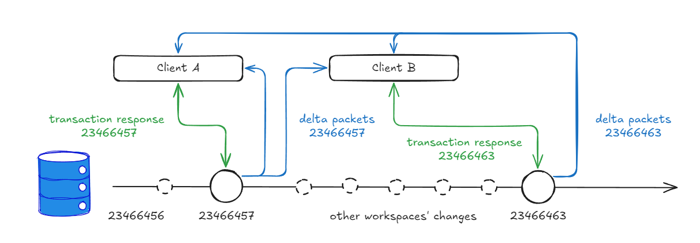
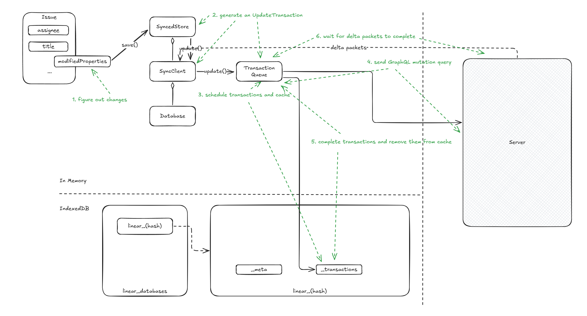

# A Reverse Study of Linear Sync Engine

> [!WARNING]
> WORK IN A PROGRESS

I work on collaborative softwares, focusing on rich text editors and spreadsheets. **Collaboration engines**, also known as **data sync engines**, play a pivotal role in enhancing user experience in these softwares. They enable real-time, simultaneous edits on the same file while offering features like offline availability and file history. Typically, engineers use **[Operational Transformation (OT)](https://en.wikipedia.org/wiki/Operational_transformation)** or **[Conflict-free Replicated Data Types (CRDTs)](https://en.wikipedia.org/wiki/Conflict-free_replicated_data_type)** to build sync engines. While these technologies are effective for editors and spreadsheets, they may not be ideal for other types of applications. Here's why.

OT is widely adopted but notorious for its complexity. This complexity stems from the need to account for diverse data models and operation sets across different applications, which requires significant effort to implement correct operations and transformation functions. While OT excels at synchronizing edits, preserving user intent, and handling conflicts, its complexity often makes it overkill for simpler use cases—such as managing user information or file metadata—where a straightforward **last-writer-wins** approach might suffice.

CRDTs, on the other hand, appear more user-friendly. They offer built-in support for fundamental data structures (e.g., texts, lists, maps, counters), reducing the workload for developers. However, CRDTs often introduce metadata overhead and become challenging to manage in scenarios involving partial syncing or permission controls—such as when users can only access a subset of files. These issues arise because CRDTs are primarily designed for decentralized systems, while most modern applications still depend on centralized servers. Although I am personally an advocate of CRDTs, they often fall short for some use cases.

What I look for in a sync engine includes:

1. **Support for arbitrary data models**: Making it adaptable to a wide range of scenarios.
2. **Rich features**: It should support partial syncing, enforce permission control, and include features like undo/redo, offline availability, and edit history.
3. **Great developer experience**: Ideally, it should allow model definitions in an ORM-like manner. Developers should not need to be experts in sync engines to build collaborative applications.

[Linear](https://linear.app)'s [Linear Sync Engine (LSE)](https://linear.app/docs/offline-mode) provides an elegant solution to all the aforementioned requirements. Moreover, it offers an intuitive API that abstracts away the underlying complexity, making feature development significantly simpler. For instance, updating the title of an issue can be as straightforward as:

```jsx
issue.title = "New Title";
issue.save();
```

I believe LSE is exactly what I've been looking for, so I decided to reverse-engineer its frontend code to understand how it works. Additionally, I'm documenting my findings to help others who are interested as I am.

> [!INFO]
> Good References
>
> This [gist](https://gist.github.com/pesterhazy/3e039677f2e314cb77ffe3497ebca07b#gistcomment-5184039) introduces some off-the-shelf solutions, such as ElectricSQL and ZeroSync (which, BTW, I am also very curious about), for general-purpose synchronization. You might want to check them out as well.

In this post, we will explore how LSE:

- Defines models, properties, and references.
- Uses **MobX** to make models observable.
- Performs **bootstrapping**.
- Builds and populates a local database (IndexedDB).
- Hydrates lazily-loaded data.
- Syncs clients with the server.
- Handles undo and redo.

To help you better understand how the Linear Sync Engine (LSE) works at the code level, I've uploaded a version of Linear's (uglified) code with detailed comments. These annotations provide additional insights that may not be covered in this post. Since the identifiers' names are obfuscated, I've done my best to infer their possible original names. At the end of the post, you'll also find a table mapping abbreviated terms to their full forms.

For the best experience, I recommend cloning the repository and viewing the code in your favorite editor. This allows you to refer to the code alongside the text for a more seamless reading experience. Personally, I suggest using VS Code because its TypeScript language service handles large files exceptionally well. Additionally, I'll include callouts at the beginning of each section to highlight relevant code snippets. You can easily jump to these by searching for symbols using the shortcut <kbd>Ctrl + Shift + O</kbd> (or <kbd>Meta + Shift + O</kbd> on macOS).


I am not affiliated with the Linear team, nor have I consulted them while writing this article. As a result, there may be inaccuracies or discrepancies with the actual implementation. However, I've made every effort—especially by watching relevant talks and comparing LSE to well-studied operational transformation (OT) approaches—to ensure that my description of the LSE approach is as accurate as possible. I hope it serves as a valuable reference for building a similar collaborative engine. If you spot any errors or misleading information, please submit an issue or a pull request to help me correct it. Your feedback is greatly appreciated!

That said, I may inevitably fall victim to the [curse of knowledge](https://en.wikipedia.org/wiki/Curse_of_knowledge). If anything is unclear, the fault is mine, and I'd be more than happy to provide further explanations. Feel free to open an issue, and I'll gladly add more details—or even diagrams—to make the article easier to understand.

With that out of the way, let's dive in!

## Introduction

If you haven't yet watched Tuomas' [two](https://www.youtube.com/watch?v=WxK11RsLqp4&t=2175s) [ talks](https://linear.app/blog/scaling-the-linear-sync-engine), a [podcast](https://www.devtools.fm/episode/61), and a [presentation at Local First Conf](https://www.youtube.com/watch?v=VLgmjzERT08) about LSE, I highly recommend exploring them out before proceeding. These resources provide valuable context. However, here are the core concepts behind LSE:


**Model**

Entities such as `Issue`, `Team`, `Organization`, and `Comment` are referred to as **models** in LSE. These models possess **properties** and **references** to other models, many of which are observable (via **MobX**) to automatically update views when changes occur. In essence, models and properties include **metadata** that dictate how they behave in LSE.

Models can be loaded from either the **local database** (IndexedDB) or the server. Some models supports **partially loading** and can be loaded on demand, either from the local database or by fetching additional data from the server. Once loaded, models are stored in an **Object Pool**, which serves as a large map for retrieving models by their **UUIDs**.

Models can be **hydrated** lazily, meaning its properties can be loaded only when accessed. This mechanism is particularly useful for improving performance by loading only the necessary data.

Operations—such as additions, deletions, updates, and archiving—on models, their properties, and references are encapsulated as **transactions**. These transactions are sent to the server, executed there, and then broadcast as **delta packets** to all connected clients. This ensures data consistency across multiple clients.

**Transaction**

Operations sent to the server are packaged as **transactions**. These transactions are intended to execute **exclusively** on the server and are designed to be **reversible** on the client in case of failure. If the client loses its connection to the server, transactions are temporarily **cached** in IndexedDB and automatically resent once the connection is reestablished.

Transactions are associated with a **sync id**, which is a monotonically increasing number that ensures the correct order of operations. This number is crucial for maintaining consistency across all clients.

Additionally, transactions play a key role in supporting **undo** and **redo** operations, enabling seamless changes and corrections in real-time collaborative workflows.

**Delta packets**

Once transactions are executed, the server broadcasts **delta packets** to all clients—including the client that initiated the transaction—to update the models. A delta packet contains several **sync action**s, and each action is associated with a **sync id** as well. This mechanism prevents clients from missing updates and helps identify any missing packets if discrepancies occur.

The **delta packets** may differ from the original transactions sent by the client, as the server might perform **side effects** during execution (e.g., generating history).

---

In the following chapters, we will explore these concepts in detail, along with the corresponding modules that manage them. We'll begin with the **"Model"**.

## Chapter 1: Defining Models and Metadata

First and foremost, we need to figure out how models are defined in LSE.

### `ModelRegistry`

> [!NOTE]
> Code References
>
> - `rr`: `ModelRegistry`

When Linear starts, it first generates metadata for models, including their properties, methods (actions), and computed values. To manage this metadata, LSE maintains a detailed dictionary called `ModelRegistry`.


> [!INFO]
> Uglified Names
>
> The names in the screenshots (e.g., Xs) may differ from those in the GitHub source code (rr). Additionally, names may vary across different screenshots. This is completely normal, as Linear ships nearly every half hour!

`ModelRegistry` is a class with static members that store various types of metadata and provide methods for registering and retrieving this information. For example:

- **`modelLookup`**: Maps a model's name to its constructor.
- **`modelPropertyLookup`**: Stores metadata about a model's properties.
- **`modelReferencedPropertyLookup`**: Stores metadata about a model's references.
- etc.

We will discuss how some of this metadata is registered in this chapter, focusing particularly on models and their properties.

### Model

> [!NOTE]
> Code References
>
> - `We`: `ClientModel` decorator
> - `as`: `Model` base model class
> - `re` `Vs`: `Issue` model class
> - `rr.registerModel`: `ModelRegistry.registerModel`


LSE uses JavaScript's `class` keyword to define models, with all model classes extending the base `Model` class. This base class provides the following key properties and methods:

- **`id`**: A unique UUID assigned to each model, serving as the key for retrieving the model from the Object Pool.
- **`_mobx`**: An empty object required to make the model observable, as detailed in the "Observability" section.
- **`makeObservable`**: A method for enabling observability. By default, models are not observable upon construction, so this method must be invoked at the appropriate time.
- **`store`**: A reference to `SyncedStore`, which will be explored in depth in later chapters.
- **`propertyChanged`, `markPropertyChanged`, `changeSnapshot`**: Methods that track property changes and generate an `UpdateTransaction`.
- **etc.**: Additional important properties and methods will be discussed in subsequent chapters.

> [!NOTE]
> While writing this post, the Linear team updated how properties are stored. The `_mobx` object was removed, and each model now uses a `__data` property to store property values. This change affects the implementation of certain decorators and the hydration process. However, it does not impact our understanding of LSE, so I have not revised the related sections of this post.

Models' metadata includes:

1. **`loadStrategy`**: Defines how models are loaded into the client. There are five strategies:
   - **`instant`**: Models that are loaded during application bootstrapping (default strategy).
   - **`lazy`**: Models that do not load during bootstrapping but are fetched all at once when needed (e.g., `ExternalUser`).
   - **`partial`**: Models that are loaded on demand, meaning only a subset of instances is fetched from the server (e.g., `DocumentContent`).
   - **`explicitlyRequested`**: Models that are only loaded when explicitly requested (e.g., `DocumentContentHistory`).
   - **`local`**: Models that are stored exclusively in the local database. No models have been identified using this strategy.
2. **`partialLoadMode`**: Specifies how a model is hydrated, with three possible values: `full`, `regular`, and `lowPriority`.
3. **`usedForPartialIndexes`**: Relates to the functionality of partial indexing.


_When I started writing this post, there were 76 models in Linear. As I am about to finish, there are 80 models._

> [!NOTE]
> What is `local` used for?
>
> You might wonder what the `local` load strategy is used for, given that no models currently use it.
> In his presentation at Local First Conf, Tuomas explained how new features can be developed without modifying server-side code. My guess is that this is achieved by initially setting a new model’s load strategy to `local`, ensuring it persists only in the local IndexedDB. Once the model is finalized, syncing can be enabled by changing its load strategy to one of the other available strategies.

LSE uses **TypeScript decorators** to register metadata in `ModelRegistry`. The decorator responsible for registering models' metadata is `ClientModel` (also known as `We`).

For example, consider the `Issue` model:

```tsx
re = Pe([We("Issue")], re);
```

The original source code may looks like this:

```typescript
@ClientModel("Issue")
class Issue extends Model {}
```

In the implementation of `ClientModel`:

1. The model's name and constructor function are registered in `ModelRegistry`'s `modelLookup`.
2. The model's name, schema version, and property names are combined into a **hash value**, which is registered in `ModelRegistry` and used to check the database schema. If the model's `loadStrategy` is `partial`, this information is also included in the hash.

You can refer to the source code for more details about how `ClientModel` works.

### Properties

> [!NOTE]
> Code References
>
> - `vn`: `PropertyTypeEnum` enumeration
> - `w`: `Property` decorator
> - `pe`: `Reference` decorator
> - `A4`: `registerReference` helper function
> - `rr.registerModel`: `ModelRegistry.registerModel`
> - `rr.registerProperty`: `ModelRegistry.registerProperty`

Models have properties that are implemented as JavaScript class properties. Each property is associated with property metadata, which includes key fields such as:

1. `type`: Specifies the property's type.
2. `lazy`: Specifies whether the property should be loaded only when the model is hydrated.
3. `serializer`: Defines how to serialize the property for data transfer or storage.
4. `indexed`: Determines whether the property should be indexed in the database. Used for references.
5. `nullable`: Specifies whether the property can be `null`, used for references.
6. etc.

`type` is an enumeration that includes the following values:

1. **`property`**: A property that is "owned" by the model. For example, `title` is a `property` of `Issue`.
2. **`ephemeralProperty`**: Similar to a `property`, but it is not persisted in the database. This type is rarely used. For example, `lastUserInteraction` is an ephemeral property of `User`.
3. **`reference`**: A property used when a model holds a reference to another model. Its value is typically the ID of the referenced model. A reference can be lazy-loaded, meaning the referenced model is not loaded until this property is accessed. For example, `subscription` is a `reference` of `Team`.
4. **`referenceModel`**: When `reference` properties are registered, a `referenceModel` property is also created. This property defines getters and setters to access the referenced model using the corresponding `reference`.
5. **`referenceCollection`**: Similar to `reference`, but it refers to an array of models. For example, `templates` is a `referenceCollection` of `Team`.
6. **`backReference`**: A `backReference` is the inverse of a `reference`. For example, `favorite` is a `backReference` of `Issue`. The key difference is that a `backReference` is considered "owned" by the referenced model. When the referenced model (B) is deleted, the `backReference` (A) is also deleted.
7. **`referenceArray`**: Used for many-to-many relationships. For example, `members` of `Project` is a `referenceArray` that references `Users`, allowing users to be members of multiple projects.

LSE uses a variety of decorators to register different types of properties. In this chapter, let's first look at three of them.

#### `Property` (`w`)

Let's take the `Issue` model as an example. `priority` and `title` are declared as properties of type `property` of `Issue`:

```tsx
Pe([w()], re.prototype, "title", void 0);
Pe(
  [
    w({
      serializer: P_,
    }),
  ],
  re.prototype,
  "priority",
  void 0
);
```

The original source code may look like this:

```tsx
@ClientModel("Issue")
class Issue extends Model {
  @Property()
  public title: string;

  @Property({ serializer: PrioritySerializer })
  public priority: Priority;
}
```

In the implementation of `Property`:

1. The property is made observable by calling `M1`, which will be covered in the [Observability](#observability-m1) section.
2. The property is registered in `ModelRegistry`.

Please refer to the source code for more details.

#### `Reference` (`pe`) and `OneToMany` (`Nt`)

For example, `assignee` is a `reference` of `Issue`, as each issue can be assigned to only one user. On the other hand, `assignedIssues` is a `LazyReferenceCollection` of `User`, as a user can have many assigned issues.

```tsx
Pe(
  [
    pe(() => K, "assignedIssues", {
      nullable: !0,
      indexed: !0,
    }),
  ],
  re.prototype,
  "assignee",
  void 0
);

st([Nt()], K.prototype, "assignedIssues", void 0);
```

The original source code may look like this:

```tsx
@ClientModel("Issue")
class Issue extends Model {
 @Reference(() => User, "assignedIssues", {
   nullable: true,
   indexed: true,
 })
 assignee: User | null;
}

@ClientModel("User")
class User extends Model {
  @OneToMany()
  assignedIssues: LazyReferenceCollection;

  constructor() {
    this.assignedIssues = new LazyReferenceCollection(Issue, this, "assigneeId", undefined, {
      canSkipNetworkHydration: () => this.canSkipNetworkHydration(Issue)
    }),
  }
}
```

In the implementation of the `Reference` decorator (more specifically, the `registerReference` function), two properties are actually registered: `assignee` and `assigneeId`.

They are of different types. `assignee` is of type `referenceModel`, while `assigneeId` is of type `reference`. The `assignee` property is not persisted in the database; only `assigneeId` is.

LSE uses a getter and setter to link `assigneeId` and `assignee`. When the `assignee` value is set, `assigneeId` is updated with the new value's `ID`. Similarly, when `assignee` is accessed, the corresponding record is fetched from the data store using the `ID`.

Additionally, `assigneeId` is made observable with `M1`.


_There are lots of `referenceModel` and `reference` pairs in the `ModelRegistry`._

### Schema Hash

`ModelRegistry` includes a special property called **`__schemaHash`**, which is a hash of all models' metadata and their properties' metadata. This hash is crucial for determining whether the local database requires migration, a topic covered in detail in a later chapter. I have already added comments in the source code explaining how it is calculated, so I won't repeat that here.

> [!INFO]
> TypeScript Decorators
>
> When TypeScript transpiles decorators, it processes property decorators before model decorators. As a result, property decorators are executed first. By the time `ModelRegistry.registerModel` is called, all properties of that model have already been registered, and their metadata will also be included in the `__schemaHash`.

### Observability (`M1`)

> [!NOTE]
> Code References
>
> - `M1`: `observabilityHelper`

The `M1` function plays a critical role in making models and properties observable.

It uses `Object.defineProperty` to define a getter and setter for the property that needs to be observable. When a value is assigned to the property, the setter checks whether a MobX box needs to be created on `__mobx` and assigns the value to that box.

The same logic applies to the getter, which ensures that if the box exists, it retrieves the value from it. By wrapping React components with `observer`, MobX can track which components subscribe to the observables and automatically refresh them when the observable values change.

Additionally, when setting the value, the `propertyChanged` method is called to register the property change, along with the old and new values. This information will later be used to create an `UpdateTransaction`, which we'll discuss in a the third chapter.

Check the source code for more details.

### Takeaway of Chapter 1

Let's summarize the key points covered in this chapter:

- **Models and Properties in LSE**: Governed by metadata that defines their behavior.
- **Model Definition**: LSE defines models using JavaScript classes and utilizes decorators to register models, properties, and references in the `ModelRegistry`.
- **Load Strategies**: Models can be loaded using different strategies, including `instant`, `lazy`, `partial`, `explicitlyRequested`, and `local`.
- **Property Types**: LSE categorizes properties into several types, such as `property`, `reference`, `referenceModel`, `referenceCollection`, `backReference`, and `referenceArray`.
- **Reactive Data Handling**: LSE uses `Object.defineProperty` to implement getters and setters, enabling efficient reference handling and observability.

In the upcoming chapters, we’ll explore how this metadata is leveraged in practice. Keep reading! 🚀

## Chapter 2: Bootstrapping & Lazy Loading

Once the models are defined, the next step is to **load them into the client**. In this chapter, we'll explore how LSE **bootstraps and lazily loads models**.

We’ll start with a high-level overview to establish a foundational understanding before diving into more intricate details. Since this process involves multiple modules, I’ll also provide brief introductions to each for better context.


1. `StoreManager` (`cce`) creates either a `PartialStore` (`jm`) or a `FullStore` (`TE`) for each model. These stores are responsible for synchronizing in-memory data with IndexedDB. Also, `SyncActionStore` (`oce`) will be created to store sync actions.
2. `Database` (`eg`) connects to IndexedDB and get databases and tables ready. If the databases don't exist, they will be created. And if a migration is needed, it will be performed.
3. `Database` determines the type of bootstrapping to be performed.
4. The appropriate bootstrapping is executed. For full bootstrapping, models are retrieved from the server.
5. The retrieved model data will be stored in IndexedDB.
6. Data requiring immediate hydration is loaded into memory, and observability is activated.
7. Build a connection to the server to receive delta packets.

There are three types of bootstrapping in LSE: **full bootstrapping**, **partial bootstrapping**, and **local bootstrapping**. In this post, I'll focus on providing a detailed explanation of **full bootstrapping**.

### Create `ObjectStore`s

> [!NOTE]
> Code References
>
> - `cce`: `StoreManager`
> - `p3`: `PartialStore`
> - `TE`: `FullStore`
>
> The bootstrapping process begins with `km.startBootstrap` (`SyncedStore.startBootstrap`). `StoreManager` is lazily created through the getter `eg.storeManager` (`Database.storeManager`).

The first step in the bootstrapping process is the construction of `StoreManager`. This module is responsible for creating and managing `ObjectStore` instances for each model registered in the `ModelRegistry`. Each `ObjectStore` handles the corresponding table for its model in IndexedDB.


_There are 80 kinds of models so there are 80 `ObjectStore` consequently._

As mentioned earlier, models have `loadStrategy` metadata, and LSE generates corresponding store types based on this field. Models with a `partial` load strategy are managed by `PartialObjectStore` (`p3`, `Jm`), while all other models use `FullObjectStore` (`TE`).

When an `ObjectStore` is created, it computes a hash for its associated model, which is used as the table's name in the database. For example, the `Issue` model has a `storeName` of `119b2a...`, corresponding to a table with the same hash.


Notably, for models with a `loadStrategy` of `partial`, an additional database named `<hash>_partial` will be created. This database stores indexes that facilitate lazy loading of these models. We will explore this mechanism in detail at the end of this chapter.


### Create Databases & Tables in IndexedDB

> [!NOTE] Code References
>
> - `eg.open`: `Database.open`
> - `jn` or `Xn`: `DatabaseManager` - `databaseInfo`, `registerDatabase`, `database`
> - `cce.checkReadinessOfStores`: `StoreManager.checkReadinessOfStores`
> - `TE.checkIsReady`: `SyncStore.checkIsReady`

After `ObjectStore`s are constructed, the next step is to prepare the database—creating the databases and tables if they don't already exist in IndexedDB.

LSE maintains two types of databases in IndexedDB: `linear_databases` and others with names like `linear_(hash)`.

**`linear_databases`**: This database stores information about other databases. LSE creates a separate database for each logged-in user in a workspace. If the user is part of multiple workspaces, LSE creates a database for each logged-in workspace.


The database information includes:

1. **`name`**: The database's name. It is derived from the `userId`, `version`, and `userVersion`. As a result, different user identities lead to multiple databases.
2. **`schemaHash`**: Used for database migration. This corresponds to the `_schemaHash` property in `ModelRegistry`.
3. **`schemaVersion`**: An incremental counter that determines if a database migration is necessary. If the new `schemaHash` differs from the one stored in IndexedDB, the counter increments. The updated version is then passed as the second parameter to [`IndexedDB.open`](http://indexdb.open/) to check if migration is needed.

and so on. You can checkout how this information is calculated in `jn.databaseInfo`.

**`linear_(hash)`**: This database contains the data of a workspace. For example, `linear_b4782b3125a816b51a44e59f2e939efa` stores the data for my private workspace.

Inside these databases, there are tables for each model, as we discussed in the previous section. Additionally, it includes two special tables:

The first table is **`_meta`**, which holds persistence details for each model, as well as the database's metadata.


_Model persistence state._

Each model has a corresponding record in the `_meta` table. If the `persisted` field is set to `true`, it indicates that all instances of that model within the workspace have been loaded onto the client.


_Database's metadata_

The database's metadata fields includes:

1. `lastSyncId`.

---

**`lastSyncId`** is a critical concept in LSE, so allow me to introduce it here. You might find that it ties into concepts like transactions and delta packets, which we will explore in greater detail in the later chapters. It's perfectly fine if you don't fully grasp this part right now. Keep reading and refer back to this section after you've covered the upcoming chapters—everything will come together.

Linear is often regarded as a benchmark for [local-first software](https://www.inkandswitch.com/local-first/). Unlike most mainstream local-first applications that use CRDTs, Linear's collaboration model aligns more closely with OT, as it relies on a centralized server to establish the order of all transactions. Within the LSE framework, all transactions sent by clients follow a [total order](https://en.wikipedia.org/wiki/Total_order), whereas CRDTs typically require only a [partial order](https://en.wikipedia.org/wiki/Partially_ordered_set). This total order is represented by the `lastSyncId`.

When a transaction is successfully executed by the server, the global **`lastSyncId`** increments by 1. This ID effectively serves as the **version number of the database**, ensuring that all changes are tracked in a sequential manner.

The server includes the updated `lastSyncId` in its response to the client that initiated the transaction. Additionally, when the server broadcasts delta packets (which represent incremental changes) to all clients, these packets are also associated with the corresponding `lastSyncId`. This ensures that clients can synchronize their local state with the server using the latest database version.



The concept of **`lastSyncId`** is similar to a **file revision number** in operational transformation (OT) algorithms. (For more details, you can check out my [detailed article on OT](https://wzhu.dev/posts/ot).) However, unlike a file revision number that typically applies to a single file, **`lastSyncId` spans the entire database**, regardless of which workspace the changes occur in.

This broader scope can be observed in practice: even if a single transaction happens in your workspace, the `lastSyncId` often increments significantly, indicating that it is tracking changes across all workspaces in the system.

Clients use the **`lastSyncId`** to determine whether they are synchronized with the server. By comparing their local `lastSyncId` with the `lastSyncId` provided by the server, clients can identify if they are missing any transactions:

- If the client's `lastSyncId` is **smaller** than the server's, it indicates that the client is out of sync and has not received some delta packets.
- The server frequently includes the `lastSyncId` in its responses to help clients stay updated.

The client's `lastSyncId` is initially set during the **full bootstrapping process**, where it retrieves the latest state of the database. As the client receives **delta packets** from the server, the `lastSyncId` is updated to reflect the new synchronized state.

Now back to other fields of database's metadata.

---

2. **`firstSyncId`**: Represents the `lastSyncId` value when the client performs a **full bootstrapping**. This marks the starting point for the client's synchronization with the server.
3. **`backendDatabaseVersion`**: Indicates the version of the backend database. The name is self-explanatory and is used to track compatibility between the client and server databases.
4. **`updatedAt`**: A timestamp indicating the last time the database or its metadata was updated. The name is straightforward.
5. **`subscribedSyncGroups`**.

---

This concept is crucial in LSE. While all workspaces share the same `lastSyncId` counter, you cannot access issues or receive delta packets from workspaces or teams to which you lack proper permissions. This restriction is enforced through an access control mechanism, with `subscribedSyncGroups` serving as the key component. The `subscribedSyncGroups` array contains UUIDs that represent your user ID, the teams you belong to, and predefined roles.

> [!NOTE]  
> Understanding how `SyncGroup` works was particularly challenging in earlier versions of LSE. However, the introduction of `userSyncGroup` and `teamSyncGroup` in recent updates by the Linear team has clarified its purpose. These changes reveal that a `SyncGroup` is essentially a collection of models linked to either a specific "User" or "Team."

> [!NOTE] Linear's Database Metadata Changes  
> In late 2024, Linear modified the database metadata fields. While this screenshot reflects the updated metadata, the source code excerpts were taken before the change. For example, `subscribedSyncGroups` is replaced by `userSyncGroups`. Since this update does not significantly impact the core concepts of how LSE works, I will omit these differences in this post.

---

The explanation above covered the `_meta` table. Now, let's discuss the second special table: **`_transaction`**. This table stores unsent transactions or those queued for server synchronization. We'll delve deeper into the details of transactions in the next chapter.


_Cached transactions_

Let's return to the bootstrapping process and explore how these two types of databases are created in IndexedDB. Please refer to `ng.initializeDatabase` (`SyncClient.initializeDatabase`) for source code and comments.

**Step 1: Retrieve Workspace Metadata**

The process begins by retrieving the metadata for the workspace being bootstrapped via the `Xn.databaseInfo` method. During this step, if the `linear_databases` database has not yet been created, it will be initialized. Once the metadata is successfully retrieved, it is stored in the `linear_databases` database using the `Xn.registerDatabase` method.

**Step 2: Create the Workspace-Specific Database**

Next, LSE prepares the workspace-specific database, such as `linear_b4782b3125a816b51a44e59f2e939efa`. It first establishes a connection to the database and evaluates whether it needs to be created or migrated. If creation or migration is required, the `StoreManager` invokes its `createStores` method (`this.storeManager.createStores(i, l)`) to initialize the necessary tables for the models.

At this stage, LSE also attempts to read the database's metadata. However, during a full bootstrapping process, no metadata is stored yet, so all fields are initialized to `0` or other default values.

**Step 3: Check Store Readiness**

The final stage involves verifying the readiness of each store. During the first load, as all tables are initially empty, so none of the stores will be ready.

At this point, LSE has prepared the databases and is ready to load data from the server. Let's dive deeper into how this process works.

### Determine the Bootstrapping Type

> [!NOTE] Code References
>
> - `ng.bootstrap`: `SyncClient.bootstrap`
> - `eg.requiredBootstrap`: `Database.requiredBootstrap`

The next step in the process is determining the bootstrapping type and executing it.

The `Database.requiredBootstrap` method identifies the appropriate bootstrapping type and supplies the necessary parameters for its execution. The method returns an object with the following fields:

1. **`type`**: The type of bootstrapping to perform.

---

There are three types of bootstrapping:

1. **`full`**: LSE retrieves all required models from the server.
2. **`local`**: Data is loaded from the local database, and the application synchronizes with the server using incremental deltas.
3. **`partial`**: A subset of models is loaded from the server, depending on the load strategy.

**LSE performs a full bootstrapping** in the following scenarios (excluding demo project logic for simplicity):

1. **No stores are ready**: Newly created tables, as discussed earlier, are still empty and unavailable.
2. **`lastSyncId` is undefined**: This indicates the database lacks a record of the last synchronization point.
3. **Models are outdated**: When the client is online, and some models are outdated, a full bootstrap refreshes all data.

This post will focus on the **full bootstrapping** process.

---

Additional fields in the `requiredBootstrap` 's return include:

2. **`modelsToLoad`**: Names of the models with a load strategy marked as either **instant** or **lazy**.
3. **`lastSyncId`**: Indicates the database snapshot the client is currently synchronized to. During full bootstrapping, this value is zero, as no data has yet been loaded from the server. In this case, the server will returns the latest snapshot.

### Bootstrapping the Database

> [!NOTE] Code References
>
> 1. `ng.bootstrap`: `SyncClient.boostrap`
> 2. `eg.bootstrap`: `Database.bootstrap`
> 3. `Xm.fullBootstrap`: `BootstrapHelper.fullBootstrap`
> 4. `sd.restModelsJsonStreamGen`: `GraphQLClient.restModelsJsonStreamGen`

When LSE initiates a full bootstrapping process, it sends a request through the `GraphQLClient.restModelsJsonStreamGen` method. This function is responsible for retrieving models from the server and will be referenced multiple times throughout the remainder of this article.

The request would look like this:

```
https://client-api.linear.app/sync/bootstrap?type=full&onlyModels=WorkflowState,IssueDraft,Initiative,ProjectMilestone,ProjectStatus,TextDraft,ProjectUpdate,IssueLabel,ExternalUser,CustomView,ViewPreferences,Roadmap,RoadmapToProject,Facet,Project,Document,Organization,Template,Team,Cycle,Favorite,CalendarEvent,User,Company,IssueImport,IssueRelation,TeamKey,UserSettings,PushSubscription,Activity,ApiKey,EmailIntakeAddress,Emoji,EntityExternalLink,GitAutomationTargetBranch,GitAutomationState,Integration,IntegrationsSettings,IntegrationTemplate,NotificationSubscription,OauthClientApproval,Notification,OauthClient,OrganizationDomain,OrganizationInvite,ProjectLink,ProjectUpdateInteraction,InitiativeToProject,Subscription,TeamMembership,TimeSchedule,TriageResponsibility,Webhook,WorkflowCronJobDefinition,WorkflowDefinition,ProjectRelation,DiaryEntry,Reminder
```

It has two parameters:

1. **`type`**: In our case, it is `"full"`.
2. **`onlyModels`**: A comma-separated list of the model names to be loaded. This corresponds to the `modelsToLoad` returned by `requiredBootstrap`.

> [!NOTE] Linear's bootstrapping requests had changed
> As part of an optimization rolled out in late 2024, the Linear team split this single request into multiple requests to improve cache performance and loading speed in large workspaces. This change does not affect how LSE operates, so I will omit the details here. For more information, open your browser's debug tools and search for `splitToCacheableRequests` in the source code.

And an example response would be like this:

```jsx
{"id":"8ce3d5fe-07c2-481c-bb68-cd22dd94e7de","createdAt":"2024-07-03T11:37:04.865Z","updatedAt":"2024-07-03T11:37:04.865Z","userId":"4e8622c7-0a24-412d-bf38-156e073ab384","issueId":"01a3c1cf-7dd5-4a13-b3ab-a9d064a3e31c","events":[{"type":"issue_deleted","issueId":"01a3c1cf-7dd5-4a13-b3ab-a9d064a3e31c","issueTitle":"Load data from remote sync engine."}],"__class":"Activity"}
{"id":"ec9ec347-4f90-465c-b8bc-e41dae4e11f2","createdAt":"2024-07-03T11:37:06.944Z","updatedAt":"2024-07-03T11:37:06.944Z","userId":"4e8622c7-0a24-412d-bf38-156e073ab384","issueId":"39946254-511c-4226-914f-d1669c9e5914","events":[{"type":"issue_deleted","issueId":"39946254-511c-4226-914f-d1669c9e5914","issueTitle":"Reverse engineering Linear's Sync Engine"}],"__class":"Activity"}
// ... many lines omitted here
_metadata_={"method":"mongo","lastSyncId":2326713666,"subscribedSyncGroups":["89388c30-9823-4b14-8140-4e0650fbb9eb","4e8622c7-0a24-412d-bf38-156e073ab384","AD619ACC-AAAA-4D84-AD23-61DDCA8319A0","CDA201A7-AAAA-45C5-888B-3CE8B747D26B"],"databaseVersion":948,"returnedModelsCount":{"Activity":6,"Cycle":2,"DocumentContent":5,"Favorite":1,"GitAutomationState":3,"Integration":1,"Issue":3,"IssueLabel":4,"NotificationSubscription":2,"Organization":1,"Project":2,"ProjectStatus":5,"Team":1,"TeamKey":1,"TeamMembership":1,"User":1,"UserSettings":1,"WorkflowState":7,"Initiative":1,"SyncAction":0}}
```

The response is a stream of JSON objects, with each line (except the last) representing the information of a model instance. For instance, here's an object describing an `Issue` model:

```json
{
  "id": "556c8983-ca05-41a8-baa6-60b6e5d771c8",
  "createdAt": "2024-01-22T01:02:41.099Z",
  "updatedAt": "2024-05-16T08:23:31.724Z",
  "number": 1,
  "title": "Welcome to Linear 👋", // Text encoding issue. Here's actually an emoji.
  "priority": 1,
  "boardOrder": 0,
  "sortOrder": -84.71, // LSE uses fractional indexing for sorting
  "startedAt": "2024-05-16T08:16:57.239Z",
  "labelIds": ["30889eaf-fac5-4d4d-8085-a4c3bd80e588"],
  "teamId": "89388c30-9823-4b14-8140-4e0650fbb9eb",
  "projectId": "3e7ada3c-f833-4b9c-b325-6db37285fa11",
  "projectMilestoneId": "397b95c4-3ee2-47b0-bad1-d6b1c7003616",
  "subscriberIds": ["4e8622c7-0a24-412d-bf38-156e073ab384"],
  "previousIdentifiers": [],
  "assigneeId": "4e8622c7-0a24-412d-bf38-156e073ab384",
  "stateId": "030a7891-2ba5-4f5b-9597-b750950cd866",
  "reactionData": [],
  "__class": "Issue"
}
```

The last line of the response contains metadata specific to this bootstrapping request. Certain fields within this metadata are used to update the corresponding fields in the database's metadata.

```json
{
  "method": "mongo",
  "lastSyncId": 2326713666,
  "subscribedSyncGroups": [
    "89388c30-9823-4b14-8140-4e0650fbb9eb",
    "4e8622c7-0a24-412d-bf38-156e073ab384",
    "AD619ACC-AAAA-4D84-AD23-61DDCA8319A0",
    "CDA201A7-AAAA-45C5-888B-3CE8B747D26B"
  ],
  "databaseVersion": 948,
  "returnedModelsCount": {
    "Activity": 6,
    "Cycle": 2,
    "DocumentContent": 5,
    "Favorite": 1,
    "GitAutomationState": 3,
    "Integration": 1,
    "Issue": 3,
    "IssueLabel": 4,
    "NotificationSubscription": 2,
    "Organization": 1,
    "Project": 2,
    "ProjectStatus": 5,
    "Team": 1,
    "TeamKey": 1,
    "TeamMembership": 1,
    "User": 1,
    "UserSettings": 1,
    "WorkflowState": 7,
    "Initiative": 1,
    "SyncAction": 0
  }
}
```

Key fields:

- **`method`**: Indicates the source of the result, which is `"mongo"`. This signifies that the data was retrieved from the MongoDB cache. Tuomas discussed this strategy in a talk about scaling Linear's sync engine.
- **`lastSyncId`**: Represents the snapshot the client is updated to after this bootstrapping request. For example, the snapshot ID is `2326713666`.
- **`subscribedSyncGroups`**: Specifies the sync groups the client should subscribe to for accessing relevant incremental changes.
- **`returnedModelsCount`**: Ensures request validity by verifying that the number of models in the response matches this count.

> [!NOTE] Linear's bootstrapping requests had changed
> In the aforementioned optimization, Linear moved `subscribedSyncGroups` from the response to a pre-request at `/sync/user_sync_groups`. In the `/sync/bootstrap` request, the sync groups are now included in the request parameters. So it can split bootstrapping requests.

Finally, the retrieved models are written to their respective object stores, and the database metadata is updated accordingly to reflect the changes.

### Hydration and Object Pool

> [!NOTE] Code References
>
> 1. `ng.bootstrap`: `SyncClient.bootstrap`.
> 2. `eg.getAllInitialHydratedModelData`: `Database.getAllInitialHydratedModelData`.
> 3. `ng.addModelToLiveCollections`: `SyncClient.addModelToLiveCollections`.
> 4. `as.updateFromData`: `ClientModel.updateFromData`.
> 5. `as.updateReferencedModels`: `ClientModel.updateReferencedModels`.

With the raw models written into the `ObjectStore`s, the next step is to construct these models in memory and add them to the **Object Pool**, making them accessible to other parts of the application. This process is known as **model hydration**.

LSE initiates model hydration by calling `Database.getAllInitialHydratedModelData`. During this step, the `Database` loads models with a `loadStrategy` set to `instant`. For each of these models, LSE retrieves the constructors from the `ModelRegistry` and uses them to instantiate model objects. These objects are then added to the Object Pool via the `addModelToLiveCollections` method.

The Object Pool is implemented as a map called `modelLookup` on `SyncClient`. This map links a model's ID to its corresponding model object, enabling other parts of Linear to efficiently retrieve models by their IDs.

When constructing a model object, LSE does not pass the dehydrated model data directly to the constructor. Instead, it initializes the object first, then hydrates it by invoking the `updateFromData` method to populate the object with the data. Additionally, it calls `attachToReferencedProperties` to resolve and populate any references.

### Lazy Hydration

> [!note] Code References
>
> - `as.hydrate`: `Model.hydrate`.
> - constructor of `Issue` (`re`)
> - `Et`: `LazyReferenceCollection`
>   - `hydrate`
>   - `getCoveringPartialIndexValues`
> - `Nt`: `LazyReferenceCollection`
> - `Ku`: `PartialIndexHelper`
>   - `resolveCoveringPartialIndexValues`
>   - `partialIndexInfoForModel`
>   - `processPartialIndexInfoForModel`

LSE does not load all data into memory during bootstrapping, regardless of the type. Instead, additional data is fetched via network requests or local database queries as the application is used. For example, when you view the details of an issue, LSE asynchronously loads the comments associated with that issue. This is called **lazy hydration**.

Classes with a `hydrate` method can be hydrated, such as `Model`, `LazyReferenceCollection`, `LazyReference`, `RequestCollection`, and `LazyBackReference`, among others.

Let's start by examining the `hydrate` method of the `Model`. It checks all of its properties that need hydration and calls their respective `hydrate` methods. There are four types of properties that require hydration:

1. `LazyReferenceCollection`
2. `LazyReference`
3. `Reference` and `ReferenceCollection`, which are set to be hydrated alongside the model.

We won't dive too deep into the hydration of `Reference` and `ReferenceCollection`, as they simply call the `hydrate` method of other `Model` instances recursively. Instead, let's focus on `LazyReferenceCollection` and `LazyReference`, as these are responsible for lazy hydration.

Now, let's discuss `LazyReferenceCollection`.

Earlier, when we discussed the definition of properties, we saw that `referenceCollection` is one of the seven types of properties. Now, let's dive deeper into this. The `OneToMany` (`Nt`) decorator is used for such properties. For instance, `comments` is a `LazyReferenceCollection` property of the `Issue` model. This decorator registers the property's metadata in the `ModelRegistry`.

```ts
Pe([Nt()], re.prototype, "comments", void 0);
```

Additionally, a `LazyReferenceCollection` instance is initialized for the property. For example, in the constructor of `Issue`:

```ts
this.comments = new Et(nt,this,"issueId"),
```

The source code would be something like this:

```js
@ClientModel()
class Issue extends BaseModel {
  @OneToMany()
  public comments = new LazyReferenceCollection(Comment, this, "issueId");
}
```

> [!NOTE] Changes of decorators used here
> After I began writing this post, the Linear team introduced a new approach that eliminates the need for developers to manually call the constructor of `LazyReferenceCollection`. In essence, they added more decorators similar to `OneToMany` that automatically construct `LazyReferenceCollection` with various options. Since this change doesn't affect how lazy hydration works, I'll omit it from this post for simplicity.

In the `hydrate` method of `LazyReferenceCollection`, the first to step is to call `this.getCoveringPartialIndexValues` to get partial index values. So what is a partial index?

---

> [!note] Code References
>
> - constructor of `Issue` (`re`)
> - `LazyReferenceCollectionImpl` (`Et`)
>   - `hydrate`
>   - `getCoveringPartialIndexValues`
> - `LazyReferenceCollection` (`Nt`)
> - `PartialIndexHelper` (`Ku`)
>   - `resolveCoveringPartialIndexValues`
>   - `partialIndexInfoForModel`
>   - `processPartialIndexInfoForModel`

**Partial Index** plays a crucial role in LSE by addressing a key question: **How should we determine which models need to be lazy-loaded?** In other words, when querying lazy-loaded models, what **parameters should the query use**? If we have the model IDs, the answer is straightforward. However, in cases where LSE needs to load assigned `Issues` for a `User`, it may not have the `Issue` IDs readily available.

Imagine you're designing Linear's database schema. To query `Issues` assigned to a `User`, you would include an `assigneeId` field and create an index on it. This concept is applied similarly in LSE's frontend code. When defining the `Issue` model, a reference to the `User` model is created, and LSE automatically generates an index for that field.

```typescript
Pe(
  [
    pe(() => K, "assignedIssues", {
      nullable: !0,
      indexed: !0,
    }),
  ],
  re.prototype,
  "assignee",
  void 0
);
```

The original source code may look like this:

```typescript
@ClientModel("Issue")
class Issue extends Model {
  @Reference(() => User, "assignee", {
    nullable: true,
    indexed: true,
  })
  public assignee: User | null;
}
```

And `User` model also references `Issue`:

```typescript
st([Nt()], K.prototype, "assignedIssues", void 0);

// In User's constructor:
this.assignedIssues = new Et(re,this,"assigneeId",void 0,{
  canSkipNetworkHydration: ()=>this.canSkipNetworkHydration(re)
}),
```

The original source code may look like this:

```typescript
@ClientModel("User")
class User extends Model {
  @OneToMany()
  public assignedIssues = new LazyReferenceCollection(
    Issue,
    this,
    "assigneeId",
    undefined,
    {
      canSkipNetworkHydration: () => this.canSkipNetworkHydration(Issue),
    }
  );
}
```

LSE can load `Issues` by the assignee's ID. In other words, the query parameter to fetch `Issues` could be `assigneeId-<id-of-the-assignee>`. Similarly, `Issues` can be loaded based on the `Team` they belong to or the `Project` they are associated with. To determine how a model can be referenced, LSE uses a `PartialIndexHelper` (`ku`) class. This class returns an array that describes how a model can be referenced by other models.


LSE takes this approach even further. As discussed in the previous section, `Issue` references `Comment`s, meaning `Comments` are indirectly referenced by `Team`. This allows for nested references to `Comment`s. For example, if you send a query with the parameter `issue.cycleId-<id-of-the-cycle>`, you can, theoretically, retrieve all comments for all issues associated with that cycle. In the method `Ku.processPartialIndexInfoForModel`, LSE calculates these nested references, supporting up to three levels of depth. The diagram below illustrates how models reference a `Comment`, either directly or indirectly.


Back to `getCoveringPartialIndexValues`. The partial indexes used to query a comment would look like `i` in the screenshot:


You can clearly see the relationship between the two images above. Essentially, LSE appends the ID of the referencing model to the end of each query parameter.

As we'll explore later, partial indexes are used to query models from the server, and also used to check whether the target model has already been fetched from the server.

<!-- TODO: 以下内容没有经过 chatGPT 优化过 -->

> [!note] Code References
>
> - constructor of `Issue` (`re`)
> - `SyncClient` (`ng`)
>   - `hydrateModelsByIndexedKey`
> - `Database` (`eg`)
>   - `getModelDataByIndexedKey`
> - `PartialStore` (`Jm`)
>   - `getAllForIndexedKey`
>   - `hasModelsForPartialIndexValues`
>   - `getAllFromIndex`

After partial indexed are retrieved, `hydrate` method of `LazyReferenceCollection` will call `SyncedStore.hydrateModels` and consequently `SyncClient.hydrateModelsByIndexedKey`.


_Please note that the implementation has slightly changed from my copied source code._

Let's assuming we are lazy loading `Comment` of an `Issue`, the parameters will be:

1. `e`: The class of `Comment`
2. `t`: Parameters of this query. `key` means we are loading `Comment`s reference by an `Issue`. And `coveringPartialIndexValues` means these `Comment`s can be indirectly referenced by other models.
3. `value`: The id of the `Issue` referencing the `Comment`.

In the implementation of this method, firstly, LSE will check if it can load the models from the local database by calling `Database.getModelDataByIndexedKey`, or a **network hydration** is necessary. LSE will perform network hydration on one of the following conditions:

1. There's no `coveringPartialIndexValues` in the function parameters, meaning LSE cannot determine if the request models has been requested from the server before.
2. `coveringPartialIndexValues` cannot be found in the partial store.

Please recall that when we talked about `ObjectStore`, we learned that for each model whose `loadStrategy` is `partial`, there will be a partial index store for storing partial indexes. This is when the store will be used. For example, `Comment`'s partial index store has two records which means LSE had tried to load `Comment`s with these indexes, so LSE can be sure that either it has fetched corresponding comments for the server some time in the past. In the next section we will see when will partial indexes get updated.


3. `canSkipNetworkHydration` options returns `true`.

If LSE doesn't need to perform a network hydration, it will query the IndexedDB with the index by calling `getAllFromIndex`. Otherwise, it will call `BatchModelLoader.addRequest` to schedule a network hydration.

> [!NOTE]
> Code references
>
> - `BatchedRequest` (`PE`)
>   - `addRequest`
> - `BatchModelLoader` (`wm`)
>   - `handleBatch`
>   - `loadSyncBatch`
>   - `loadFullModels`
>   - `handleLoadedModels`
> - `Database` (`eg`)
>   - `setPartialIndexValueForModel`

`BatchModelLoader`, as its name suggests, batch a group of network hydration requests to a single GraphQL request. We will not discuss how LSE dedupes requests here, but we will focus on how it handles the batch.

In method `BatchModelLoader.handleBatch`, Linear divides requests into 3 categories:

1. Requests that are associated with an `indexedKey`.
2. Requests that are associated a `SyncGroup`.
3. Requests that are either associated with an `indexedKey` nor `SyncGroup`.

LSE uses different methods for different categories of requests, respectively `loadSyncBatch` `loadPartialModels` and `loadFullModels`.

In `loadSyncBatch`, it will call `GraphQLClient.resetModelsJsonStream` to send a request to `https://client-api.linear.app/sync/batch`. The request body will be like:

```json
{
  "firstSyncId": 3528373991,
  "requests": [
    {
      "indexedKey": "issueId",
      "keyValue": "bda1a998-91b0-4ceb-8f89-91b7f6608685",
      "modelName": "Comment"
    },
    {
      "indexedKey": "issueId",
      "keyValue": "bda1a998-91b0-4ceb-8f89-91b7f6608685",
      "modelName": "IssueHistory"
    }
  ]
}
```

And the response will be like:

```json
{"id":"9a4ea82f-bd0e-4a3d-a8f3-430ea570bbbb","createdAt":"2025-01-27T05:11:59.451Z","updatedAt":"2025-01-27T05:11:59.337Z","issueId":"bda1a998-91b0-4ceb-8f89-91b7f6608685","userId":"4e8622c7-0a24-412d-bf38-156e073ab384","bodyData":"{\"type\":\"doc\",\"content\":[{\"type\":\"paragraph\",\"content\":[{\"type\":\"text\",\"text\":\"Some comment.\"}]}]}","reactionData":[],"subscriberIds":["4e8622c7-0a24-412d-bf38-156e073ab384"],"__class":"Comment"}
{"id":"6168d074-cfc0-45ef-9a14-2e5162cbf3dd","createdAt":"2025-01-19T16:02:24.806Z","updatedAt":"2025-01-19T16:02:24.806Z","issueId":"bda1a998-91b0-4ceb-8f89-91b7f6608685","fromCycleId":"43714e70-c8a5-44f8-b2ce-3b8613397955","toCycleId":"8c74d891-d9f3-4b47-b4cc-79cf27d9f93c","__class":"IssueHistory"}
{"id":"c7726ecb-672f-4604-a0f5-f2bf1e420ba7","createdAt":"2025-01-06T11:49:21.638Z","updatedAt":"2025-01-06T11:49:21.638Z","issueId":"bda1a998-91b0-4ceb-8f89-91b7f6608685","actorId":"4e8622c7-0a24-412d-bf38-156e073ab384","fromPriority":3,"toPriority":1,"__class":"IssueHistory"}
{"id":"b68d9b8a-6fb4-45ab-944e-7b45a8c30673","createdAt":"2025-01-26T02:17:17.771Z","updatedAt":"2025-01-26T02:17:17.771Z","issueId":"bda1a998-91b0-4ceb-8f89-91b7f6608685","actorId":"4e8622c7-0a24-412d-bf38-156e073ab384","fromPriority":1,"toPriority":2,"__class":"IssueHistory"}
{"id":"4c8a41ec-b0b5-448e-a47d-34dfb11112d1","createdAt":"2024-12-30T07:34:42.354Z","updatedAt":"2024-12-30T08:08:27.668Z","issueId":"bda1a998-91b0-4ceb-8f89-91b7f6608685","actorId":"4e8622c7-0a24-412d-bf38-156e073ab384","fromPriority":0,"toPriority":3,"fromStateId":"dfbab132-44b7-47b9-a411-906426533033","toStateId":"7bd765d0-7fa4-40ed-9b62-ae963436682c","toCycleId":"398ba8c7-c523-43c8-b6c7-d748d0e171a4","addedLabelIds":["bd1ce6b0-b0d0-49c9-b4a3-f905674fe9ac"],"__class":"IssueHistory"}
{"id":"cd0833d4-d92e-40ef-a7d2-223d6c7b4592","createdAt":"2025-01-05T16:01:14.558Z","updatedAt":"2025-01-05T16:01:14.558Z","issueId":"bda1a998-91b0-4ceb-8f89-91b7f6608685","fromCycleId":"398ba8c7-c523-43c8-b6c7-d748d0e171a4","toCycleId":"43714e70-c8a5-44f8-b2ce-3b8613397955","__class":"IssueHistory"}
_metadata_={"returnedModelsCount":{"Comment":1,"IssueHistory":5}}
```

Does this response looks familiar to you? Yes, this is also the format of the responding of a full bootstrapping. Later in `handleLoadedModels`, this response will be parsed, models will be written into the database and created in memory. And what is also important is that the **partial index of the request will also get saved into the database**, so the next time LSE tries to hydrate this model, it will know it is unnecessary to perform a network hydration.

Wait, hold on a second. Why is `firstSyncId` in `/sync/patch` request params but not `lastSyncId`, since `lastSyncId` is how we can tell if the client is update to date with latest data?

It has something to do with how LSE deals with incremental changes (delta packets) which I will talk about in chapter 4. But the basic idea is: after the full bootstrapping, LSE will subscribe to delta packets from the server. When dealing a delta packet, LSE finds out the models that the delta packet affects and have not been loaded into memory. It will immediately load those models. So this method shall only loaded models that has not been changed since `firstSyncId`.

> [!NOTE]
> Code references
>
> - `BatchModelLoader` (`wm`)
>   - `handleBatch`
> - `Database` (`eg`)
>   - `loadPartialModels`

Under some circumstances `syncGroups` will be the query params instead of partial indexed keys. For example, a `Team` may have a lots of `Issue`s associated, so it has an `issue` property whose type is `lazyReferenceCollection`, and `customNetworkHydration` is used to define the query params for loading `Issue`s of a `Team`.

```typescript
this.issues = new Et(re,this,"teamId",void 0,{
    customNetworkHydration: ()=>[{
        modelClass: re, // Issue model
        syncGroup: this.id
    }, {
        modelClass: mr, // Attachment model
        syncGroup: this.id
        }]
    }),
```

So when LSE loads `Issue`s of a `Team`, `loadPartialModels` calls `BootstrapHelper.partialBootstrap` and the later sends a request like this:

```
https://client-api.linear.app/sync/bootstrap?type=partial&noSyncPackets=true&useCFCaching=true&noCache=true&firstSyncId=3577987809&syncGroups=aa788b7b-9b76-4caa-a439-36ca3b3d6820&onlyModels=Issue,Attachment&modelsHash=4f1dabd6151ad381a502c352b677d5c4
```

You can see from the request's parameters that `modelClass` are mapped to `onlyModels` property and `syncGroups` are also there.

### Takeaway of Chapter 2

Let's sum up what we've learned in chapter 2:

- LSE create two types of databases to store metadata and models.
- There are three different bootstrapping types: full, partial and local.
- LSE uses `lastSyncId` to determine the sequence of transactions and help clients to find out if it misses incremental updates from the server.
- LSE can lazily hydrate models into memory from the server or the local database.

## Chapter 3: Transactions

In the previous chapter, we explored how LSE loads existing models from the server. Now, we'll shift our focus to how LSE synchronizes changes between clients and the server. Specifically, this chapter will cover how client-side changes are synced to the server.

Let's start with a fundamental question: **What happens when we change the assignee of an Issue?** How does LSE manage networking, error handling, offline caching, and other underlying complexities—all within just two lines of code?

```jsx
issue.assignee = user;
issue.save();
```



Let's start by getting a high-level overview of the process before diving into the details in the sections below.

72. **Property Assignment and Immediate Updates**  
    When a property is assigned a new value, the system records three key pieces of information:
    - The name of the changed property
    - The new value
    - The old value
      **Models in memory** are updated **immediately** to reflect these changes.
73. **Generating an `UpdateTransaction`**  
    When `issue.save()` is called, an `UpdateTransaction` is created. This transaction is based on the properties that have been modified.
74. **Queueing and Storing Transactions**  
    The generated `Transaction` is then added to a request queue within the `TransactionQueue`. Simultaneously, it is saved into the `__transactions` table in IndexedDB for persistence.
75. **Scheduling and Sending Batches**  
    The `TransactionQueue` schedules timers (sometimes triggering them immediately) to send queued transactions to the server in batches. This batching mechanism helps optimize network efficiency.
76. **Successful Execution and Cleanup**  
    Once a batch is successfully processed by the backend, it is removed from the `__transactions` table in IndexedDB. Additionally, the Local Storage Engine (LSE) clears the cached batch to free up resources.
77. **Propagating Changes to Clients**  
    Finally, the server sends delta batches to all connected clients. These delta packets:
    - Update the database models
    - Modify metadata
    - Resolve any pending transactions

### Figuring out what has been changed

> [!note]  
> **Code References**
>
> - `M1`: The decorator used to add observability to LSE models.
> - `as.propertyChanged`: `ClientModel.propertyChanged`
> - `as.markPropertyChanged`: `ClientModel.markPropertyChanged`
> - `as.referencedPropertyChanged`: `ClientModel.referencedPropertyChanged`
> - `as.updateReferencedModel`: `ClientModel.updateReferencedModel`

As discussed in the [Observability](<https://chat.deepseek.com/a/chat/s/fd61116c-cfd9-4043-b25e-8fdc7900b48b#observability-(m1)>) section, LSE leverages the `M1` function to make model properties observable. Beyond enabling observability, `M1` also plays a pivotal role in transaction generation.

Here's how it works:

When a property of a model is assigned a new value, the setter intercepts the assignment and triggers `propertyChanged`. This function records:

- The name of the property
- The new value
- The old value

Next, `markPropertyChanged` is called to serialize the **old value** and store it in `modifiedProperties`. Later, it will be used to generate a transaction.


Before `save()` is called, the **model in memory has already been updated**! Transactions are **not** responsible for updating in-memory models—this happens immediately when a property is changed. However, transactions do play a role in **undo** and **redo** operations and updateing in-memory models. We'll dive deeper into this topic in **Chapter 5**.

### Generating an `UpdateTransaction`

> [!note] Code References
>
> - `as.save`: `ClientModel.save`
> - `sg.save`: `SyncedStore.save`
> - `ng.update`: `SyncClient.update`
> - `uce.update`: `TransactionQueue.update`

Chains of calling in this section:

```typescript
as.save
  -> sg.save
    -> ng.update
```

If the model exists in the Object Pool, an `UpdateTransaction` will be generated. During the construction of `UpdateTransaction`, the model's `changeSnapshot` function will be called. Ultimately, an object is generated to represent the changes and bound to `changeSnapshot` property of `UpdateTransaction`.

<!-- TODO: add a snapshot to demonstrate what the object will look like. -->

```json
{
  "assigneeId" {
    "original": null,
    "unoptimizedUpdated": undefined,
    "updatedFrom": null,
    "updated": "4e8622c7-0a24-412d-bf38-156e073ab384"
  }
}
```

An `UpdateTransaction` has the following properties:

- `retries`: indicates how many times the client has tried to send the transaction to the server;
- `type`: type of transaction.
- `model`: the in-memory model object this transaction is related to
- `batchIndex`: each transaction has a `batchIndex`. Transactions that have the same `batchIndex` will be sent to the server in batch.

Besides `UpdatingTransaction`, there are 4 kinds of transactions and `TransactionQueue` provides corresponding methods to construct them. But in this post, let's focus on `UpdatingTransaction` solely.

| Minimized name | Possible original names | Description                                                             |
| -------------- | ----------------------- | ----------------------------------------------------------------------- |
| `M3` `Zo`      | `BaseTransaction`       | The base class of all transactions.                                     |
| `Hu`           | `CreationTransaction`   | The transaction to add an model.                                        |
| `zu`           | `UpdatingTransaction`   | The transaction to update properties on an existing model.              |
| `g3`           | `DeletionTransaction`   | The transaction to delete a model. E.g. deleting a comment of an issue. |
| `m3`           | `ArchivalTransaction`   | The transaction to archive a model. E.g. deleting an issue.             |
| `y3`           | `UnarchiveTransaction`  | The transaction to unarchive a model.                                   |
| `Tc`           | `LocalTransaction`      | %% TODO: this has something to do with Undo & REdo %%                   |

### Queueing transactions

`TransactionQueue` is also responsible for managing transactions and sending them to the server. `TransactionQueue` uses four arrays to manage transactions:

78. `createdTransactions`: When a transaction is queued, it firstly goes to `createdTransactions`. A `commitCreatedTransactions` scheduler periodically moves all transactions in this array to the end of `queuedTransactions`.
79. `queuedTransactions`: These transactions are waiting to be executed. Transactions will be saved into `__transactions` local database when are are move to `queuedTransactions`. If there the client disconnects from the Internet, or the application get closed before the transactions in `queuedTransactions` are send, the client can load these transactions from `__transactions` store and retry the next time the client reconnect to the Internet.
80. `executingTransactions`: These transactions have been sent to the server but have not been accepted (nor rejected) yet.
81. `persistedTransactionsEnqueue`. When the database bootstraps, transactions saved in `__transactions` would be loaded into this array. After remote updates have been processed, they are moved to `queueTransactions` and waiting to be executed.

There are another special array `completedButUnsyncedTransactions`. I will explain how it works when we talking about rebasing transactions.

### Executing transactions

> [!NOTE] Code References
>
> - `uce.dequeueNextTransactions`: `TransactionQueue.dequeueNextTransactions`
> - `zu.graphQLMutation`
> - `as.updateMutation`:
> - `uce.executeTransactionBatch`:
> - `dce.execute`:
> - `M3.transactionCompleted`

Before sending a batch of transactions to the server, they should be converted into GraphQL mutating queries. Each transaction object has a `graphQLMutation` function to generate these queries, and bind it to the `graphQLMutationPrepared` property of that transaction. For example, updating the assignee of an issue would generate a query like this:

```json
{
  "mutationText": "issueUpdate(id: \"a3dad63b-8302-4f1f-a874-a80e6d9ed418\", input: $issueUpdateInput) { lastSyncId }",
  "variables": {
    "issueUpdateInput": {
      "assigneeId": "4e8622c7-0a24-412d-bf38-156e073ab384"
    }
  },
  "variableTypes": {
    "issueUpdateInput": "IssueUpdateInput"
  }
}
```

Prepared transactions will later be executed in a batch by `executeTransactionBatch`. LSE will create a `TransactionExecutor` to execute these transactions. Queries are then used in `TransactionExecutor.execute` to create a GraphQL request:

```json
{
  "query": "mutation IssueUpdate($issueUpdateInput: IssueUpdateInput!) {
    issueUpdate(id: \"a3dad63b-8302-4f1f-a874-a80e6d9ed418\", input: $issueUpdateInput) { lastSyncId }
  }",
  "variables": {
    "issueUpdateInput": {
      "assigneeId": "4e8622c7-0a24-412d-bf38-156e073ab384"
    }
  },
  "operationName": "IssueUpdate"
}

```

And the response will contains a `lasySyncId`.

```json
{
  "data": {
    "issueUpdate": {
      "lastSyncId": 3273967562
    }
  }
}
```

In addition to including the `lastSyncId` in the response body when executing a transaction, the delta packets generated by the server for this transaction will also carry the same `lastSyncId`. When the delta packets are broadcasted to a client, the client can use the `lastSyncId` to determine whether its data is consistent with the server's data. If the client's `lastSyncId` is less than the `lastSyncId` received from the server, it indicates that the client has missed some incremental updates.

So, when the transactions are succesfully executed, if the `lastSyncId` is larger than the client's `lastSyncId`, this transaction will be moved to `completedButUnsyncedTransactions`. As we will discuss in the next section, it is essential for perform rebasing.

### Complete transactions

%% TODO: 介绍一下在请求返回之后会咋样 %%

### Takeaway of Chapter 3

This post is already very long so I am not going to investigate more on other types of transactions. Let's sum up this chapter!

**Firstly, client-side operations will never directly modify the tables in the local database!** Instead, they only alter in-memory models. The changes are then sent as transactions to the server for submission. Only after receiving the corresponding delta packages from the server does the local database get updated. A simple way to verify this is: if you make any changes offline and then reload the page, those changes will not appear on the webpage. **Linear does not apply these transactions locally because they are designed to be executed only on the backend.** In other words, the frontend and backend use distinct methods for updating data. Unlike Operational Transformation (OT), both the client and server perform operations to update data. Given that the backend also needs to execute additional server-side business logic, this approach is quite reasonable.

Secondly, unlike OT, which only sends an acknowledgment signal to the mutator, **LSE (Last-Server-Executed) sends all modified model properties to all connected clients, even if the client making the modification is not the mutator.** This simplifies the management of WebSocket connections.

Lastly, LSE employs a simple **Last-Writer-Wins strategy to resolve conflicts** and only addresses conflicts in `InsertionTransaction` and `UpdateTransaction`.

## Chapter 4: Delta Packets

In this chapter, we will look into how LSE handles incremental udpates and keep the client up to date with the server.

### Establish Connection

> [!NOTE] Code References
>
> - `ng.startSyncing`: `SyncClient.startSyncing`
> - `ng.constructor`: `SyncClient.constructor`

The last phrase of bootstrapping is connecting to the server using WebSocket for receiving incremental updates. In the `handshakeCallback` witch will be executed after the connection is established, the client will compare `lastSyncId` in the callback's parameters with local `lastSyncId` to see if the client misses incremental changes. If so, it will fetch missing delta packets from the server and then apply them.

The parameters of the callback would be something like this:

```typescript
{
  "userSyncGroups": {
    "all": [
      "89388c30-9823-4b14-8140-4e0650fbb9eb",
      "094f76cf-b0c1-4f6c-9908-1801a6654f05",
      "4e8622c7-0a24-412d-bf38-156e073ab384",
      "E7E6104E-AAAA-42BC-9B8B-B91FCDD9946B",
      "AD619ACC-AAAA-4D84-AD23-61DDCA8319A0",
      "CDA201A7-AAAA-45C5-888B-3CE8B747D26B",
      "B0B41C7E-AAAA-4C7D-A93D-CD9565DA4358"
    ],
    "optimized": [
      "4e8622c7-0a24-412d-bf38-156e073ab384",
      "E7E6104E-AAAA-42BC-9B8B-B91FCDD9946B",
      "AD619ACC-AAAA-4D84-AD23-61DDCA8319A0",
      "CDA201A7-AAAA-45C5-888B-3CE8B747D26B",
      "B0B41C7E-AAAA-4C7D-A93D-CD9565DA4358"
    ]
  },
  "lastSyncId": 3529152751,
  "lastSequentialSyncId": 3529152751,
  "databaseVersion": 1179
}
```

Also, the `SyncClient` module listens the `SyncMessage` channel of the WebSocket connection which will emits delta packets, and calls `applyDelta` to handle those delta packets.

### Applying Deltas

> [!NOTE] Code References
>
> - `ng.applyDelta`: `SyncClient.applyDelta`
> - `ng.constructor`: `SyncClient.constructor`
> - `oce.addSyncPacket`: `SyncActionStore.addSyncPacket`
> - `zu.supportedPacket`: `DependentsLoader.supportedPacket`
> - `uce.modelUpserted`: `TransactionQueue.modelUpserted`

After a client sends a GraphQL mutating query to the server, the server will execute that query and generate a group of delta packets, and then broadcast them to all connected clients (including the one who sends the transaction).

Each delta packet contain changes (described by the class `SyncAction`) happened on the server. For example, if the assignee of an `Issue` is changed, a client will receive delta packets like this:

```jsx
[
  {
    id: 2361610825,
    modelName: "Issue",
    modelId: "a8e26eed-7ad4-43c6-a505-cc6a42b98117",
    action: "U",
    data: {
      id: "a8e26eed-7ad4-43c6-a505-cc6a42b98117",
      title: "Connect to Slack",
      number: 3,
      teamId: "369af3b8-7d07-426f-aaad-773eccd97202",
      stateId: "28d78a58-9fc1-4bf1-b1a3-8887bdbebca4",
      labelIds: [],
      priority: 3,
      createdAt: "2024-05-29T03:08:15.383Z",
      sortOrder: -12246.37,
      updatedAt: "2024-07-13T06:25:40.612Z",
      assigneeId: "e86b9ddf-819e-4e77-8323-55dd488cb17c",
      boardOrder: 0,
      reactionData: [],
      subscriberIds: ["e86b9ddf-819e-4e77-8323-55dd488cb17c"],
      prioritySortOrder: -12246.37,
      previousIdentifiers: [],
    },
    __class: "SyncAction",
  },
  {
    id: 2361610826,
    modelName: "IssueHistory",
    modelId: "ac1c69bb-a37e-4148-9a35-94413dde172d",
    action: "I",
    data: {
      id: "ac1c69bb-a37e-4148-9a35-94413dde172d",
      actorId: "e86b9ddf-819e-4e77-8323-55dd488cb17c",
      issueId: "a8e26eed-7ad4-43c6-a505-cc6a42b98117",
      createdAt: "2024-07-13T06:25:40.581Z",
      updatedAt: "2024-07-13T06:25:40.581Z",
      toAssigneeId: "e86b9ddf-819e-4e77-8323-55dd488cb17c",
    },
    __class: "SyncAction",
  },
  {
    id: 2361610854,
    modelName: "Activity",
    modelId: "1321dc17-cceb-4708-8485-2406d7efdfc5",
    action: "I",
    data: {
      id: "1321dc17-cceb-4708-8485-2406d7efdfc5",
      events: [
        {
          type: "issue_updated",
          issueId: "a8e26eed-7ad4-43c6-a505-cc6a42b98117",
          issueTitle: "Connect to Slack",
          changedColumns: ["subscriberIds", "assigneeId"],
        },
      ],
      userId: "e86b9ddf-819e-4e77-8323-55dd488cb17c",
      issueId: "a8e26eed-7ad4-43c6-a505-cc6a42b98117",
      createdAt: "2024-07-13T06:25:41.924Z",
      updatedAt: "2024-07-13T06:25:41.924Z",
    },
    __class: "SyncAction",
  },
];
```

You can see clearly in the example above that each action has an integer `id` field, which, is the `lastSyncId` associated with this sync action. And the `id` of the third sync action is 28 larger than the `id` of the second sync action which, again, indicates that the `lastSyncId` is not by workspace but the whole database.

Actions have `action` type. All possible types are:

82. `I` for insertion
83. `U` for updating
84. `A` for archive
85. `D` for deletion
86. `C` for covering
87. `G` for changing sync groups
88. `S` for changing sync groups, (it is a pity that I haven't figure out its differences with `G`)
89. `V` for unarchive

`ng.applyDelta` is responsible for handling these sync actions. It does the following things (refer to the source for implementation details):

90. **Figure out if the user is added to or removed from sync groups**. If the user is added to a sync group, LSE will send a network request (indeed a partial bootstrapping) for models of that sync group. LSE will wait for the response before continue processing the sync actions.
91. Load dependents of these actions.

---

%% TODO: 实地看一下 transient 里面存储的都是什么东西 %%

---

92. Write data of the new sync groups and dependents into the local database.
93. Loop through all sync actions and resolve them to update the local database.

In this step, LSE will call `TransactionQueue.modelUpserted` to remove local `CreationTransaction`s that are not valid after the sync actions. If the `CreationTransaction`'s UUID is same with the model's ID, the transaction should be cancelled. Its intention is obviously avoid UUID confliction since the UUID is generated on the client side. Also, if user leaves a sync group, models of that sync group will be removed as well.

94. Loop all sync actions again to change in-memory data.

---

In fact, in this step, LSE loops sync actions twice.

The first loop will prepare models to perform the sync actions. 95. For actions whose types are "I" "V" or "U", LSE creates corresponding model instances. 96. For actions whose types are "A", LSE updates the models' properties.

And then LSE will attach references for newly created models. But before that, LSE will first check if the newly created model are deleted by sync action in the same delta packet to avoid performing unnecessary works. It achieves that by comparing the `syncId`s of the action creating the model and the action deleting this model. If deleting action's `syncId` is larger, the model shall not be created.

The second loop will handle sync actions one by one.

For actions of type "I", "V", "U" and "C", LSE will **rebase** `UpdateTransactions` onto them.

> [!NOTE] Code References
>
> - `ng.applyDelta`: `SyncClient.applyDelta`
> - `uce.rebaseTransactions`: `SyncActionStore.addSyncPacket`
> - `zu.rebase`: `UpdateTransaction.rebase`

When applying a sync action, conflicts can arise with local transactions. For example, imagine your colleague changes the assignee to Alice, while you simultaneously change the assignee to Bob. The server processes your colleague's update first, so according to the "last-writer-wins" principle, the assignee on the server ends up as Bob.

Here's what happens on your client: you create an `UpdateTransaction` to change the assignee, but before this transaction is executed by the server, your client receives a delta packet, updating the assignee to Alice. At this point, LSE needs to perform a rebasing, because, following the "last-writer-wins" principle, the in-memory model needs to be reverted back to Bob.

This rebasing occurs in the `rebaseTransactions` method, where all `UpdateTransaction` objects in the queue call the `rebase` method. The `original` value of each transaction is updated to reflect the value from the delta packet (in this case, Alice), and the in-memory model is reset to Bob. Fairly speaking, it is very similar to OT!

---

97. Update `lastSyncId` of the client, update `firstSyncId` if sync groups change.
98. Completed transactions waiting for this `lastSyncId`.

```typescript
this.syncWaitQueue.progressQueue(this.lastSyncId), // If some transactions are waiting for a lastSyncId to complete, complete them.
```

#### Server-side business logic

If we take a closer look at the `UpdateTransaction` and the corresponding delta packets, it's clear that the delta packets carry more data than the transaction itself—specifically, an `IssueHistory` of the assignee change. Unlike OT, where the server mainly handles operation transformations, validates permissions, and executes operations to maintain a single source of truth, LSE's backend involves a lot of business logic in addition to these tasks.

### How to Know If The Client is Missing Delta Packets?

That is an important question! And should the delta packet's of the same sync groups should be applied in a sequence?

### Takeaway of Chapter 4

## Chapter 5: Misc

### Undo & Redo

> [!NOTE]
> Please refer to the following functions:
>
> - `zu.undoTransaction`: `UpdateTransaction.undoTransaction`
> - `jce.addOperation`: `UndoQueue.addOperation`
> - `jce.undo`: `UndoQueue.undo`

Undos and redos in LSE are based on transactions. Each transaction type includes a specific `undoTransaction` method, which executes the undo logic and returns another transaction for redo purposes. For example, the `undoTransaction` method of an `UpdateTransaction` reverts the model's property to its previous value and returns another `UpdateTransaction` to the `UndoQueue`. It's important to note that when a transaction executes its undo logic, a new transaction is created and added to the `queuedTransactions` to ensure proper synchronization.

But how does the `UndoManager` determine which transactions should be appended to the undo/redo stack? The answer lies in Linear's UI logic, which is responsible for identifying differences.

```jsx
n.title !== d &&
  o.undoQueue.addOperation(
    s.jsxs(s.Fragment, {
      children: [
        "update title of issue ",
        s.jsx(Le, {
          model: n,
        }),
      ],
    }),
    () => {
      (n.title = d), n.save();
    }
  );
```

When an edit is made, the UI calls `UndoQueue.addOperation`, which allows the `UndoQueue` to subscribe to the next `transactionQueuedSignal` and create an undo item. This signal is emitted when transactions are added to `queuedTransactions`. The subscription ends when the callback finishes execution, at which point `save()` is called, and any transactions created in `save()` are pushed to the undo/redo stack. However, when an undo operation is performed, although the signal is triggered, no additional undo item is created because `UndoQueue` is not actively listening during that time.

When performing undo, `undoTransaction` will return a correpsoding transaction for redo purposes.

This raises an interesting question: while a transaction can perform "undo" and "redo" transactions on the client, **could Linear redo transactions cached in the local database when the application starts in order to provide a better offline experience?**

### Permissions

## Conclusion

%% TODO 为什么在这里提到了 SyncActionStore? %%

_Here it becomes clear that SyncActionStore plays an important of role of syncing models!_ As

SyncActionStore 实际上存储了所有被删除以及 removal 的数据的记录。

No pagination?

Other types of transactions.
TransientRemoval

## Appendix A: Minimized and Possible Original Names Lookup

| Minimized names                                                                                                                                         | Possible original names                                                     | Description                                                                                                                                                                    |
| ------------------------------------------------------------------------------------------------------------------------------------------------------- | --------------------------------------------------------------------------- | ------------------------------------------------------------------------------------------------------------------------------------------------------------------------------ |
| `Me` `rr`                                                                                                                                               | `ModelRegistry`                                                             |                                                                                                                                                                                |
| `w`                                                                                                                                                     | `ApplicationStore`                                                          |                                                                                                                                                                                |
| `Ln`                                                                                                                                                    | `makeObservable`                                                            | `MobX` API to make an object observable.                                                                                                                                       |
| `sg` `hf` `km`                                                                                                                                          | `SyncedStore`                                                               | It is the `store` in models. It provides lots of methods to get or manipulate models.                                                                                          |
| `Hr`                                                                                                                                                    | `SyncedClient`                                                              |                                                                                                                                                                                |
| `Dt`                                                                                                                                                    | `Database`                                                                  |                                                                                                                                                                                |
| `jn`                                                                                                                                                    | `DatabaseManager`                                                           |                                                                                                                                                                                |
| `cce`                                                                                                                                                   | `StoreManager`                                                              | The in-memory store manager. It manages lots of object stores. Each store maps to a model, and maps to a table in the database.                                                |
| `TE`                                                                                                                                                    | `FullStore`                                                                 | A store which content should be loaded all-at-once.                                                                                                                            |
| `Jm` `p3`                                                                                                                                               | `PartialStore`                                                              | A store which content can be partially loaded. It extends `FullStore` .                                                                                                        |
| `uce`                                                                                                                                                   | `TransactionQueue`                                                          |                                                                                                                                                                                |
| `A8` `sd`                                                                                                                                               | `GraphQLClient`                                                             | A GraphQL client. It would be used by many classes.                                                                                                                            |
| `w`                                                                                                                                                     | `Property`                                                                  | This refers to a self-owned property of a model. For example, `title` is a property of `Issue`.                                                                                |
| `_g`                                                                                                                                                    | `EphemeralProperty`                                                         | This is also a self-owned property of a model but is not stored in the database. For example, `lastUserInteraction` is an ephemeral property of `User`.                        |
|                                                                                                                                                         |                                                                             | For example, `documentContentId` of `Issue` refers to the document model's ID of the issue's description.                                                                      |
| `pe`                                                                                                                                                    | `Reference`                                                                 |                                                                                                                                                                                |
| `xe` `Nt`                                                                                                                                               | `ReferenceCollection` `LazyReferenceCollection`                             | This is used for 1 to many relationships. For example, `issues` is a lazy reference collection of `IssueLabel`. And `notifications` is a reference collection of `Initiative`. |
| `pe` `hr` `Ue` `g5` `dt` `kl`                                                                                                                           | `WithBackReference` `LazyWithBackReference` `Reference` `LazyBackReference` | These 6 decorators are used to declare reference and back references with different options.                                                                                   |
| `ReferenceArray`                                                                                                                                        | `ii`                                                                        |                                                                                                                                                                                |
| Many to many relationships. For example, `labels` are reference array of `Issue`. (But `issues` are lazy reference collection of `Label`).              |                                                                             |                                                                                                                                                                                |
| `as`                                                                                                                                                    | `Model`                                                                     |                                                                                                                                                                                |
| The base class that each model will inherit. The class declares a `store` and `__mobx` . The are the critical parts of data fetching and observability. |                                                                             |                                                                                                                                                                                |
| The class provides lots of static methods to register models, properties and their metadata.                                                            |                                                                             |                                                                                                                                                                                |
| `Qc`                                                                                                                                                    | `UUID`                                                                      | A helper function to generate UUID.                                                                                                                                            |

## Appendix B: Actions and Computed Values

Actions (`rt`) & Computed (`O`)

Let's take `moveToTeam` and `parents` of `Issue` for example, there is `Action` decorator and `Computed` decorator.

```jsx
Pe([rt], re.prototype, "moveToTeam", null);
Pe([O], re.prototype, "parents", null);

// The source code would be something like:
@ClientModel("Issue")
class Issue {
  @Action
  moveToTeam() {
    // implementation
  }

  @Computed
  get parents() {
    // implementation
  }
}
```

**Action** and **computed** are core MobX primitives. During bootstrapping, these properties are made observable by directly calling MobX's `makeObservable` API.

## Appendix C: What's not covered in this post?

3. **`persistence`**: Indicates how the property should be stored in the database. Options include `none`, `createOnly`, `updateOnly`, and `createAndUpdate`.
4. **`referenceOptional`**: Its distinction from `referenceNullable` is unclear.
5. **`referenceNullable`**: Its function is unknown.
6. **`referencedClassResolver`**: A function that returns the constructor of the referenced model.
7. **`referencedProperty`**: If the referenced model has a property that references back, this specifies the name of that property.
8. **`cascadeHydration`**: Indicates whether referenced models should be hydrated in a cascading manner.
9. **`onDelete`**: Defines how to handle the referenced model when the model is deleted. Options include `CASCADE`, `NO ACTION`, `SET NULL`, and `REMOVE AND CASCADE WHEN EMPTY`.
10. **`onArchive`**: Specifies how to handle the referenced model when the model is archived.