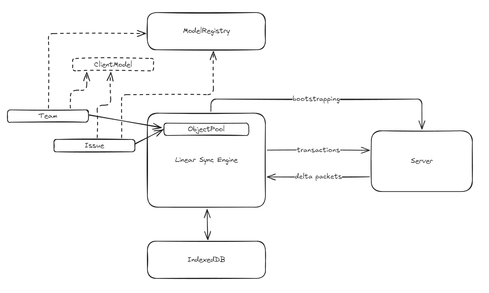
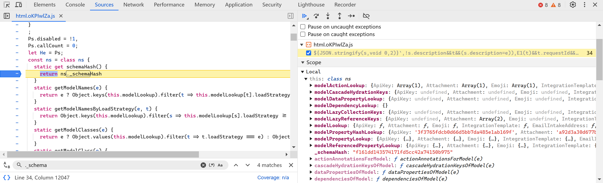
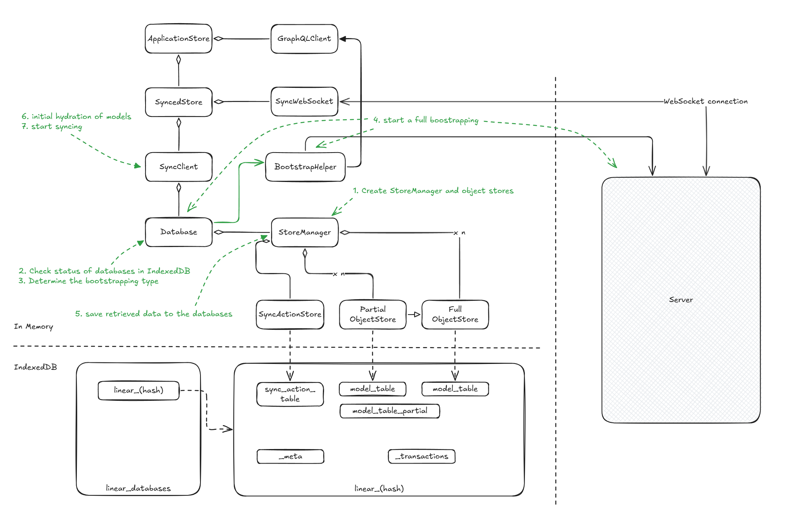
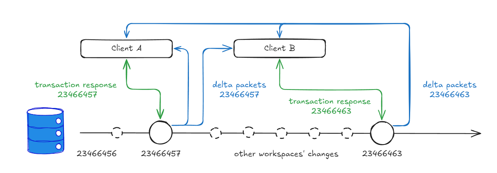
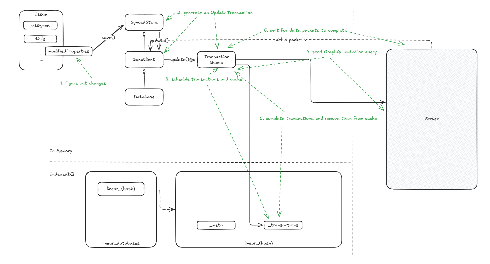

# Summary (WIP)

This is a summary of the reverse-engineering of Linear's Sync Engine (LSE). It provides a conceptional description of how LSE works and would be a good starting point for understanding the source code.

## Introduction

Here are the core concepts behind LSE:

**Model**

Entities such as `Issue`, `Team`, `Organization`, and `Comment` are referred to as **models** in LSE. These models possess **properties** and **references** to other models, many of which are observable (via **MobX**) to automatically update views when changes occur. In essence, models and properties include **metadata** that dictate how they behave in LSE.

Models can be loaded from either the **local database** (IndexedDB) or the server. Some models supports **partially loading** and can be loaded on demand, either from the local database or by fetching additional data from the server. Once loaded, models are stored in an **Object Pool**, which serves as a large map for retrieving models by their **UUIDs**.

Models can be **hydrated** lazily, meaning its properties can be loaded only when accessed. This mechanism is particularly useful for improving performance by loading only the necessary data.

Operations—such as additions, deletions, updates, and archiving—on models, their properties, and references are encapsulated as **transactions**. These transactions are sent to the server, executed there, and then broadcast as **delta packets** to all connected clients. This ensures data consistency across multiple clients.

**Transaction**

Operations sent to the server are packaged as **transactions**. These transactions are intended to execute **exclusively** on the server and are designed to be **reversible** on the client in case of failure. If the client loses its connection to the server, transactions are temporarily **cached** in IndexedDB and automatically resent once the connection is reestablished.

Transactions are associated with a **sync id**, which is a monotonically increasing number that ensures the correct order of operations. This number is crucial for maintaining consistency across all clients.

Additionally, transactions play a key role in supporting **undo** and **redo** operations, enabling seamless changes and corrections in real-time collaborative workflows.

**Delta packets**

Once transactions are executed, the server broadcasts **delta packets** to all clients—including the client that initiated the transaction—to update the models. A delta packet contains several **sync action**s, and each action is associated with a **sync id** as well. This mechanism prevents clients from missing updates and helps identify any missing packets if discrepancies occur.

The **delta packets** may differ from the original transactions sent by the client, as the server might perform **side effects** during execution (e.g., generating history).

## Defining Models and Metadata

When Linear starts, it first generates metadata for models, including their properties, methods (actions), and computed values. To manage this metadata, LSE maintains a detailed dictionary called `ModelRegistry`.

LSE uses **decorators** to define models and properties, and record their metadata to the `ModelRegistry`.

Model's metadata includes:

1. **`loadStrategy`**: Defines how models are loaded into the client. There are five strategies:
   - **`instant`**: Models that are loaded during application bootstrapping (default strategy).
   - **`lazy`**: Models that do not load during bootstrapping but are fetched all at once when needed (e.g., `ExternalUser`).
   - **`partial`**: Models that are loaded on demand, meaning only a subset of instances is fetched from the server (e.g., `DocumentContent`).
   - **`explicitlyRequested`**: Models that are only loaded when explicitly requested (e.g., `DocumentContentHistory`).
   - **`local`**: Models that are stored exclusively in the local database. No models have been identified using this strategy.
2. **`partialLoadMode`**: Specifies how a model is hydrated, with three possible values: `full`, `regular`, and `lowPriority`.
3. **`usedForPartialIndexes`**: Relates to the functionality of partial indexing.

Property's metadata includes:

1. `type`: Specifies the property's type.
2. `lazy`: Specifies whether the property should be loaded only when the model is hydrated.
3. `serializer`: Defines how to serialize the property for data transfer or storage.
4. `indexed`: Determines whether the property should be indexed in the database. Used for references.
5. `nullable`: Specifies whether the property can be `null`, used for references.
6. etc.

`type` is an enumeration that includes the following values:

1. **`property`**: A property that is "owned" by the model. For example, `title` is a `property` of `Issue`.
2. **`ephemeralProperty`**: Similar to a `property`, but it is not persisted in the database. This type is rarely used. For example, `lastUserInteraction` is an ephemeral property of `User`.
3. **`reference`**: A property used when a model holds a reference to another model. Its value is typically the ID of the referenced model. A reference can be lazy-loaded, meaning the referenced model is not loaded until this property is accessed. For example, `subscription` is a `reference` of `Team`.
4. **`referenceModel`**: When `reference` properties are registered, a `referenceModel` property is also created. This property defines getters and setters to access the referenced model using the corresponding `reference`.
5. **`referenceCollection`**: Similar to `reference`, but it refers to an array of models. For example, `templates` is a `referenceCollection` of `Team`.
6. **`backReference`**: A `backReference` is the inverse of a `reference`. For example, `favorite` is a `backReference` of `Issue`. The key difference is that a `backReference` is considered "owned" by the referenced model. When the referenced model (B) is deleted, the `backReference` (A) is also deleted.
7. **`referenceArray`**: Used for many-to-many relationships. For example, `members` of `Project` is a `referenceArray` that references `Users`, allowing users to be members of multiple projects.

LSE uses a variety of decorators to register different types of properties. In this chapter, let's first look at three of them.

### Schema Hash

`ModelRegistry` includes a special property called **`__schemaHash`**, which is a hash of all models' metadata and their properties' metadata. This hash is crucial for determining whether the local database requires migration.

## Bootstrapping

A full bootstrapping of Linear looks like this:

1. `StoreManager` (`cce`) creates either a `PartialStore` (`jm`) or a `FullStore` (`TE`) for each model. These stores are responsible for synchronizing in-memory data with IndexedDB. Also, `SyncActionStore` (`oce`) will be created to store sync actions.
2. `Database` (`eg`) connects to IndexedDB and get databases and tables ready. If the databases don't exist, they will be created. And if a migration is needed, it will be performed.
3. `Database` determines the type of bootstrapping to be performed.
4. The appropriate bootstrapping is executed. For full bootstrapping, models are retrieved from the server.
5. The retrieved model data will be stored in IndexedDB.
6. Data requiring immediate hydration is loaded into memory, and observability is activated.
7. Build a connection to the server to receive delta packets.

Linear creates a database for each workspaces logged in. The metadata of this database includes the following fields.

1. `lastSyncId`. Explained in a section below.
2. **`firstSyncId`**: Represents the `lastSyncId` value when the client performs a **full bootstrapping**. As we'll see later, this value is used to determine the starting point for incremental synchronization.
3. **`subscribedSyncGroups`**. Explained in a section below.
4. etc.

During a full bootstrapping, the response will contains this metadata and LSE will dump them into the database.

### `lastSyncId`

**`lastSyncId`** is a critical concept in LSE. You might find that it ties into concepts like transactions and delta packets, which we will explore in greater detail in the later chapters. It's perfectly fine if you don't fully grasp this part right now. Keep reading and refer back to this section after you've covered the upcoming chapters—everything will come together.

Linear is often regarded as a benchmark for [local-first software](https://www.inkandswitch.com/local-first/). Unlike most mainstream local-first applications that use CRDTs, Linear's collaboration model aligns more closely with OT, as it relies on a centralized server to establish the order of all transactions. Within the LSE framework, all transactions sent by clients follow a [total order](https://en.wikipedia.org/wiki/Total_order), whereas CRDTs typically require only a [partial order](https://en.wikipedia.org/wiki/Partially_ordered_set). This total order is represented by the `sync id`, which is an incremental integer. And `lastSyncId` is the latest `sync id` as you can tell from its name.

When a transaction is successfully executed by the server, the global **`lastSyncId`** increments by 1. This ID effectively serves as the **version number of the database**, ensuring that all changes are tracked in a sequential manner.

### SyncGroup

This concept is crucial in LSE. While all workspaces share the same `lastSyncId` counter, you cannot access issues or receive delta packets from workspaces or teams to which you lack proper permissions. This restriction is enforced through an access control mechanism, with `subscribedSyncGroups` serving as the key component. The `subscribedSyncGroups` array contains UUIDs that represent your user ID, the teams you belong to, and predefined roles.

### Lazy Hydration

Linear does not loading everything from the server at once during a full bootstrapping, nor loading everything to the memory during each bootstrapping. It supports lazy hydration, which means that only the necessary data is loaded into memory when needed. This mechanism is particularly useful for improving performance and reducing memory usage.

## Syncing

### Transactions

1. When a property is assigned a new value, the system records key information: the name of the changed property and its previous value. **Models in memory** are updated **immediately** to reflect these changes.
2. When `issue.save()` is called, an **`UpdateTransaction`** is created. This transaction captures the changes made to the model.
3. The generated `UpdateTransaction` is then added to a request queue. Simultaneously, it is saved in the `__transactions` table in IndexedDB for **caching**.
4. The `TransactionQueue` schedules timers (sometimes triggering them immediately) to send the queued transactions to the server in **batches**.
5. Once a batch is successfully processed by the backend, it is removed from the `__transactions` table in IndexedDB. The Local Storage Engine (LSE) then clears the cached batch.
6. Transactions will wait for delta packets containing the `lastSyncId` to complete before proceeding.

### Delta Packets & Sync Actions

LSE will create a WebSocket connection 